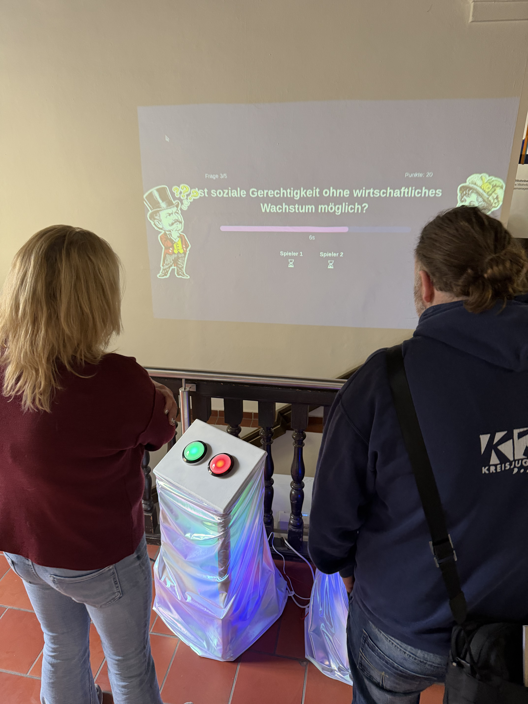
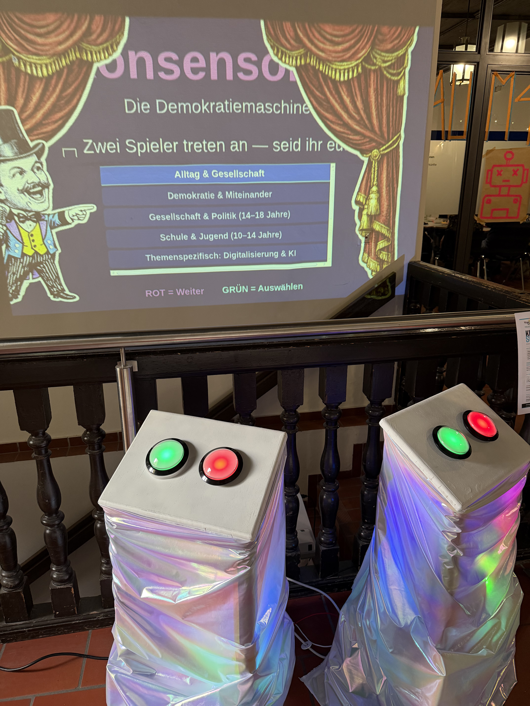
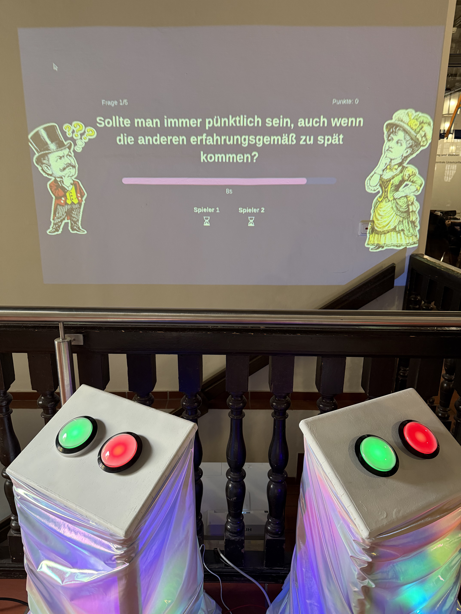
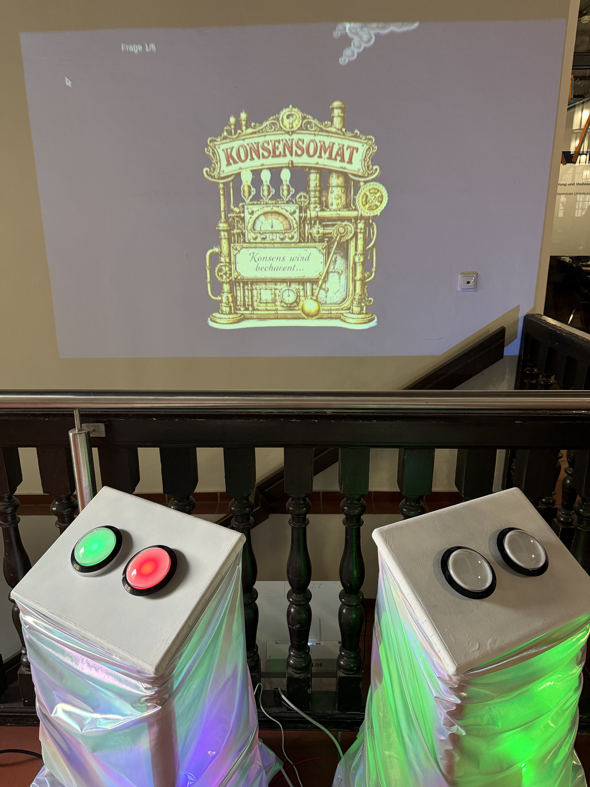
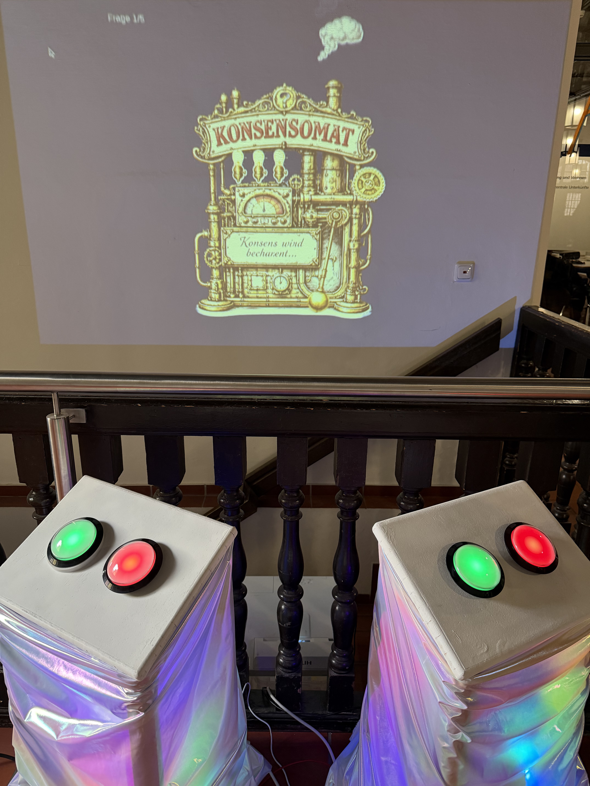
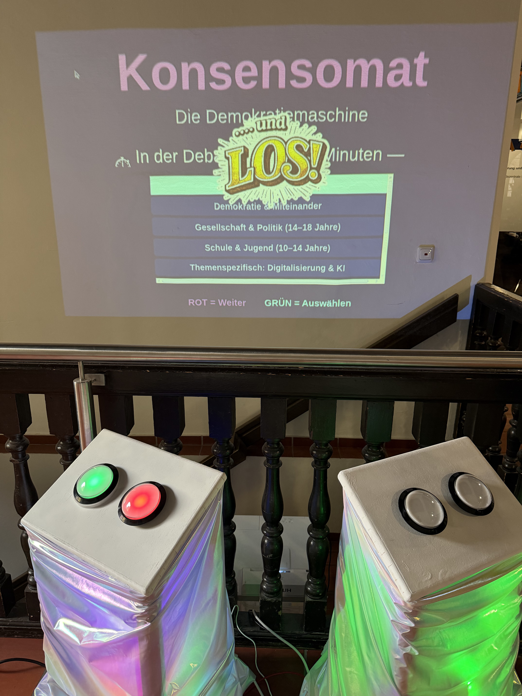
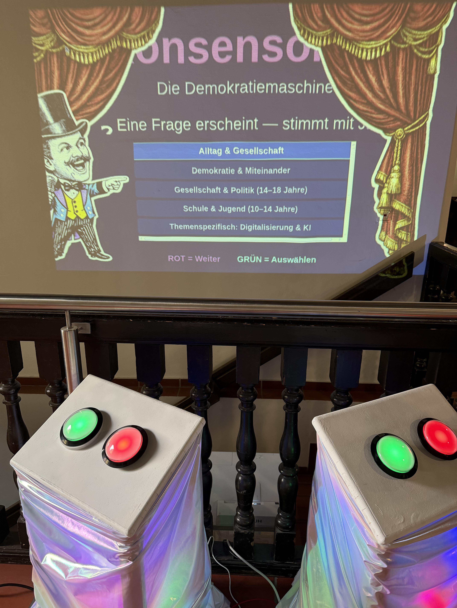

> Zwei Personen. Eine Frage. Zwei Minuten Zeit, um sich zu einigen — sonst ist das Spiel vorbei. **Konsensomat** macht Demokratie zum Erlebnis.




  
  
  
  
  
  
  


## Was ist der Konsensomat?

Abstimmen ist einfach. Sich einigen ist schwerer. Beim **Konsensomat** treten zwei Personen an physischen Abstimmstationen gegeneinander an. Auf einem großen Bildschirm erscheint eine Frage — beide drücken Ja oder Nein. Sind sie einer Meinung? Punkt! Nicht einig? Dann tickt die Uhr: **zwei Minuten**, um durch Diskutieren, Argumentieren und Verhandeln einen Konsens zu finden — oder das Spiel ist aus.

Demokratie bedeutet mehr als Abstimmen — sie lebt von Debatte, dem Mut zur eigenen Meinung, und der Stärke, einen Kompromiss zu finden. Der Konsensomat macht genau das erfahrbar: spielerisch, laut, und für alle ab 10 Jahren.

## So funktioniert's


Auf dem großen Bildschirm erscheint eine Frage — z.B. *"Sollte man immer pünktlich sein, auch wenn die anderen erfahrungsgemäß zu spät kommen?"*



Jede:r drückt den grünen (Ja) oder roten (Nein) Buzzer an der eigenen Station.



Gleiche Antwort? Ihr bekommt einen Punkt und die nächste Frage kommt.



Unterschiedliche Antworten? Die Uhr tickt — ihr habt 2 Minuten, um euch zu einigen. Schafft ihr es nicht: Game Over!


## Fragenkategorien

Der Konsensomat enthält Fragen aus verschiedenen Bereichen — je nach Zielgruppe und Veranstaltung:

- **Alltag & Gesellschaft** — Alltagsfragen, die zum Nachdenken anregen
- **Demokratie & Miteinander** — Grundwerte des Zusammenlebens
- **Gesellschaft & Politik (14–18 Jahre)** — Politische und gesellschaftliche Themen für Jugendliche
- **Schule & Jugend (10–14 Jahre)** — Altersgerechte Fragen rund um Schule und Zusammenleben
- **Themenspezifisch: Digitalisierung & KI** — Fragen zu digitalen Themen

## Das macht den Konsensomat besonders

- **Kein Vorwissen nötig** — nur die Bereitschaft zuzuhören
- **Keine Vorkenntnisse** — nur die Bereitschaft, wirklich zuzuhören
- **Kein Verlierer** — sondern das Ergebnis eines echten Dialogs
- **Physische Installation** — anfassen, drücken, erleben statt nur klicken
- **Für alle ab 10 Jahren** — in der Schule, auf dem Festival, im Jugendzentrum

## Geeignet für

- Schulveranstaltungen & Projekttage
- Festivals & Messen
- Politische Bildung
- Firmen- & Vereinsevents
- Workshops & Aktionstage

## Die Technik dahinter

Die Installation besteht aus zwei Buzzer-Stationen (Holzboxen mit großen Arcade-Buttons, LED-Beleuchtung und holografischer Folie), einem Raspberry Pi als Server und einem Beamer/Bildschirm. Die Software ist komplett Open Source:

- **Backend:** Python (Flask + Socket.IO) auf Raspberry Pi
- **Frontend:** Echtzeit-WebSocket-Verbindung zum Spielserver
- **Steuerung:** Große Arcade-Buttons (Ja/Nein), ersetzbar durch GPIO oder USB-Encoder
- **Kiosk-Modus:** Startet automatisch beim Einschalten, inkl. Fallback-Hotspot



## Konsensomat mieten

Den Konsensomat kann man für Events mieten — inklusive Aufbau, Betreuung und Fragenset. Kontakt: [gregor@kidslab.de](mailto:gregor@kidslab.de)

[Plakat herunterladen (PDF)](konsensomat_plakat.pdf)

Anfragen & Buchung

---

*Inspiriert von Adam J. Scarboroughs "The Democracy Machine!" — eine interaktive Installation von [KidsLab gGmbH](https://kidslab.de), Augsburg.*
