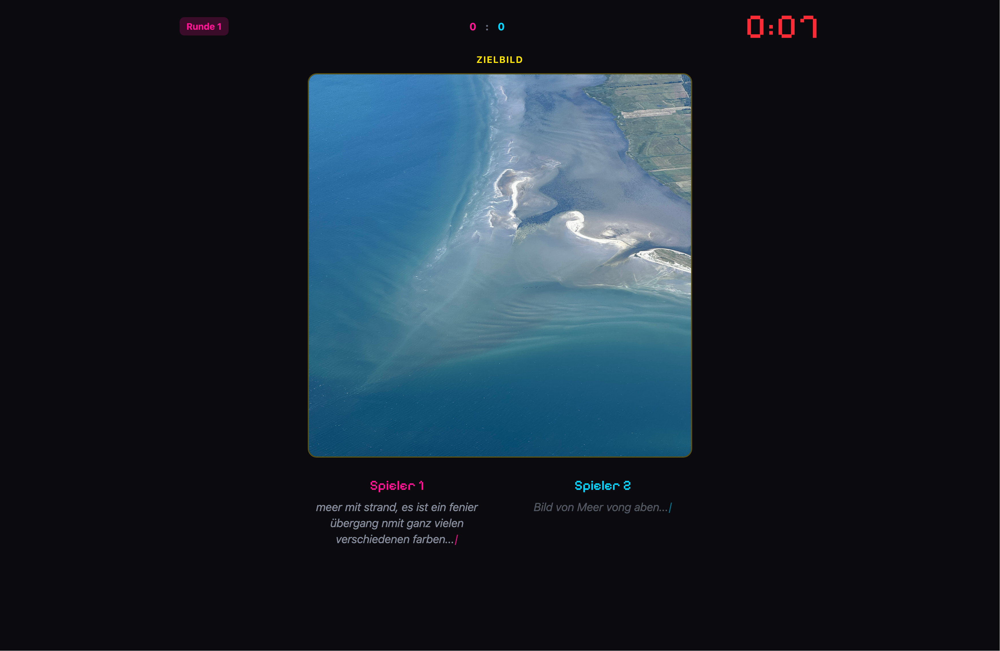
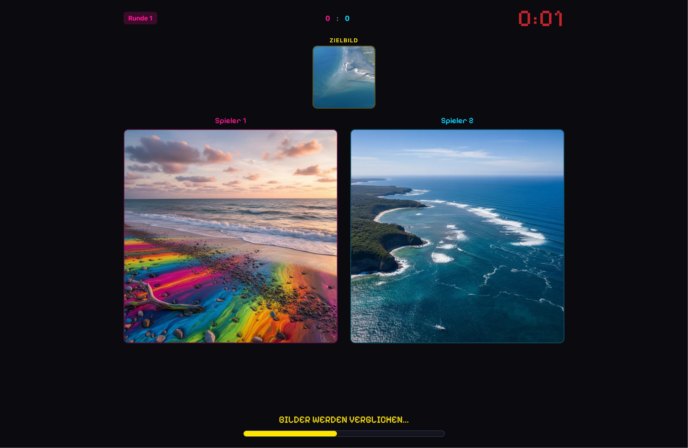
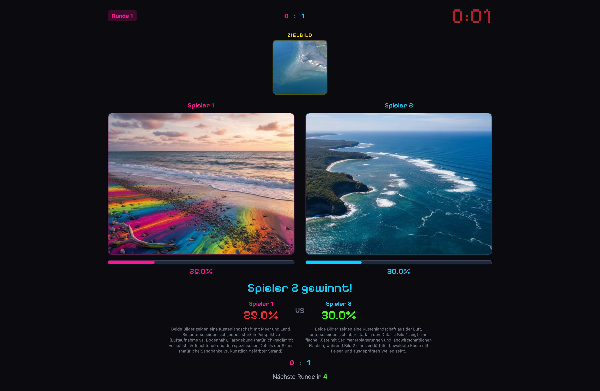
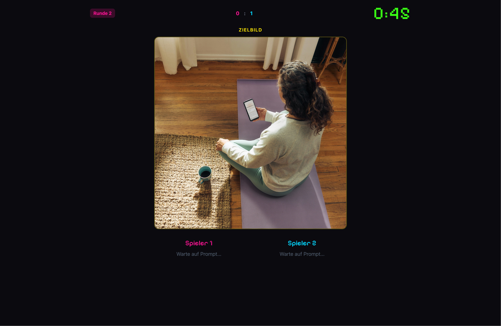
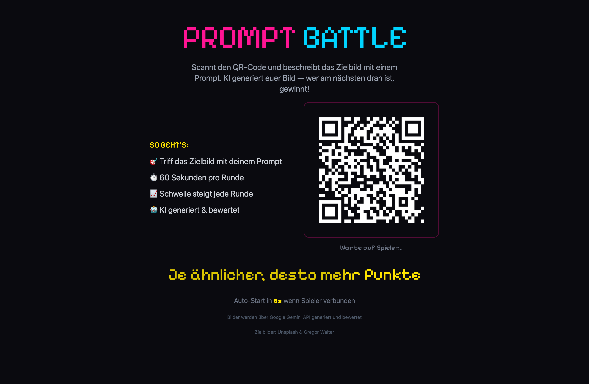
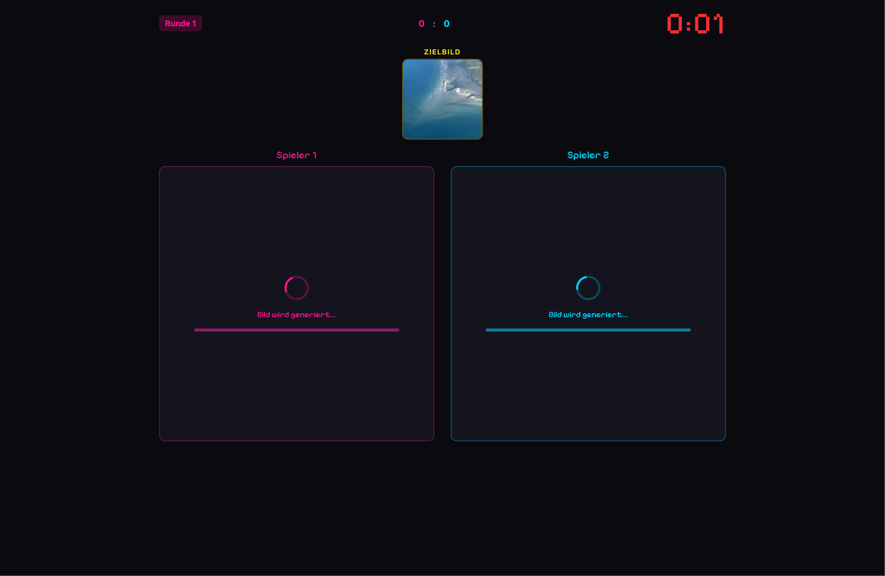
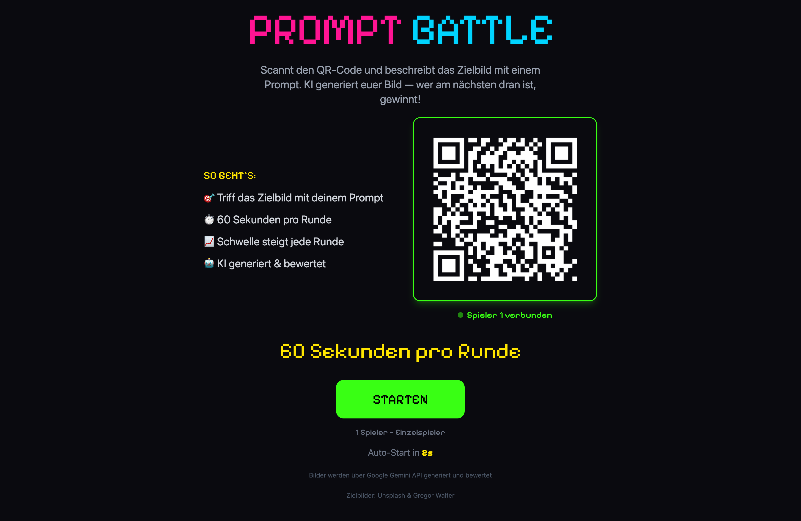

> A live game for groups: a target image appears on screen — everyone has 60 seconds to write a text prompt that generates an AI image as close to it as possible. Whoever gets closest wins the round.


  
  
  
  
  
  
  


## What is Prompt Battle?

**Prompt Battle** is an on-stage competition centred on AI image generation. A target image appears on a big screen — players have **60 seconds** to write a text prompt on their smartphone that gets the AI to generate an image as similar as possible. The AI generates the images, automatically compares them to the target image, and crowns a winner. The more similar the generated image, the more points.

It all happens live on stage — with a countdown, tension, and often surprisingly funny results. Because small changes to a prompt lead to completely different images.

## How it works


A random photo is shown on the big screen — that's the target.



Players scan the QR code with their smartphone and describe the image as precisely as possible in a text prompt. No app needed, everything runs in the browser.



Once time is up, the AI generates an image from each prompt. The results appear side by side on the big screen.



The AI automatically compares the generated images to the target image and calculates a similarity score in percent. Whoever gets closest wins the round!


## What do participants learn?

- **Understanding AI models** — how does text-to-image work? How do prompts work, and why do they sometimes fail?
- **The influence of language** — small changes to a prompt lead to completely different results. Precise wording becomes a competitive advantage.
- **Critical thinking** — what can AI do well, what can't it do — and what does that mean for us?

## Suitable for

- **School classes** — from about age 12, perfect for project days on AI and media literacy
- **Workshops** — a playful introduction to the topic of artificial intelligence
- **Trade fairs & events** — a crowd magnet with stage appeal
- **Youth centres** — low barrier to entry, only a smartphone needed
- **Corporate events** — team building with a tech factor
- **Action days** — quick to set up, ready to play instantly

## The tech

The Prompt Battle app is completely **open source** and self-hosted — no accounts, no data in the cloud.

- **Backend:** Python (FastAPI) — generates images via the Google Gemini API, scores similarity
- **Frontend:** SvelteKit (TypeScript) — real-time game interface with a retro pixel aesthetic
- **Playing along:** via QR code in the browser on your own smartphone — no app needed
- **Setup:** laptop + projector/big screen, that's it



## Book Prompt Battle

Prompt Battle can be rented as a complete package for events — including equipment, hosting, and adapting the target images to your theme.

[Download poster (PDF)](prompt_battle_plakat.pdf)

Inquire & book

---

*Inspired by [Prompt Battle](https://promptbattle.com/) — a live event format by Florian A. Schmidt, Sebastian Schmieg, and students at HTW Dresden. The KidsLab version is a standalone open-source app.*
