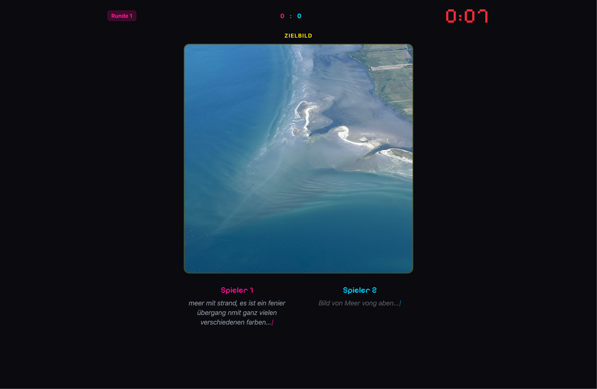
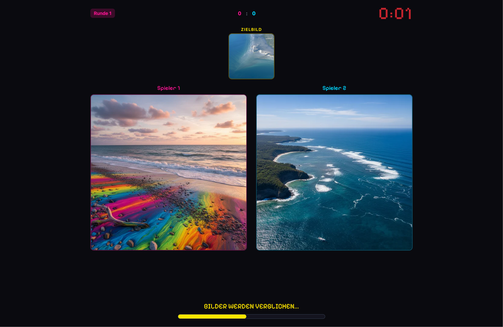
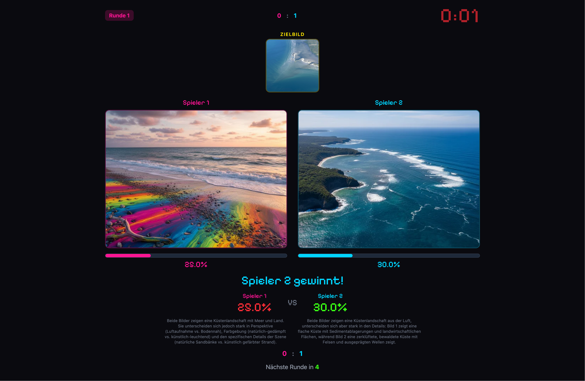
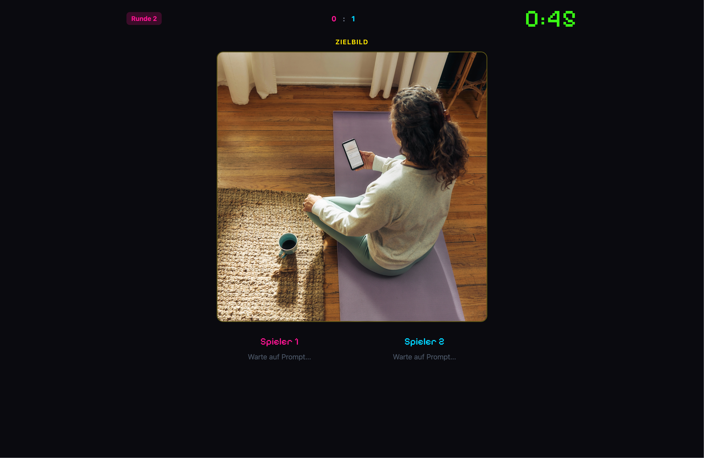
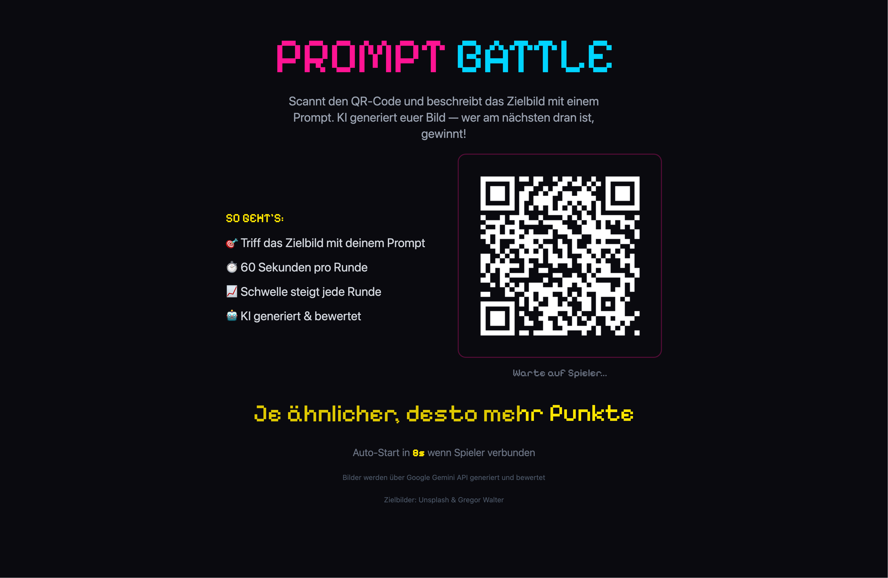
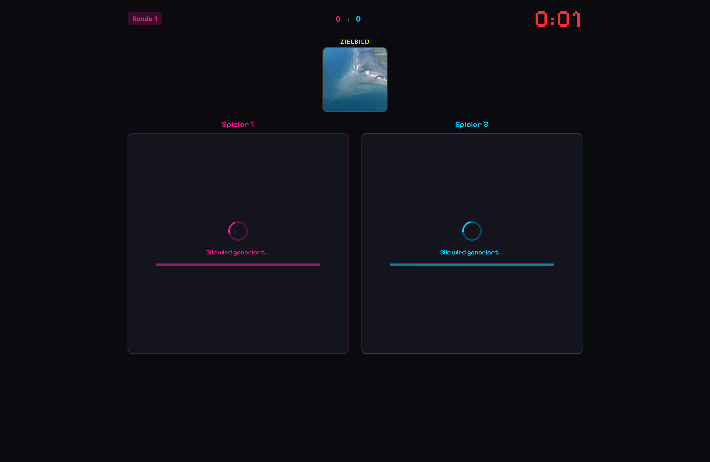
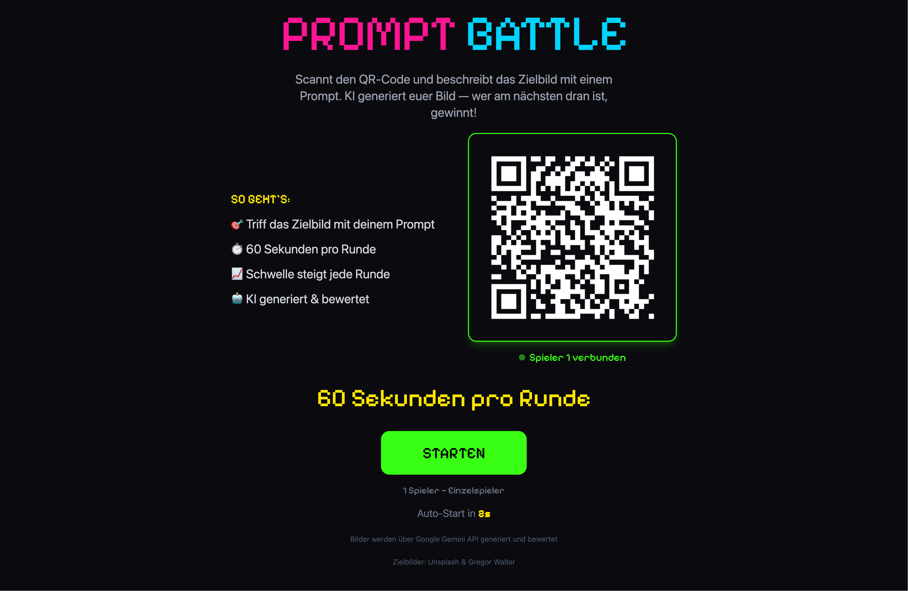

> Ein Live-Spiel für Gruppen: Auf dem Bildschirm erscheint ein Zielbild — alle haben 60 Sekunden, um mit einem Textprompt ein möglichst ähnliches KI-Bild zu erzeugen. Wer näher dran ist, gewinnt die Runde.


  
  
  
  
  
  
  


## Was ist Prompt Battle?

**Prompt Battle** ist ein Bühnenwettbewerb rund um KI-Bildgenerierung. Auf einem großen Bildschirm erscheint ein Zielbild — die Spieler:innen haben **60 Sekunden**, um auf ihrem Smartphone einen Textprompt zu schreiben, der die KI dazu bringt, ein möglichst ähnliches Bild zu erzeugen. Die KI generiert die Bilder, vergleicht sie automatisch mit dem Zielbild und kürt den Gewinner. Je ähnlicher das generierte Bild, desto mehr Punkte.

Das Ganze läuft live auf der Bühne — mit Countdown, Spannung und oft überraschend lustigen Ergebnissen. Denn: Kleine Änderungen im Prompt führen zu völlig anderen Bildern.

## So funktioniert's


Auf dem großen Bildschirm wird ein zufälliges Foto angezeigt — das ist das Ziel.



Die Spieler:innen scannen den QR-Code mit dem Smartphone und beschreiben das Bild so präzise wie möglich als Text-Prompt. Keine App nötig, alles läuft im Browser.



Nach Ablauf der Zeit generiert die KI aus jedem Prompt ein Bild. Die Ergebnisse erscheinen nebeneinander auf dem großen Bildschirm.



Die KI vergleicht automatisch die generierten Bilder mit dem Zielbild und berechnet einen Ähnlichkeitswert in Prozent. Wer näher dran ist, gewinnt die Runde!


## Was lernen die Teilnehmenden?

- **KI-Modelle verstehen** — Wie funktioniert Text-zu-Bild? Wie arbeiten Prompts, und warum scheitern sie manchmal?
- **Einfluss der Sprache** — Kleine Änderungen im Prompt führen zu völlig anderen Ergebnissen. Präzise Formulierung wird zum Wettbewerbsvorteil.
- **Kritisches Denken** — Was kann KI gut, was nicht — und was bedeutet das für uns?

## Geeignet für

- **Schulklassen** — Ab ca. 12 Jahren, perfekt für Projekttage zu KI & Medienkompetenz
- **Workshops** — Spielerischer Einstieg in das Thema Künstliche Intelligenz
- **Messen & Events** — Publikumsmagnet mit Bühnen-Charakter
- **Jugendtreffs** — Niedrigschwelliger Zugang, nur Smartphone nötig
- **Firmenevents** — Team-Building mit Tech-Faktor
- **Aktionstage** — Schnell aufgebaut, sofort spielbar

## Die Technik

Die Prompt-Battle-App ist komplett **Open Source** und selbst-gehostet — keine Accounts, keine Daten in der Cloud.

- **Backend:** Python (FastAPI) — generiert Bilder über Google Gemini API, bewertet Ähnlichkeit
- **Frontend:** SvelteKit (TypeScript) — Echtzeit-Spieloberfläche mit Retro-Pixel-Ästhetik
- **Mitspielen:** Per QR-Code im Browser auf dem eigenen Smartphone — keine App nötig
- **Aufbau:** Laptop + Beamer/großer Bildschirm, das war's



## Prompt Battle buchen

Prompt Battle kann als fertiges Paket für Events gemietet werden — inklusive Technik, Moderation und Anpassung der Zielbilder an euer Thema.

[Plakat herunterladen (PDF)](prompt_battle_plakat.pdf)

Anfragen & Buchung

---

*Inspiriert von [Prompt Battle](https://promptbattle.com/) — einem Live-Event-Format von Florian A. Schmidt, Sebastian Schmieg und Studierenden der HTW Dresden. KidsLab-Version als eigenständige Open-Source-App.*
