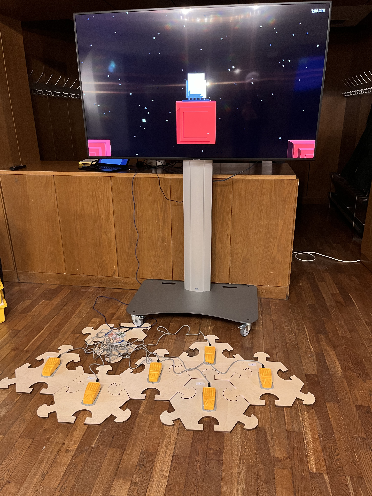
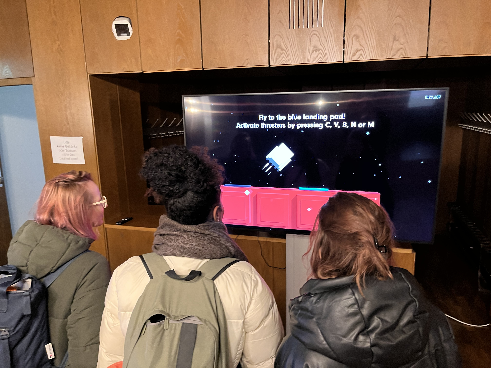
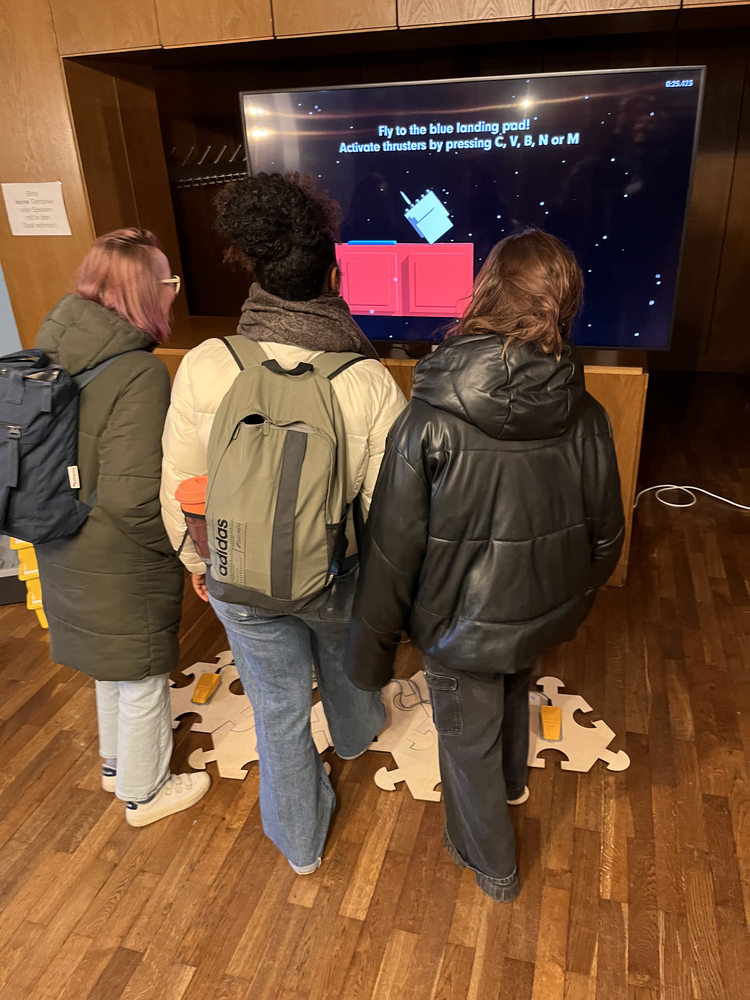
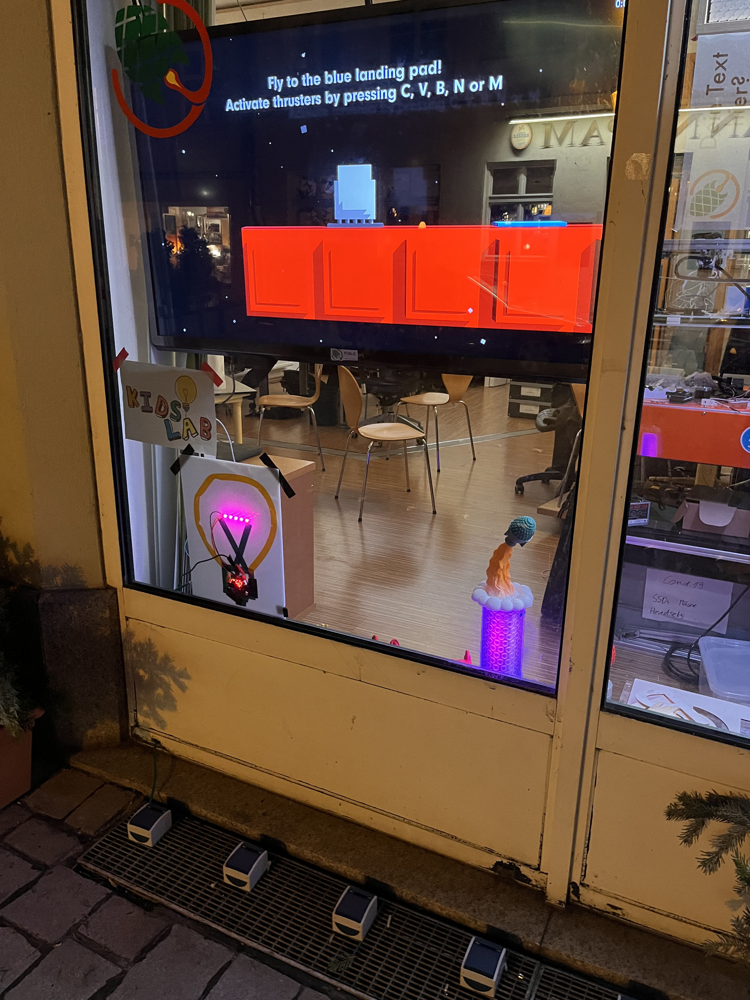

Five buttons, a screen, a space adventure — just sit down and start playing.

## The game

The game is by [Mario von Rickenbach](https://mariorickenbach.ch/) — we adapted it for our interactive station. It runs on a screen and is controlled with five physical buttons — no phone, no app, no account. Just press and steer.

After 90 seconds without input, the game restarts automatically so the next person can jump right in.





## How does it work?

Behind the game is a Raspberry Pi Pico running CircuitPython. The buttons send their signals to the Pico, which forwards them as keyboard input to the game computer — like an invisible gamepad. Our hardware adaptation is open source:



## When is the station open?

The rocket runs whenever KidsLab is open — just walk in and play.

## Rent the rocket

The station can be rented for events, festivals, or exhibitions — including setup and hardware. Just get in touch:

Inquire & book
