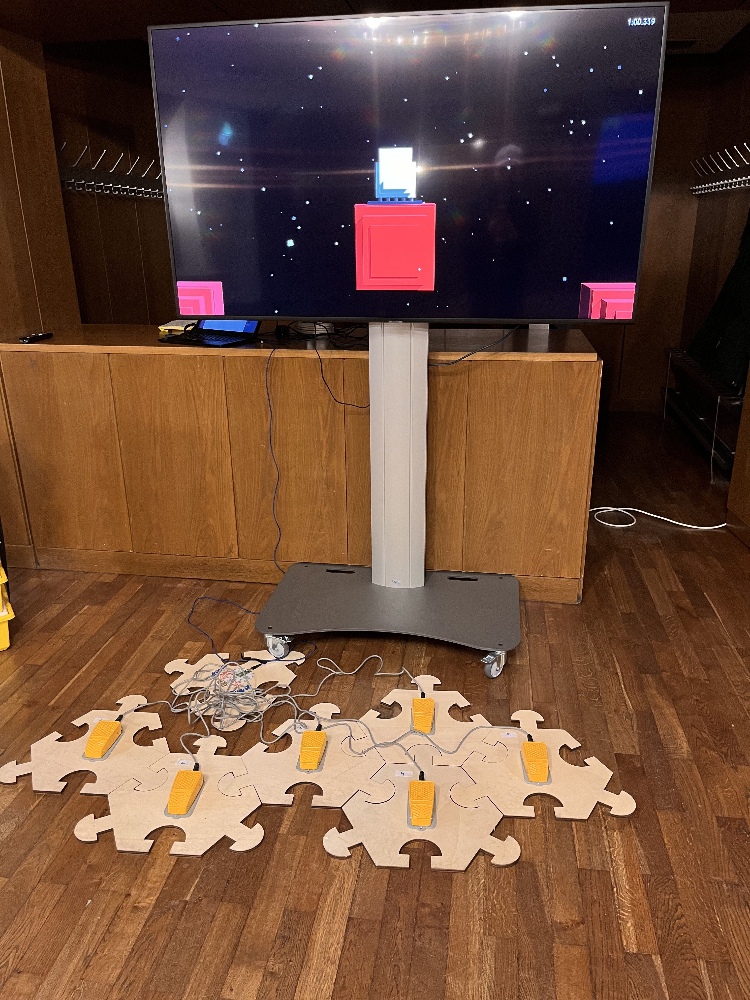
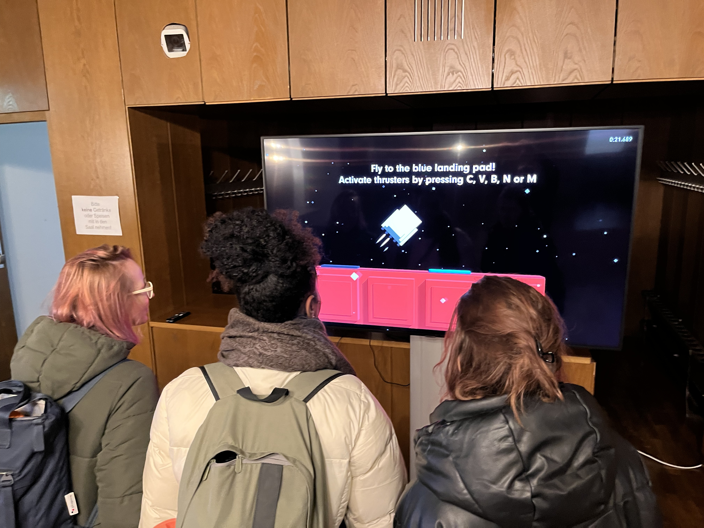
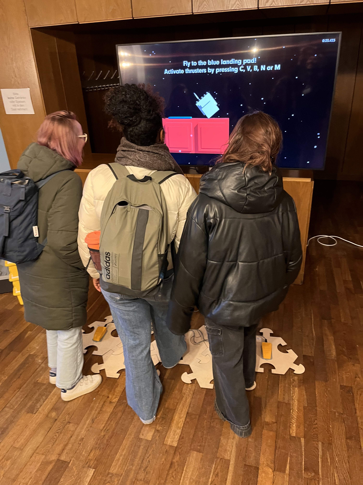
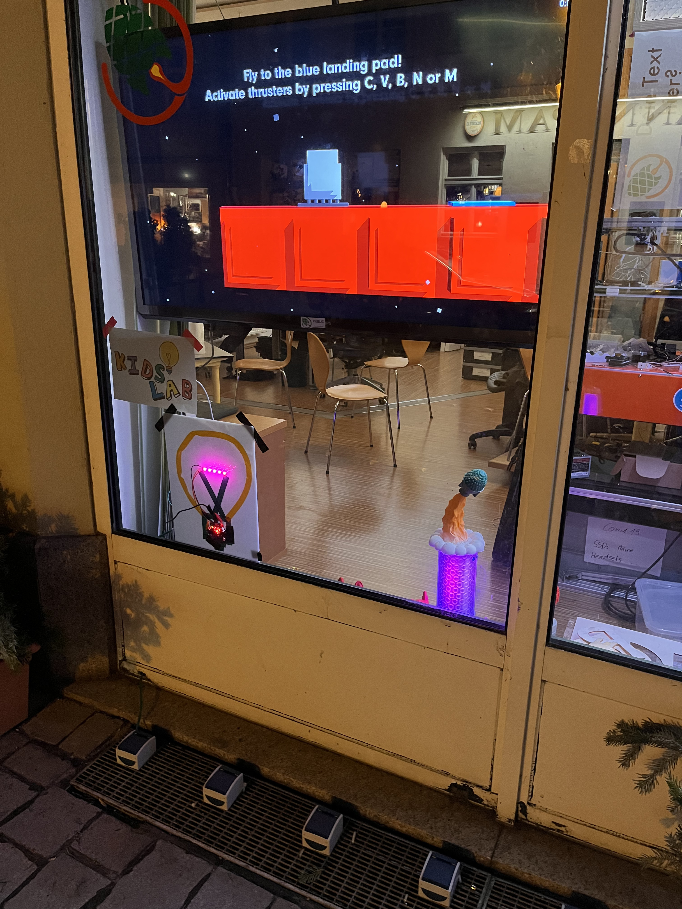

Fünf Taster, ein Bildschirm, ein Weltraumabenteuer — einfach hinsetzen und losspielen.

## Das Spiel

Das Spiel stammt von [Mario von Rickenbach](https://mariorickenbach.ch/) — wir haben es für unsere Mitmachstation adaptiert. Es läuft auf einem Bildschirm und wird durch fünf physische Taster gesteuert — kein Handy, keine App, kein Account. Einfach draufdrücken und steuern.

Nach 90 Sekunden ohne Eingabe startet das Spiel automatisch neu, damit die nächste Person sofort loslegen kann.





## Wie funktioniert das?

Hinter dem Spiel steckt ein Raspberry Pi Pico mit CircuitPython. Die Taster senden ihre Signale an den Pico, der sie als Tastatureingaben an den Spielrechner weitergibt — wie ein unsichtbares Gamepad. Unsere Hardware-Adaptation ist Open Source:



## Wann ist die Station zugänglich?

Die Rakete läuft, wann immer das KidsLab geöffnet ist — einfach reinkommen und loslegen.

## Rakete mieten

Die Station kann für Events, Festivals oder Ausstellungen gemietet werden — inklusive Aufbau und Hardware. Einfach anfragen:

Anfragen & Buchung
