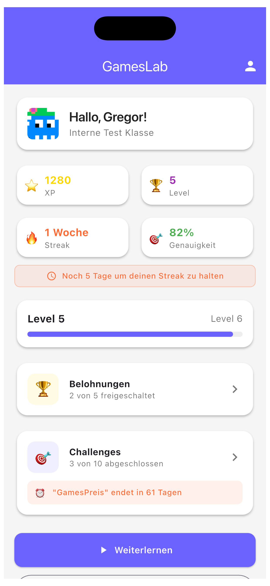
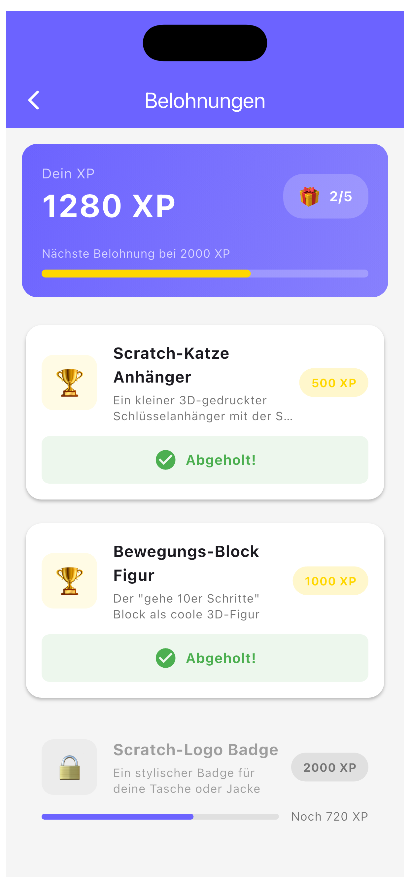
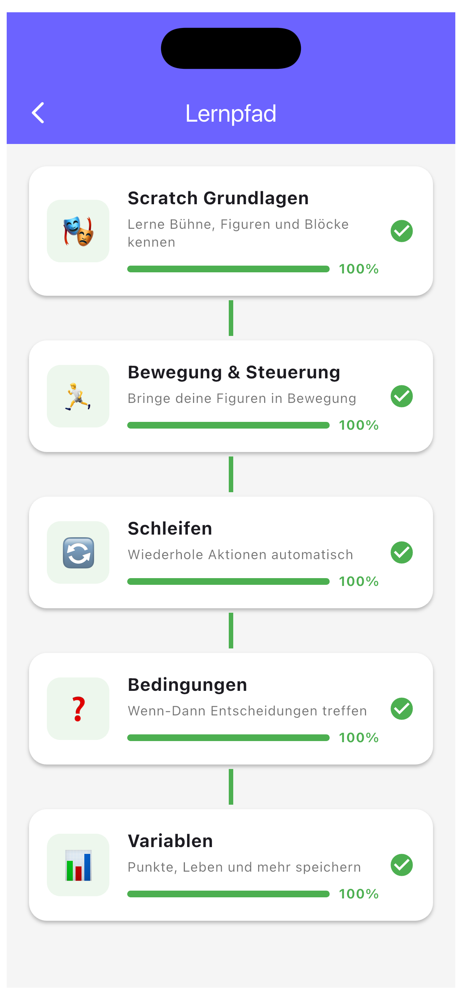
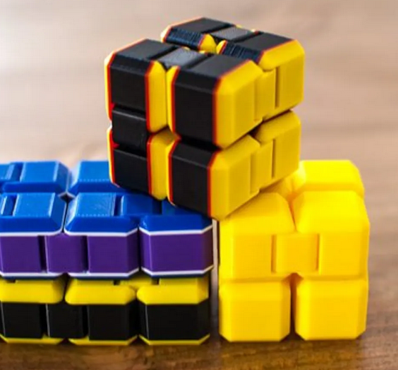
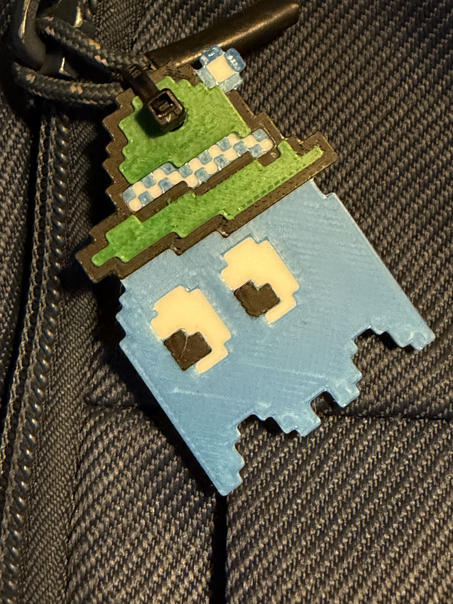
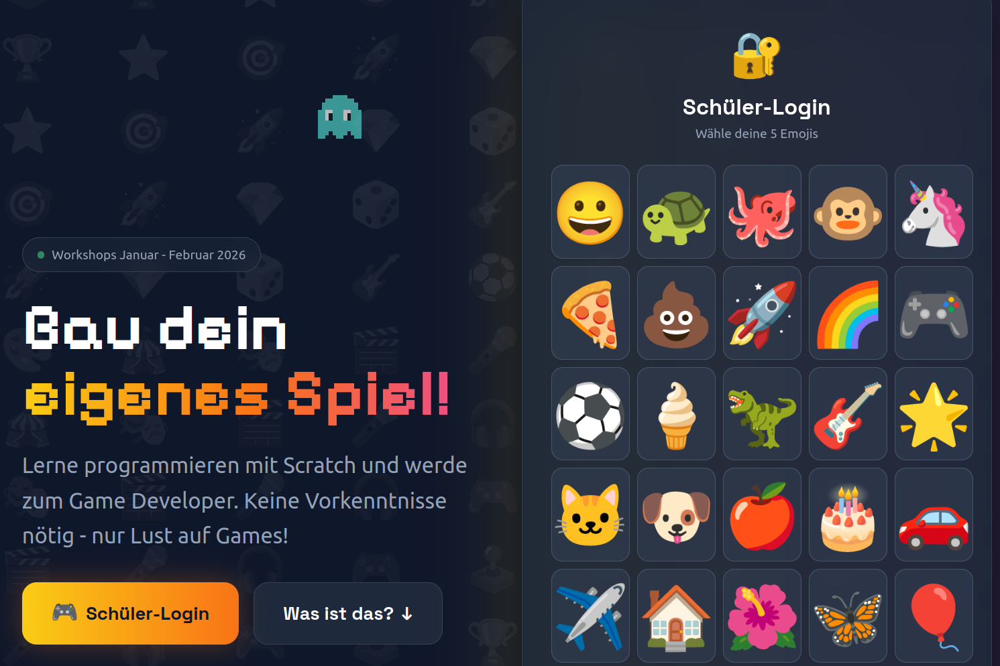
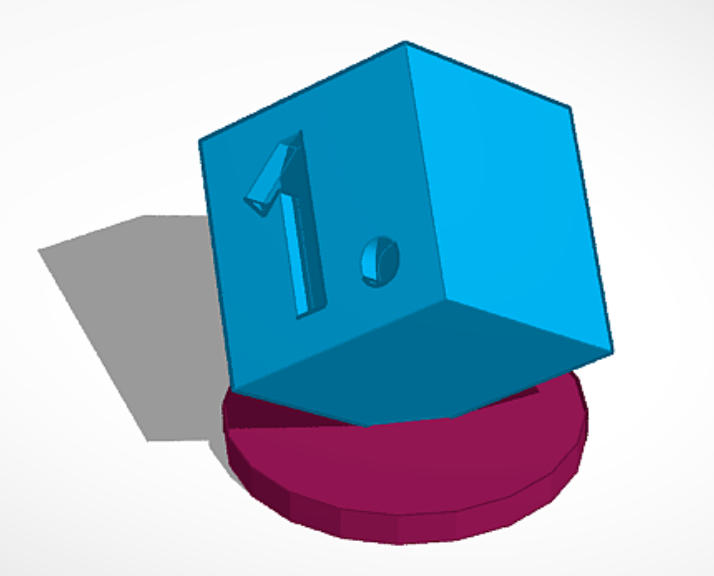
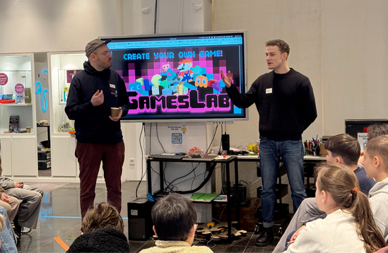



> Free game design workshops for students in grades 5 to 13.

Since 2024 we've been running GamesLab in Augsburg — three times so far, over 1,500 students, all school types. In one-day workshops, teenagers develop real computer games in teams: their own code, their own design, their own story.

**No prior knowledge needed. Free of charge.**

---

## What happens in a workshop?

A GamesLab day lasts a school morning. Students arrive as a class — and leave as game developers.

The morning starts with what makes a good game: game design, storytelling, and the question of why you'd actually want to play a game again. Then it's time to code — with Scratch, browser-based, no installation required. In small teams, playable prototypes emerge within a few hours.

What happens along the way surprises us every time: students who are unassuming in regular class suddenly blossom. Groups who barely know each other work together with real focus. And by the end of the day, almost every team has something that actually works — and that they can be proud of.



---

## The GamesPreis

Every GamesLab ends with the **Augsburger GamesPreis**: an evening gala where the best games are reviewed and awarded by a jury.

The patron is Bavaria's Minister for Digital Affairs, Dr. Fabian Mehring — who has personally presented the top prizes since 2025. The GamesPreis is motivation, finale, and proof all at once: what can emerge from a single school day is more than just a school project.



See all winners and play the games

---

## Numbers from three years

| | 2024 | 2025 | 2026 |
|---|---|---|---|
| **Participants** | ~500 | ~700 | ~500 |
| **Locations** | Augsburg | Augsburg, Traunstein | Augsburg + surrounding districts |

In total, more than **1,500 students** have gone through GamesLab.

Ratings: an average of **4.03 out of 5 points**, **83.8%** positive ratings (4–5 stars). **59%** of participants say they want to develop games themselves afterwards.

Teachers rate the programme **4.51 out of 5 points**. 72% plan to integrate the content into their regular lessons.



---

## GamesLab Studio — the platform





With [GamesLab Studio](/gameslab/studio/), students can keep working independently: solving challenges, earning XP, submitting games. Teachers stay in the loop.

More about GamesLab Studio

---

## For schools

Want to spice up your IT classes — or show your students what's possible with programming?

We'll come to you, or you come to us. Participating schools get:

- A free one-day workshop with professional supervision
- A teaching handbook for classroom follow-up
- Access to [GamesLab Studio](/gameslab/studio/) for continued independent work
- Optional support integrating it into your curriculum

Contact: gregor@kidslab.de

---

## GamesLab in your city?

We want to grow GamesLab — beyond Augsburg, and eventually across Bavaria.

If you're an organisation, school, or initiative wanting to bring GamesLab to your area: we have the materials, the experience, and the concept. What we're looking for are local partners who know their city.

Get in touch: gregor@kidslab.de

### Rewards that motivate





---

## Screenshots & insights





---

## Latest on GamesLab




