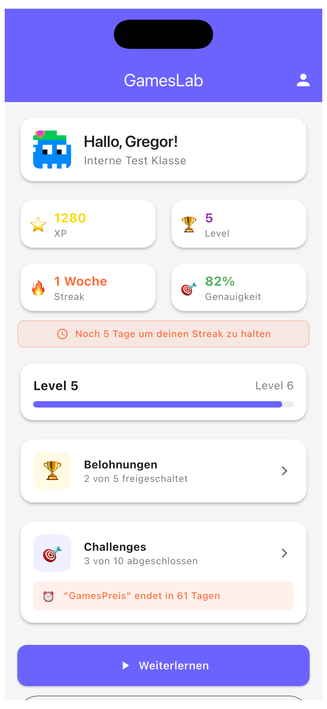
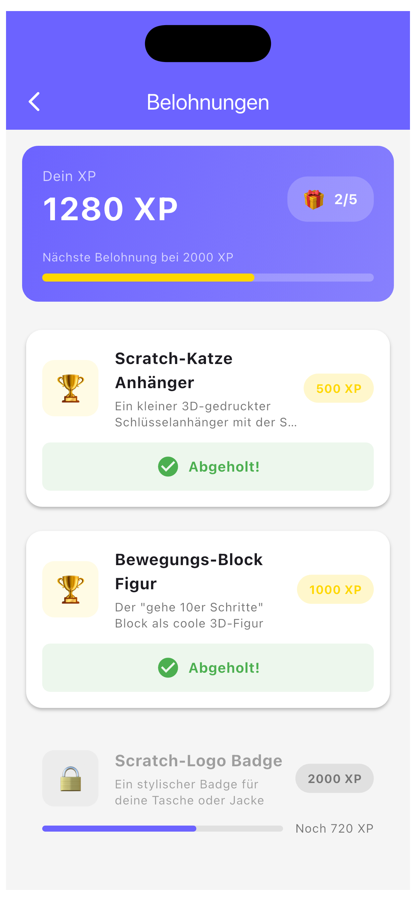
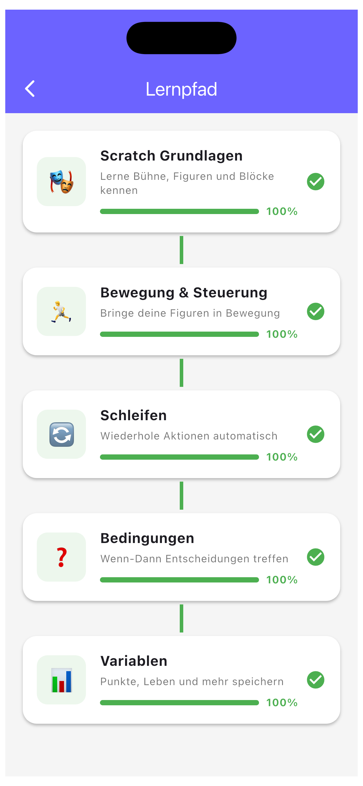
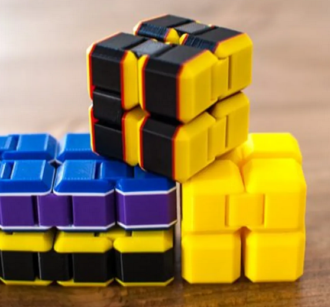
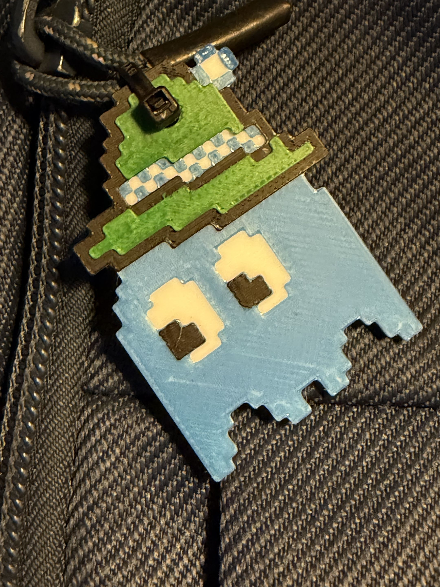
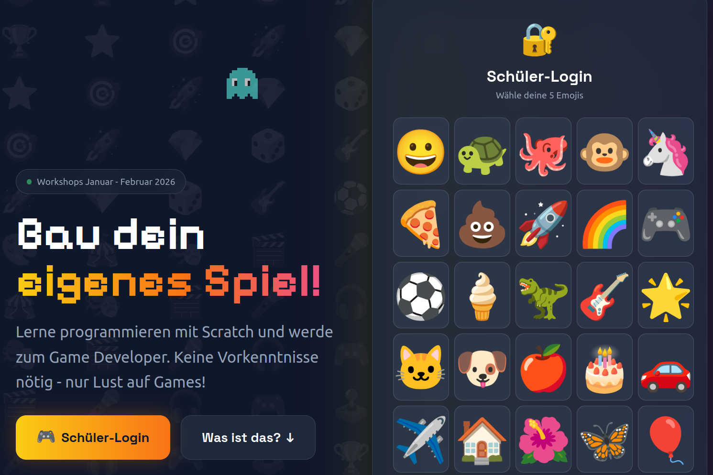
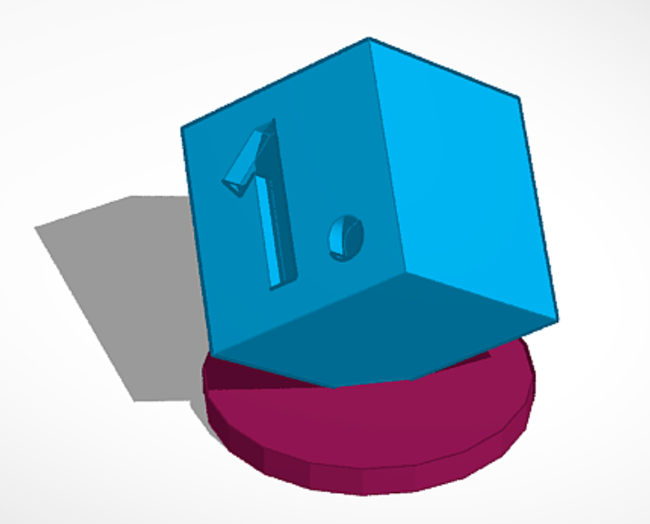
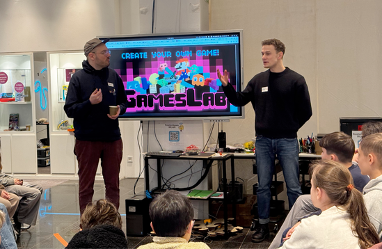



> Kostenlose Game-Design-Workshops für Schülerinnen und Schüler der Klassen 5 bis 13.

Seit 2024 veranstalten wir in Augsburg das GamesLab — drei Mal, über 1.500 Schülerinnen und Schüler, alle Schularten. In eintägigen Workshops entwickeln Jugendliche in Teams echte Computerspiele: mit eigenem Code, eigenem Design, eigener Geschichte.

**Keine Vorkenntnisse nötig. Kostenlos.**

---

## Was passiert in einem Workshop?

Ein GamesLab-Tag dauert einen Schulvormittag. Die Schülerinnen und Schüler kommen als Klasse — und gehen als Spieleentwickler.

Am Vormittag geht es darum, was ein gutes Spiel ausmacht: Game Design, Storytelling, die Frage, warum man ein Spiel eigentlich nochmal spielen will. Dann wird programmiert — mit Scratch, browserbasiert, ohne Installation. In kleinen Teams entstehen in wenigen Stunden erste spielbare Prototypen.

Was dabei passiert, erleben wir jedes Mal neu: Schülerinnen und Schüler, die im normalen Unterricht unauffällig sind, blühen auf. Gruppen, die sich kaum kennen, arbeiten plötzlich konzentriert zusammen. Und am Ende des Tages hat fast jedes Team etwas, das tatsächlich funktioniert — und auf das es stolz sein kann.



---

## Der GamesPreis

Am Ende jedes GamesLab steht der **Augsburger GamesPreis**: eine Abendgala, bei der die besten Spiele von einer Jury begutachtet und ausgezeichnet werden.

Schirmherr ist Bayerns Digitalminister Dr. Fabian Mehring — der die Hauptpreise seit 2025 persönlich überreicht. Der GamesPreis ist Ansporn, Abschluss und Beweis zugleich: Was in einem Schultag entstehen kann, ist mehr als ein Schulprojekt.



Alle Gewinner und Spiele anspielen

---

## Zahlen aus drei Jahren

| | 2024 | 2025 | 2026 |
|---|---|---|---|
| **Teilnehmende** | ~500 | ~700 | ~500 |
| **Standorte** | Augsburg | Augsburg, Traunstein | Augsburg + Landkreise |

Insgesamt haben damit mehr als **1.500 Schülerinnen und Schüler** das GamesLab durchlaufen.

Die Bewertungen: **4,03 von 5 Punkten** im Durchschnitt, **83,8 %** positive Bewertungen (4–5 Sterne). **59 %** der Teilnehmenden geben an, danach selbst Spiele entwickeln zu wollen.

Lehrkräfte bewerten das Programm mit **4,51 von 5 Punkten**. 72 % planen, die Inhalte in ihren regulären Unterricht zu integrieren.



---

## GamesLab Studio — die Plattform





Mit dem [GamesLab Studio](/gameslab/studio/) können Schüler eigenständig weiterarbeiten: Challenges lösen, XP sammeln, Spiele einreichen. Lehrkräfte behalten den Überblick.

Mehr zum GamesLab Studio

---

## Für Schulen

Du willst deinen IT-Unterricht aufpeppen — oder deinen Schülerinnen und Schülern zeigen, was mit Programmieren möglich ist?

Wir kommen zu euch, oder ihr kommt zu uns. Teilnehmende Schulen bekommen:

- Einen kostenlosen eintägigen Workshop mit professioneller Betreuung
- Ein didaktisches Handbuch für die Nachbereitung im Unterricht
- Zugang zum [GamesLab Studio](/gameslab/studio/) für eigenständiges Weiterarbeiten
- Auf Wunsch: Begleitung bei der Unterrichtsintegration

Kontakt: gregor@kidslab.de

---

## GamesLab in deiner Stadt?

Wir wollen das GamesLab wachsen lassen — über Augsburg hinaus, perspektivisch bayernweit.

Wenn du eine Organisation, Schule oder Initiative bist und das GamesLab an deinen Standort bringen willst: Wir haben die Materialien, die Erfahrung und das Konzept. Was wir suchen, sind Partner vor Ort, die ihre Stadt kennen.

Meld dich: gregor@kidslab.de

### Belohnungen die motivieren





---

## Screenshots & Einblicke





---

## Aktuelles zum GamesLab


