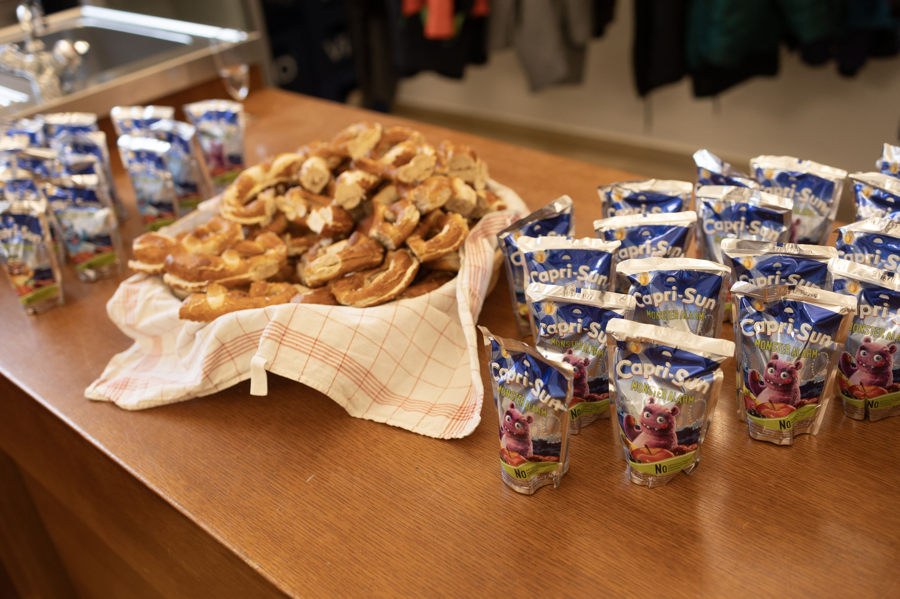
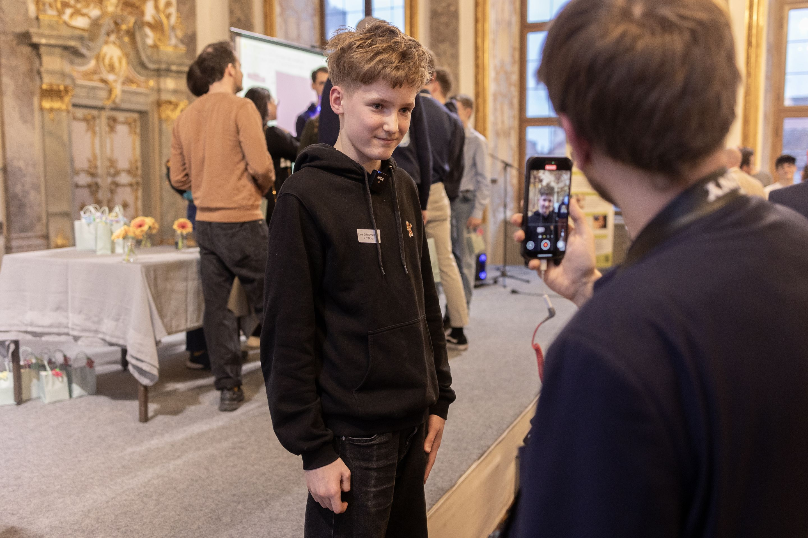
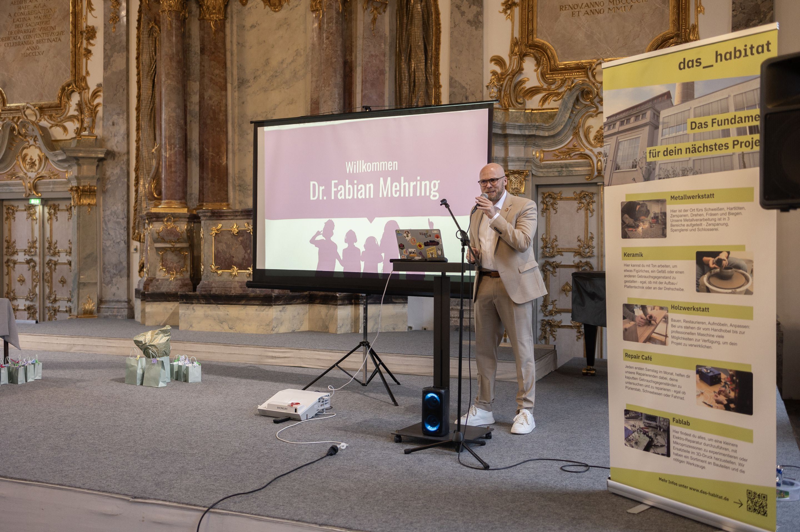
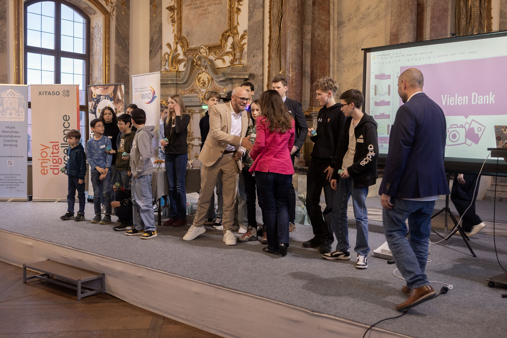
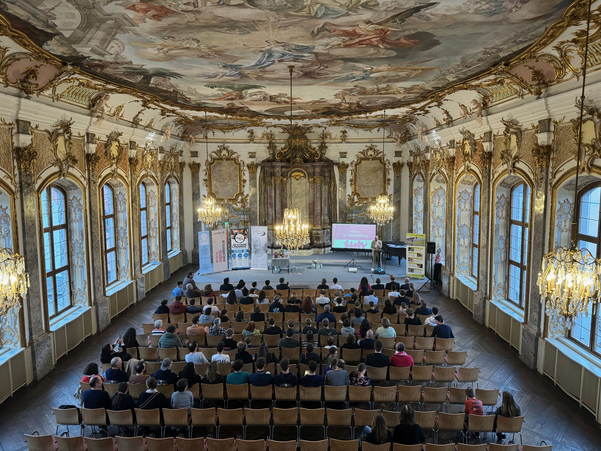
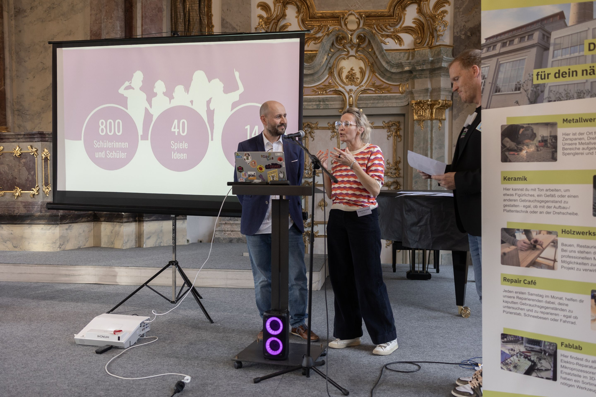
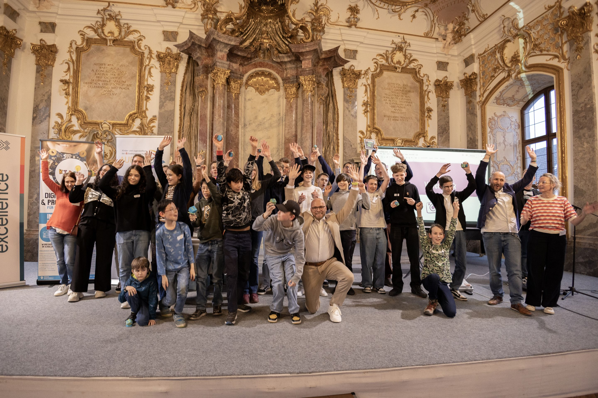
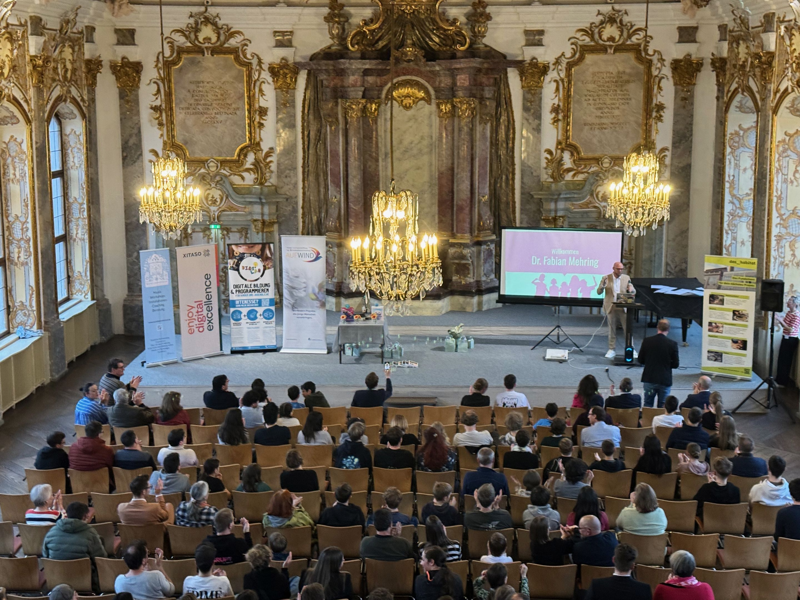

> Alle Gewinner und Einreichungen vom GamesPreis 2025.

## Augsburger GamesPreis 2025

Am 27. März 2025 hat im kleinen goldenen Saal in Augsburg die Preisverleihung des 2. Augsburger GamesPreises stattgefunden!

Als Ehrengast war der Bayerische Staatsminister für Digitales, Dr.  Fabian Mehring zu Besuch, dazu gibt es auch einen Artikel auf der Seite  des <a href="https://www.stmd.bayern.de/minister-mehring-zeichnet-in-augsburg-junge-programmiertalente-aus-dr-mehring-augsburger-gameslab-ist-bayerns-talentschmiede-fuer-die-it-genies-der-zukunft/">Staatsministerium</a>.





<h3>Was ist der GamesPreis?</h3>
Der Augsburger GamesPreis ist ein jährlicher Wettbewerb, bei dem Kinder und Jugendliche ihre selbst programmierten Spiele präsentieren können. 2025 fand bereits die zweite Ausgabe statt, bei der sogar der Bayerische Staatsminister für Digitales, Dr. Fabian Mehring, als Ehrengast die Preisverleihung im kleinen goldenen Saal begleitete.
<h3>Das Besondere am Wettbewerb</h3>
Was den GamesPreis so einzigartig macht: Hier geht es nicht nur ums Gewinnen, sondern darum, junge Programmierer*innen in ihrer Kreativität zu fördern. Die Altersgruppe reicht von 7 bis 16 Jahren – und alle zeigen beeindruckende Fähigkeiten im Game Design, in der Programmierung und in der kreativen Umsetzung ihrer Ideen.
<h3>Die Gewinner 2025</h3>
<strong>Top 3:</strong>
<ul><li>
<strong>1. Platz</strong>: „Katz und Maus" – Ein cleveres Verfolgungsspiel mit selbstkomponierter Musik
</li><li>
<strong>2. Platz</strong>: „Pape World" – Ein stilvolles Adventure in einer einzigartigen Papierwelt
</li><li>
<strong>3. Platz</strong>: „EcoSort" – Mülltrennung wird zum spannenden Arcade-Game
</li></ul><h3>Vielfältige Kategorien</h3>
Der GamesPreis würdigt unterschiedlichste Spielgenres und Ansätze:
<ul><li>
<strong>Bestes Vater &amp; Sohn Projekt</strong>: Gemeinsames Programmieren verbindet Generationen
</li><li>
<strong>Bestes Umweltspiel</strong>: Games mit wichtiger Botschaft
</li><li>
<strong>Bestes Sandbox-Spiel</strong>: Grenzenlose Kreativität
</li><li>
<strong>Bestes Fußballspiel</strong>: Sport trifft Gaming
</li><li>
<strong>Beste Simulation</strong>: Von der Börse bis zum Weltraum
</li><li>
<strong>Beste Graphic Novel</strong>: Storytelling im Spielformat
</li><li>
<strong>Achtsamkeitspreis</strong>: Innovative Konzepte, die zum Nachdenken anregen
</li></ul><h3>Plattform und Technik</h3>
Alle Spiele wurden mit Scratch entwickelt – einer visuellen Programmiersprache, die speziell für Kinder und Jugendliche konzipiert ist. Die eingereichten Projekte zeigen eindrucksvoll, was mit dieser scheinbar einfachen Plattform alles möglich ist: Von komplexen RPGs über atmosphärische Adventures bis hin zu actionreichen Arcade-Games.
<h3>Warum der GamesPreis wichtig ist</h3>
Der Wettbewerb zeigt, dass Augsburg zu einer echten „Talentschmiede für die IT-Genies der Zukunft" wird, wie es Staatsminister Mehring formulierte. Die jungen Entwickler*innen beweisen nicht nur technisches Können, sondern auch Durchhaltevermögen, Kreativität und die Fähigkeit, komplexe Projekte zu Ende zu bringen.
<h3>Mitmachen beim nächsten GamesPreis?</h3>
Der GamesPreis findet jährlich statt. Alle interessierten jungen Programmierer<em>innen können ihre Spiele einreichen – egal ob Anfänger</em>in oder schon fortgeschritten. Wichtig ist die Leidenschaft fürs Spieleentwickeln!

<!-- Blog posts: GamesPreis -->
