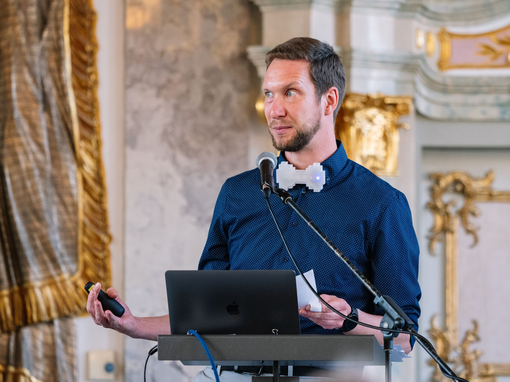
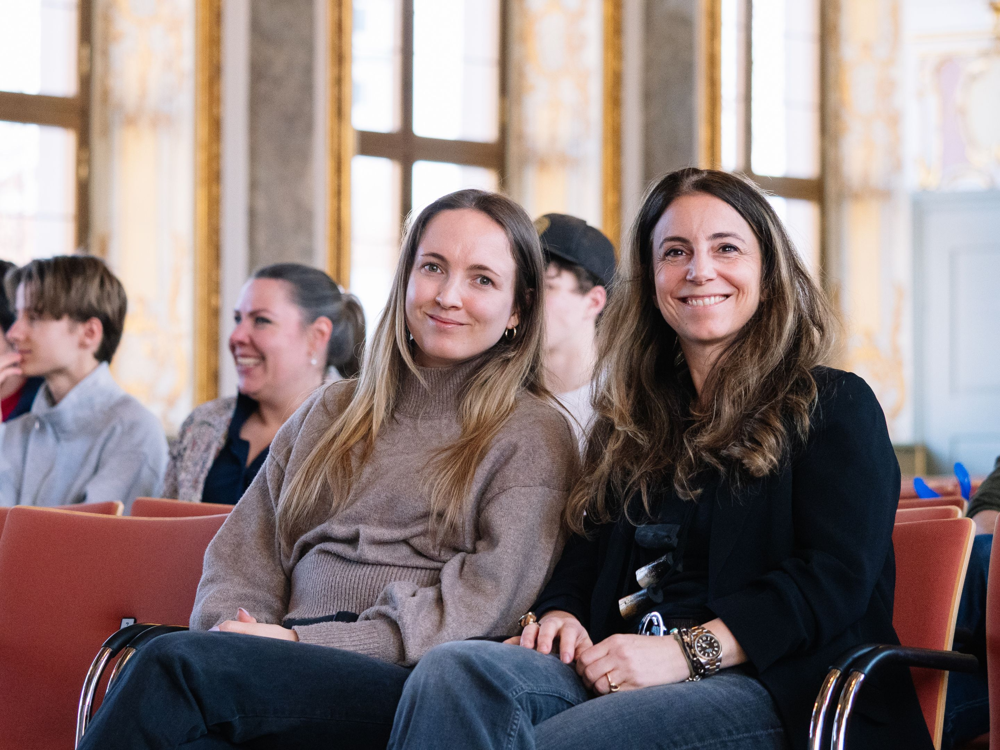
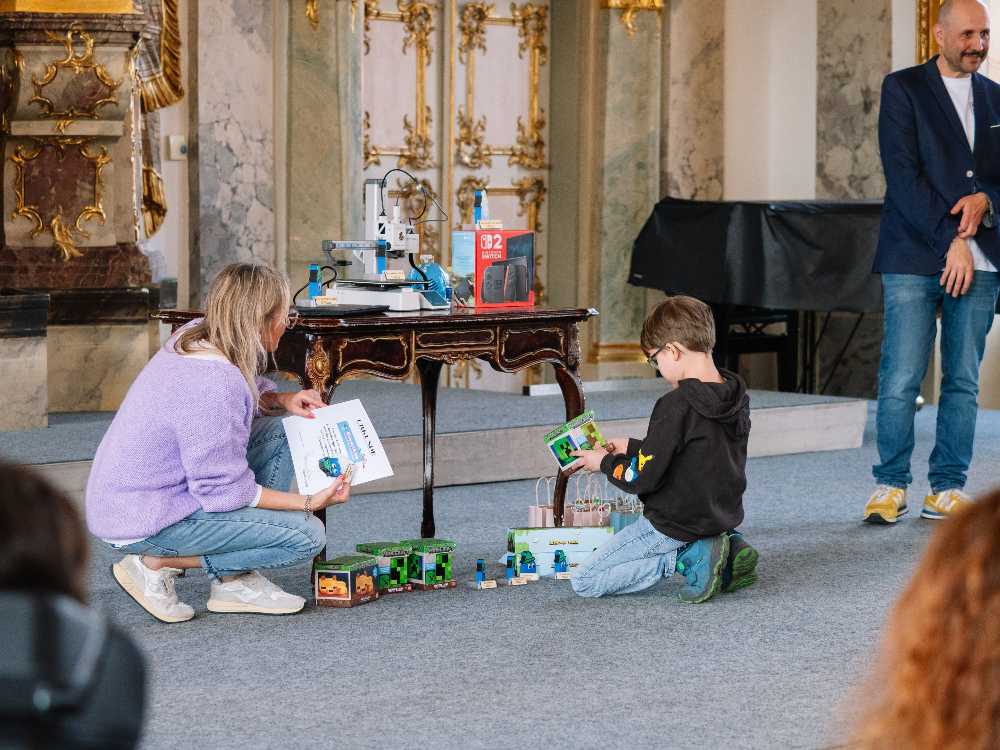
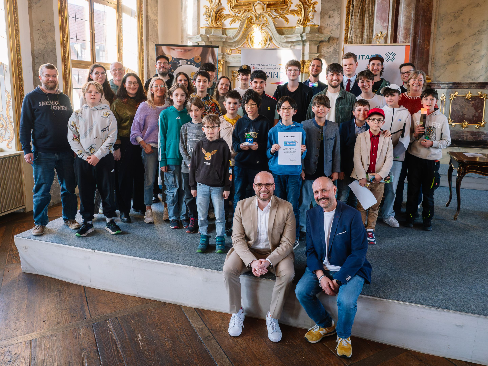
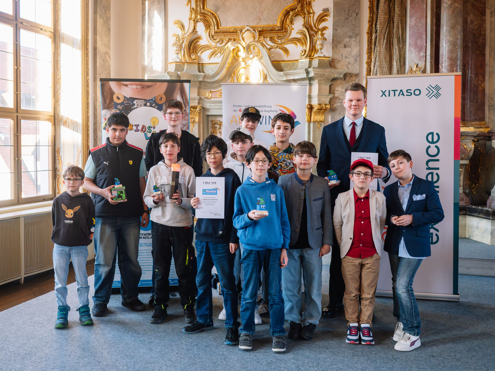

> 500 students, 20 classes, 12 prizes — Bavaria's Digital Minister honours young coding talent.

**March 12, 2026 · Kleiner Goldener Saal, Augsburg**

| | |
|---|---|
| **500 students** | from 20 classes |
| **3 districts** | Augsburg and surrounding area |
| **12 prizes** | 3 main prizes & 9 category prizes |
| **3rd edition** | Since 2024 |

## The evening at a glance

On March 12, 2026, the Kleiner Goldener Saal in Augsburg belonged, for one evening, entirely to students who all had one thing in common: over the past weeks, they hadn't been playing games — they'd been **building** them.

The 3rd Augsburger GamesPreis was the finale of this year's GamesLab, in which around **500 students from 20 classes** — from Augsburg as well as the districts of Augsburg and Aichach-Friedberg — had taken part in free one-day workshops. They learned the basics of game design, storytelling, and programming with Scratch — many of them with no prior experience at all.

The result: dozens of self-developed computer games, the best of which were honoured on this evening.





## Digital Minister Mehring presents the main prizes

Bavaria's Digital Minister Dr. Fabian Mehring, himself born in Augsburg, personally presented the three main prizes.

> *"Our country is in the deepest economic crisis since World War II. To carry our prosperity into the future, we need fresh ideas in new markets. All the more reason to get young people excited about the future — and about the technologies of the AI age in which they'll spend their lives."*

> *"Games are sport, high tech, and a future industry all at once. Anyone who learns to code today or tries their hand at game design acquires skills that will be urgently needed in tomorrow's digital economy."*

> *"Events like the Augsburger GamesPreis show just how much creativity, enthusiasm, and technical talent already exists in the next generation of our region."*

— **Dr. Fabian Mehring**, Bavarian State Minister for Digital Affairs

## The winners

### 1st place: "Die fliegende Untertasse" (The Flying Saucer)

*Yann and Ben Kratzer*

The defending champions did it again! After their 2025 win with "Katz und Maus," they impress once more: steering a flying saucer, collecting ingredients, delivering them to pots — with physically coherent flight movement, a minimap, and self-composed music.





More about 1st place

---

### 2nd place: "Billard-Extrem" (Billiards Extreme)

*Kilian Grün (16 years old)*

Kilian is no stranger here either: he won a category prize in 2025. With "Billard-Extrem" he follows up — mathematically calculated physics, realistic shots, 8-ball rules, and a two-player mode.





More about 2nd place

---

### 3rd place: "Schatzjäger" (Treasure Hunter)

*Matti Brousek, Jakob-Fugger-Gymnasium (9th grade)*

A clever puzzle and reaction game: simple controls, surprisingly tricky solutions. Absolutely stable — no bugs, no crashes.





More about 3rd place

---

## Category prizes

Besides the three main prizes, the jury awarded **nine category prizes** and one **audience award**:

- **Wackiest game** — Leonie: "Coco's Adventure"
- **Augschburg Regio** — Josef: "Lost in Augsburg"
- **Best technical execution** — Dominik: "Minecraft Unfinished Edition"
- **Best game-over sound** — Andi: "Der Dino hat dich…" (The Dino Got You…)
- **Face goulash** — Jakob: "Ritterschlacht" (Knight Battle)
- **Healthy eating** — Danial: "Kaugummclaimer" (Gum Claimer)
- **Jump & Run** — Aleks: "Classic Plattformer"
- **Sustainability** — Aaron: "Car Repair Shop"
- **Best sequel** — Fabian: "Raumschiff gegen Asteroiden – Part 2" (Spaceship vs. Asteroids – Part 2)
- **Together / Values** — Alex: "Werte an Schulen" (Values at Schools)
- **Menti prize** (audience vote) — Hannah: "Gaumenschmaus oder Garaus" (Feast or Fiasco)

All category prizes in detail

## All GamesPreis articles


