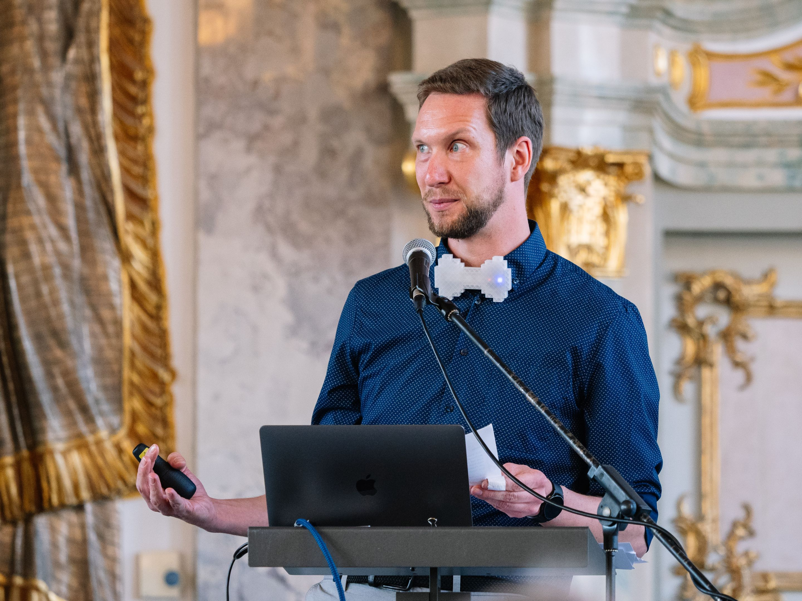
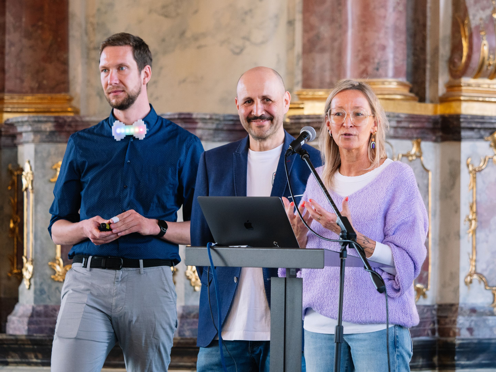
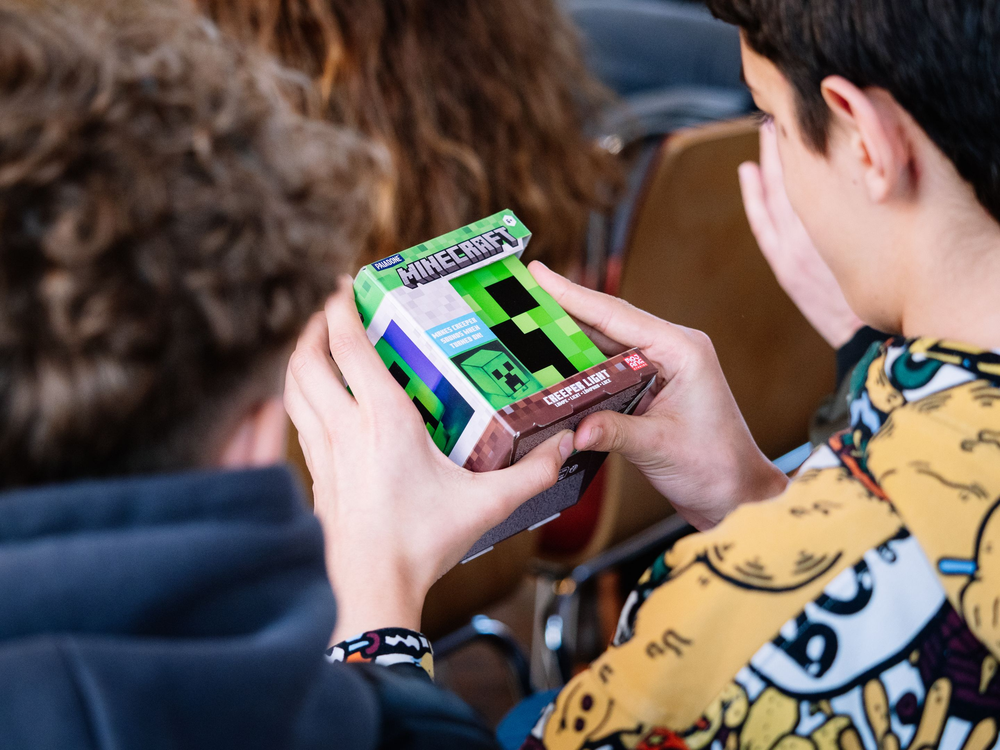
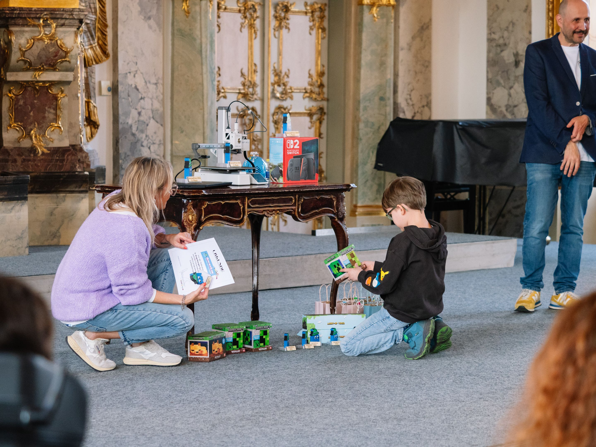
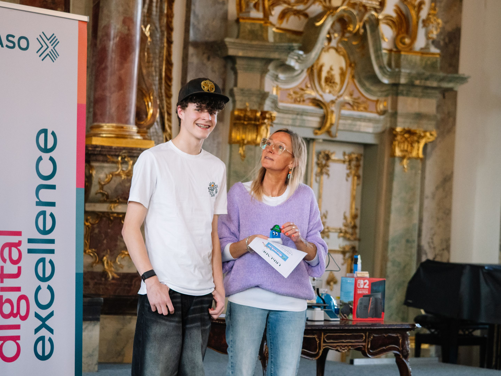
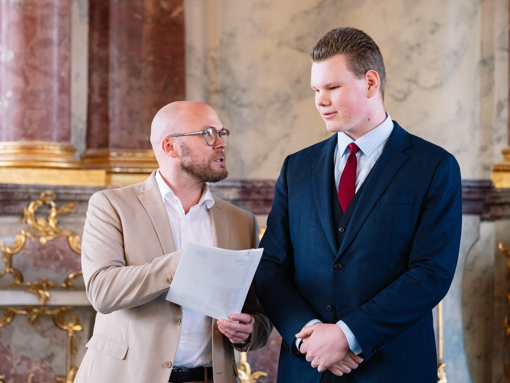
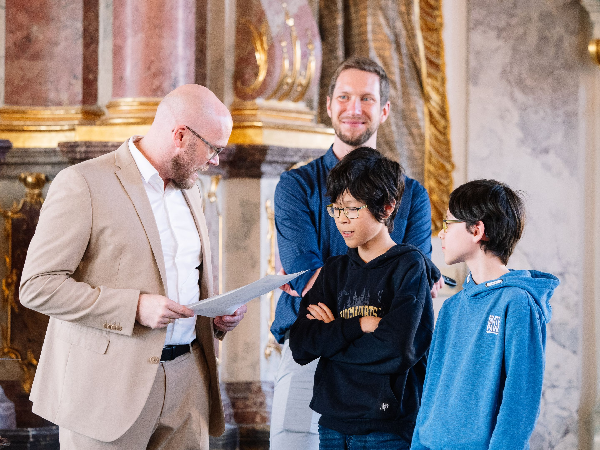
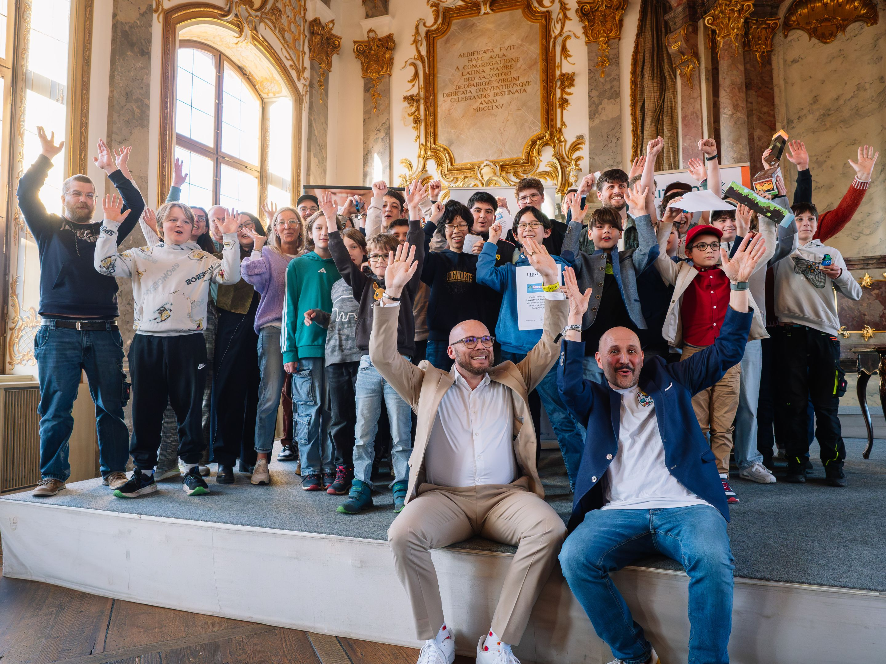

> 500 Schüler, 20 Klassen, 12 Preise — Bayerns Digitalminister zeichnet junge Programmiertalente aus.

**12. März 2026 · Kleiner Goldener Saal, Augsburg**

| | |
|---|---|
| **500 Schüler** | aus 20 Klassen |
| **3 Landkreise** | Augsburg & Umgebung |
| **12 Preise** | 3 Haupt- & 9 Kategoriepreise |
| **3. Durchgang** | Seit 2024 |

## Der Abend im Überblick

Am 12. März 2026 war der Kleine Goldene Saal in Augsburg für einen Abend fest in der Hand von Schülerinnen und Schülern, die eines gemeinsam haben: Sie haben in den vergangenen Wochen nicht gespielt — sie haben **Spiele gebaut**.

Der 3. Augsburger GamesPreis bildete den Abschluss des diesjährigen GamesLab, in dem rund **500 Schülerinnen und Schüler aus 20 Klassen** — aus Augsburg sowie den Landkreisen Augsburg und Aichach-Friedberg — kostenlos an eintägigen Workshops teilgenommen hatten. Sie lernten die Grundlagen von Game Design, Storytelling und Programmierung mit Scratch — viele von ihnen ohne jede Vorerfahrung.

Das Ergebnis: Dutzende selbst entwickelte Computerspiele, von denen die besten an diesem Abend ausgezeichnet wurden.





## Digitalminister Mehring überreicht die Hauptpreise

Bayerns Digitalminister Dr. Fabian Mehring, selbst gebürtiger Augsburger, überreichte persönlich die drei Hauptpreise.

> *„Unser Land steckt in der tiefsten Wirtschaftskrise seit dem Zweiten Weltkrieg. Um unseren Wohlstand in die Zukunft zu tragen, brauchen wir frische Ideen auf neuen Märkten. Umso mehr müssen wir jungen Leuten Bock auf Zukunft machen — und auf die Technologien des KI-Zeitalters, in dem sie ihr Leben verbringen werden."*

> *„Games sind Sport, Hightech und Zukunftsbranche zugleich. Wer heute programmieren lernt oder sich im Game Design ausprobiert, erwirbt Fähigkeiten, die in der digitalen Wirtschaft von morgen dringend gebraucht werden."*

> *„Veranstaltungen wie der Augsburger GamesPreis zeigen, wie viel Kreativität, Begeisterungsfähigkeit und technisches Talent bereits heute in der nächsten Generation unserer Heimat steckt."*

— **Dr. Fabian Mehring**, Bayerischer Staatsminister für Digitales

## Die Gewinner

### 1. Platz: „Die fliegende Untertasse"

*Yann und Ben Kratzer*

Die Titelverteidiger haben es wieder geschafft! Nach ihrem Sieg 2025 mit „Katz und Maus" überzeugen sie erneut: Eine fliegende Untertasse steuern, Zutaten einsammeln, in Töpfe bringen — mit physikalisch schlüssiger Flugbewegung, Minimap und selbst komponierter Musik.





Mehr zu Platz 1

---

### 2. Platz: „Billard-Extrem"

*Kilian Grün (16 Jahre)*

Auch Kilian ist kein Unbekannter: 2025 gewann er einen Kategoriepreis. Mit „Billard-Extrem" legt er nach — mathematisch berechnete Physik, realistische Stöße, 8-Ball-Regeln und Zweispieler-Modus.





Mehr zu Platz 2

---

### 3. Platz: „Schatzjäger"

*Matti Brousek, Jakob-Fugger-Gymnasium (9. Klasse)*

Ein cleveres Rätsel- und Reaktionsspiel: einfache Steuerung, überraschend knifflige Lösungen. Absolut stabil — keine Bugs, keine Abstürze.





Mehr zu Platz 3

---

## Kategoriepreise

Neben den drei Hauptpreisen vergab die Jury **neun Kategoriepreise** und einen **Publikumspreis**:

- **Affigstes Spiel** — Leonie: „Coco's Adventure"
- **Augschburg Regio** — Josef: „Lost in Augsburg"
- **Beste technische Umsetzung** — Dominik: „Minecraft Unfinished Edition"
- **Bester Game-Over-Sound** — Andi: „Der Dino hat dich…"
- **Gesichtsgulasch** — Jakob: „Ritterschlacht"
- **Gesunde Ernährung** — Danial: „Kaugummclaimer"
- **Jump & Run** — Aleks: „Classic Plattformer"
- **Nachhaltigkeit** — Aaron: „Car Repair Shop"
- **Beste Fortsetzung** — Fabian: „Raumschiff gegen Asteroiden — Part 2"
- **Zusammen / Werte** — Alex: „Werte an Schulen"
- **Menti-Preis** (Publikumsvoting) — Hannah: „Gaumenschmaus oder Garaus"

Alle Kategoriepreise im Detail

## Alle GamesPreis-Artikel


