> The annual game competition — show what you've built!

## 3rd Augsburger GamesPreis 2026

*Bavaria's Digital Minister honours young coding talent*

March 12, 2026 · Kleiner Goldener Saal, Augsburg

**500 students**

from 20 classes

**3 districts**

Augsburg and surrounding area

**12 prizes**

3 main prizes & 9 category prizes

**3rd edition**

Since 2024


### Coding, playing, winning

*The evening at a glance*

On March 12, 2026, the Kleiner Goldener Saal in Augsburg belonged, for one evening, entirely to students who all had one thing in common: over the past weeks, they hadn't been playing games — they'd been <strong>building</strong> them.

The 3rd Augsburger GamesPreis was the finale of this year's GamesLab, in which around <strong>500 students from 20 classes</strong> — from Augsburg as well as the districts of Augsburg and Aichach-Friedberg — had taken part in free one-day workshops. They learned the basics of game design, storytelling, and programming with Scratch — many of them with no prior experience at all.

The result: dozens of self-developed computer games, the best of which were honoured on this evening.





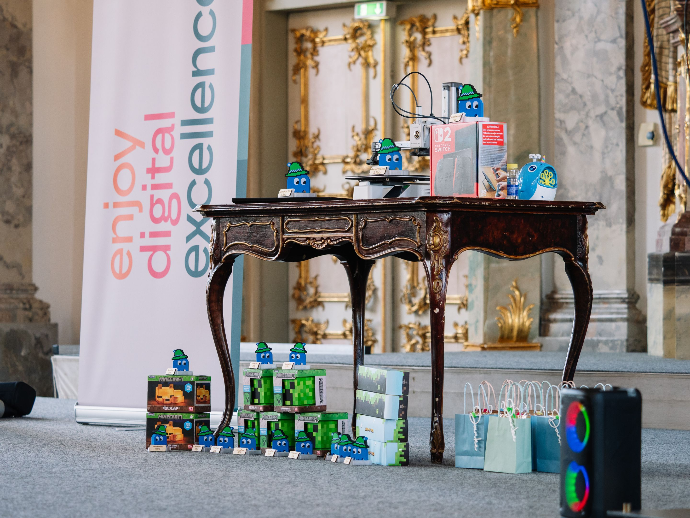
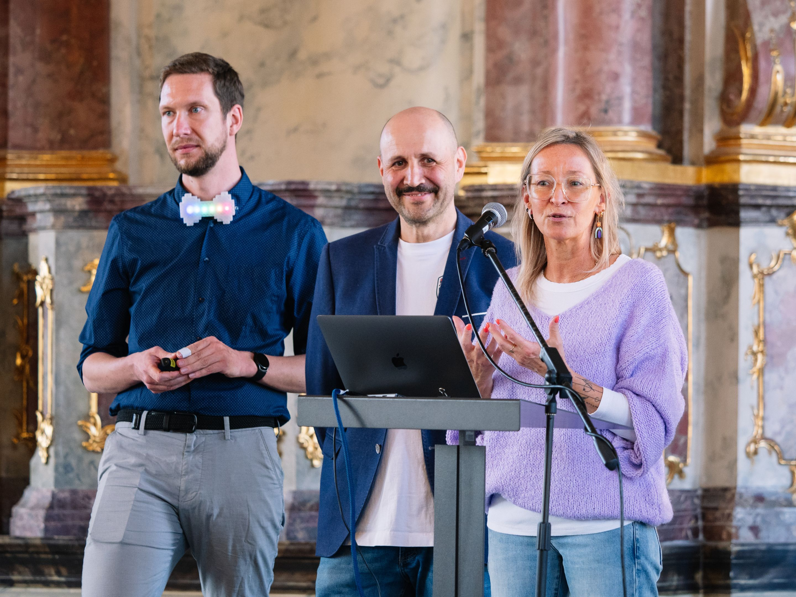

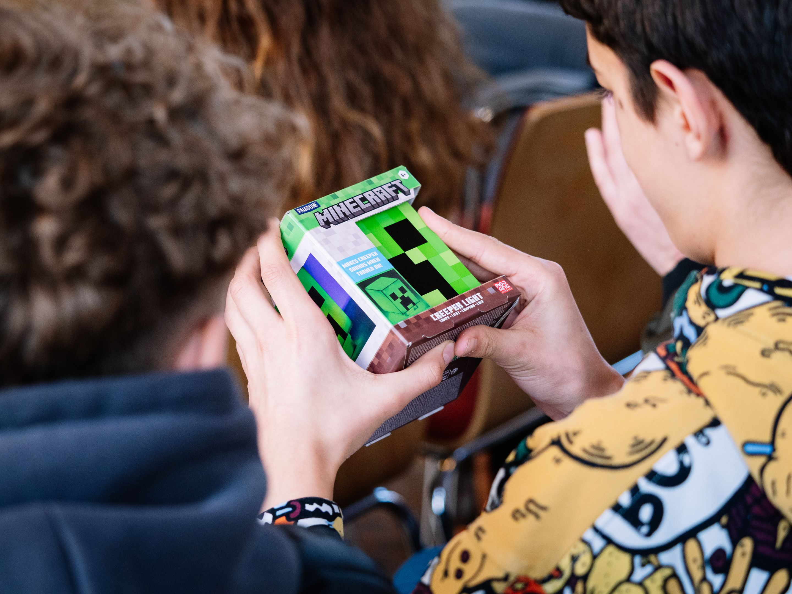

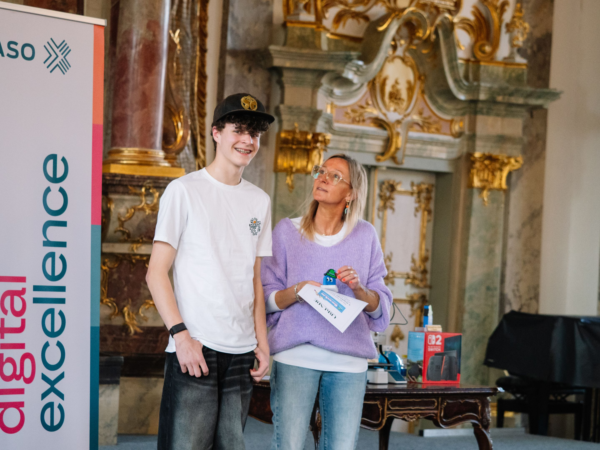
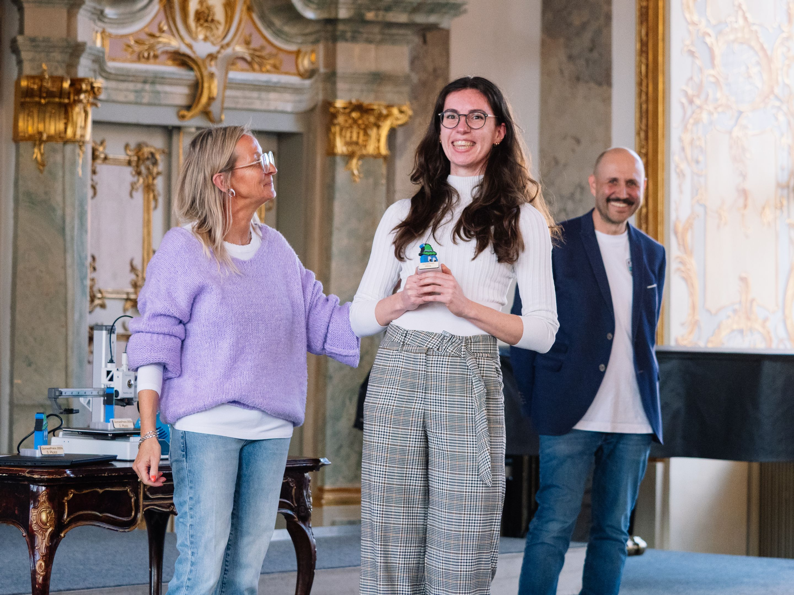
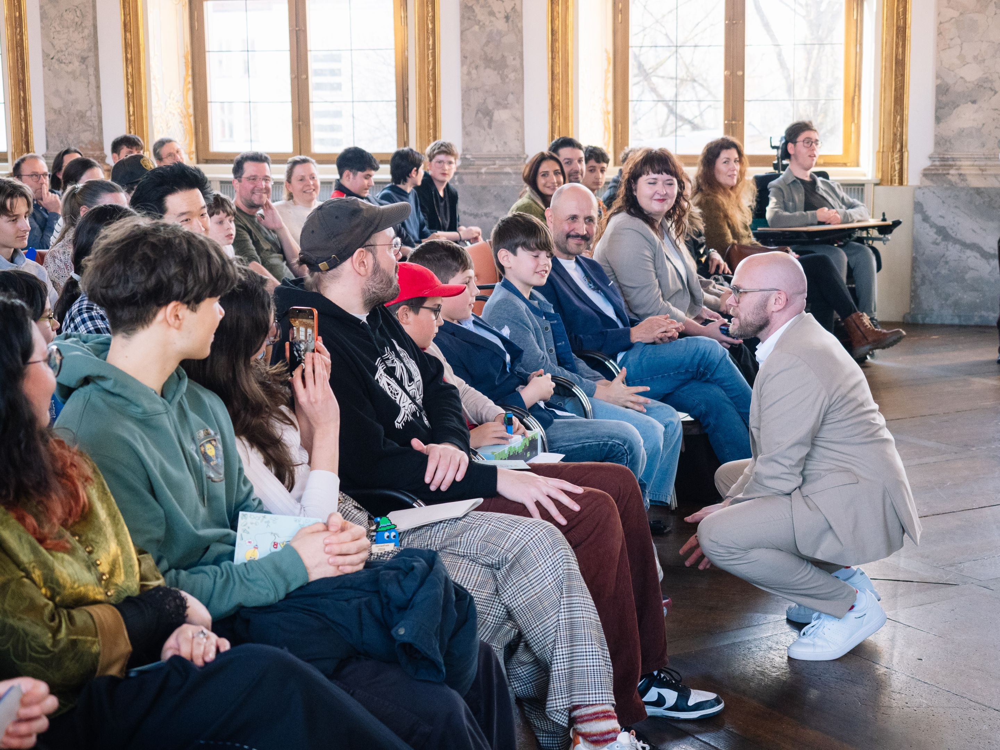
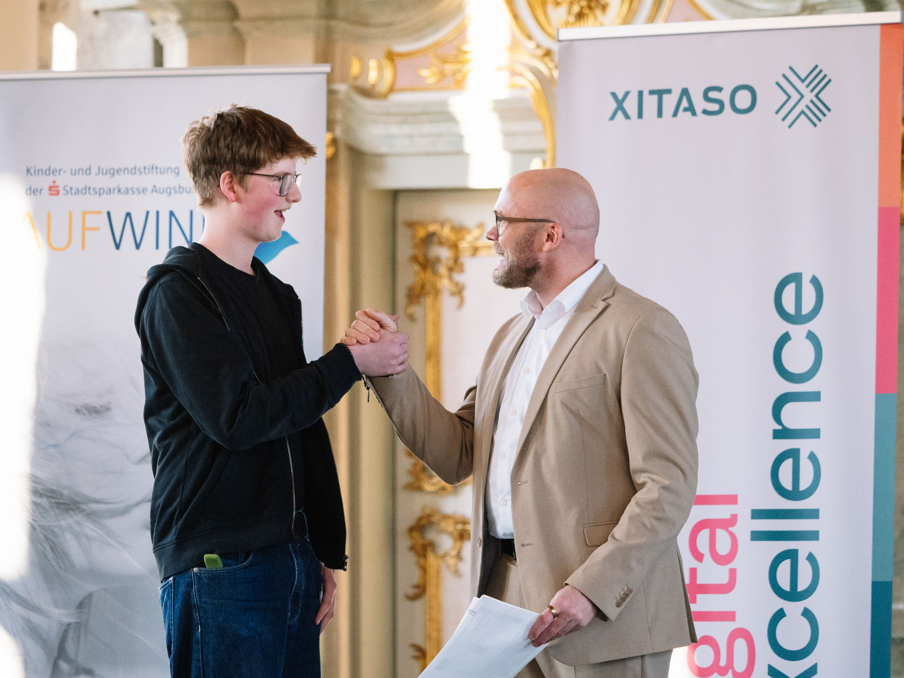
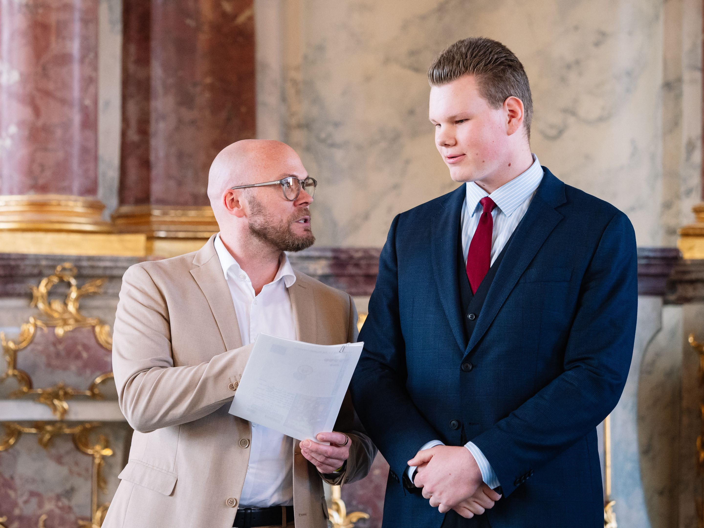
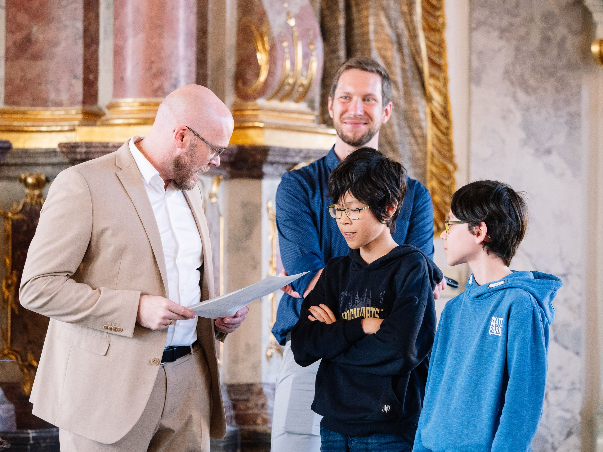

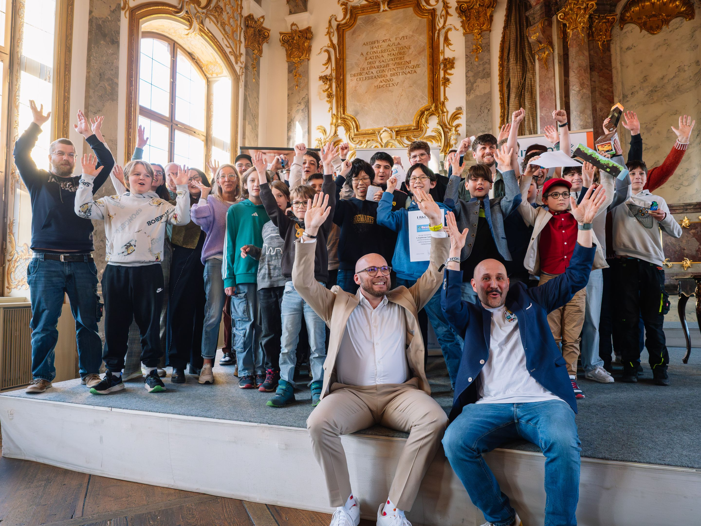
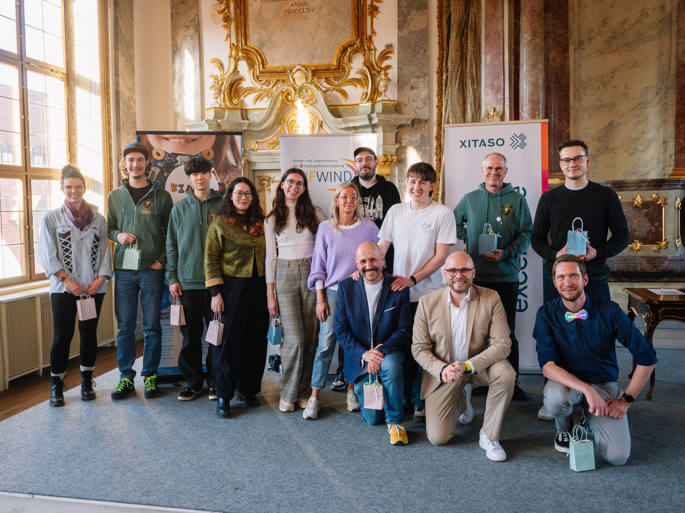




### Digital Minister Mehring presents the main prizes

*Guest of honour Dr. Fabian Mehring*

Bavaria's Digital Minister Dr. Fabian Mehring, himself born in Augsburg, personally presented the three main prizes. Having already kept his promise at the 2nd GamesPreis in 2025 by coming to Augsburg, he was back again in 2026.

Mehring used the occasion to clearly spell out the social relevance of formats like this one:

<em>"Our country is in the deepest economic crisis since World War II. To carry our prosperity into the future, we need fresh ideas in new markets. All the more reason to get young people excited about the future — and about the technologies of the AI age in which they'll spend their lives."</em>

<em>"Games are sport, high tech, and a future industry all at once. Anyone who learns to code today or tries their hand at game design acquires skills that will be urgently needed in tomorrow's digital economy."</em>

<em>"Events like the Augsburger GamesPreis show just how much creativity, enthusiasm, and technical talent already exists in the next generation of our region."</em>



## The winners of GamesPreis 2026


### 1st place: "Die fliegende Untertasse" (The Flying Saucer)

*Yann and Ben Kratzer*

<strong>Yann and Ben Kratzer</strong> – the defending champions did it again! After their 2025 win with "Katz und Maus," they impress once more: steering a flying saucer, collecting ingredients, delivering them to pots — with physically coherent flight movement, a minimap, and self-composed music.



More about 1st place

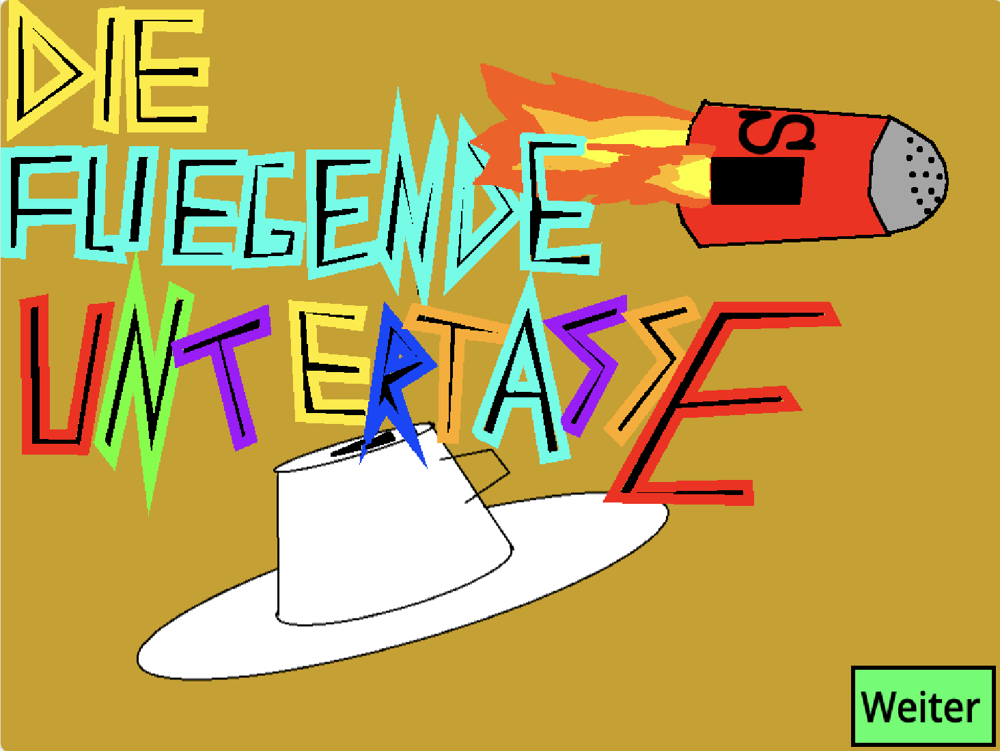


### 2nd place: "Billard-Extrem" (Billiards Extreme)

*Kilian Grün*

<strong>Kilian Grün (16 years old)</strong> – Kilian is no stranger here either: he won a category prize in 2025. With "Billard-Extrem" he follows up — mathematically calculated physics, realistic shots, 8-ball rules, and a two-player mode. A game that was polished over a long time.



More about 2nd place

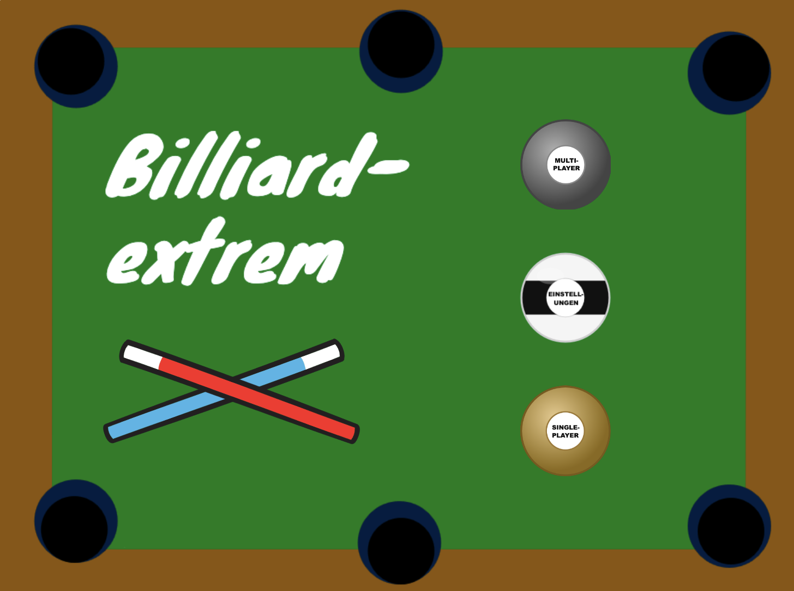


### 3rd place: "Schatzjäger" (Treasure Hunter)

*Matti Brousek*

<strong>Matti Brousek, Jakob-Fugger-Gymnasium (9th grade)</strong> – a clever puzzle and reaction game: simple controls, surprisingly tricky solutions. What impressed the jury most: the game runs absolutely stable — no bugs, no crashes. Several building-on-each-other sections make every round a challenge.



More about 3rd place

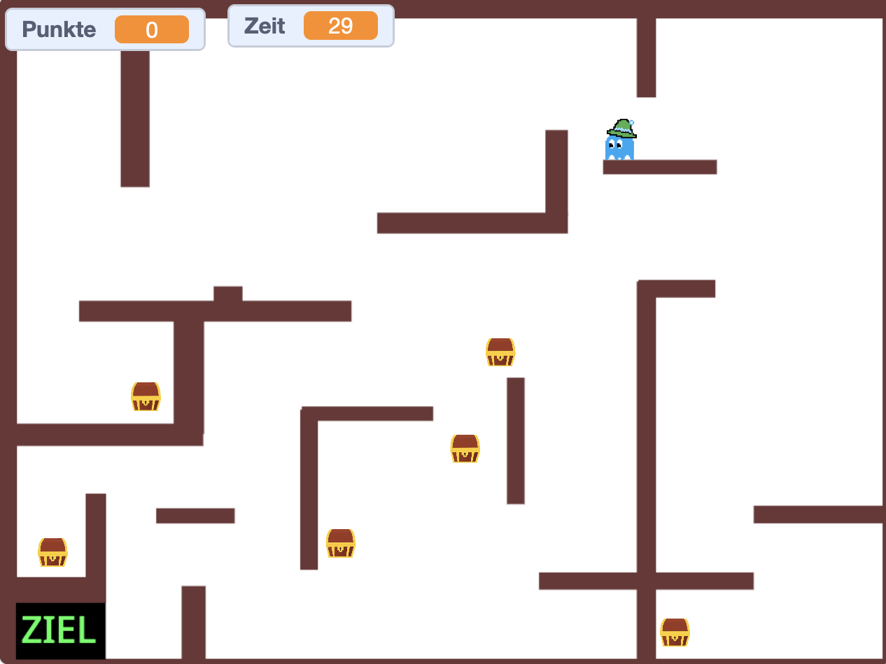








### Category prizes 2026

*11 further awards*

Besides the three main prizes, the jury awarded <strong>nine category prizes</strong> and one <strong>audience award</strong> for special achievements:
<ul><li><strong>Wackiest game</strong> – Leonie: "Coco's Adventure"</li><li><strong>Augschburg Regio</strong> – Josef: "Lost in Augsburg"</li><li><strong>Best technical execution</strong> – Dominik: "Minecraft Unfinished Edition"</li><li><strong>Best game-over sound</strong> – Andi: "Der Dino hat dich…" (The Dino Got You…)</li><li><strong>Face goulash</strong> – Jakob: "Ritterschlacht" (Knight Battle)</li><li><strong>Healthy eating</strong> – Danial: "Kaugummclaimer" (Gum Claimer)</li><li><strong>Jump & Run</strong> – Aleks: "Classic Plattformer"</li><li><strong>Sustainability</strong> – Aaron: "Car Repair Shop"</li><li><strong>Best sequel</strong> – Fabian: "Raumschiff gegen Asteroiden – Part 2" (Spaceship vs. Asteroids – Part 2)</li><li><strong>Together / Values</strong> – Alex: "Werte an Schulen" (Values at Schools)</li><li><strong>Menti prize</strong> (audience vote) – Hannah: "Gaumenschmaus oder Garaus" (Feast or Fiasco)</li></ul>


See all category prizes


### What is GamesLab?

*Free programme for school classes*

GamesLab is a free programme run by KidsLab, a nonprofit company (gGmbH) based in Augsburg. It's aimed at students in grades 5 to 13 — regardless of school type, prior knowledge, or background.

In one-day workshops, teenagers develop their own computer games in teams. They learn the basics of storytelling, game design, and programming with Scratch — and discover that programming isn't an abstract craft, but a tool for bringing their own ideas to life.

2026 was already the third edition. In total, <strong>more than 1,500 students</strong> have gone through GamesLab.

**All submitted games can be played directly in the browser: kidslab.de/gameslab**


## All GamesPreis articles


