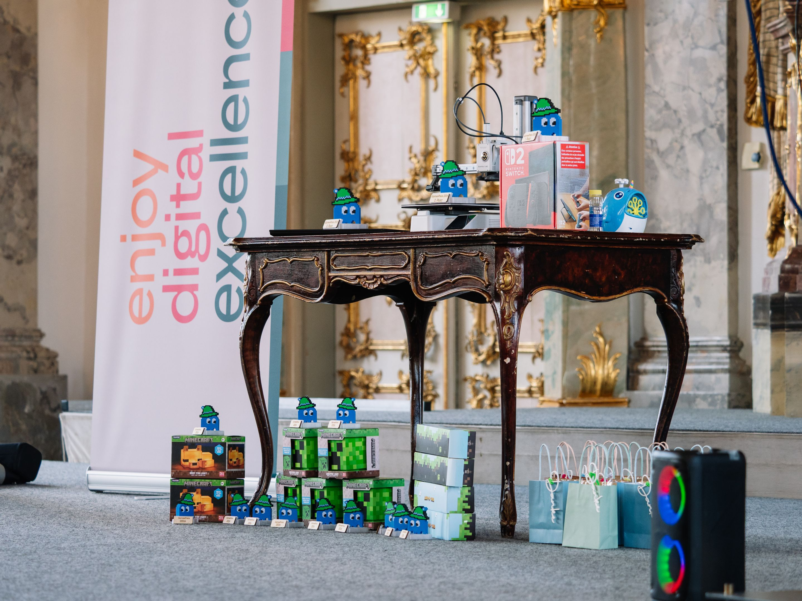
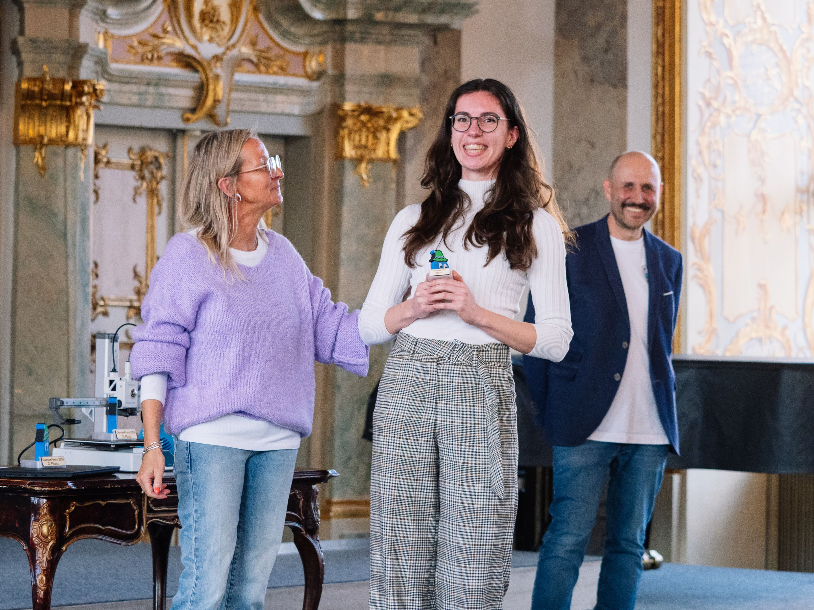
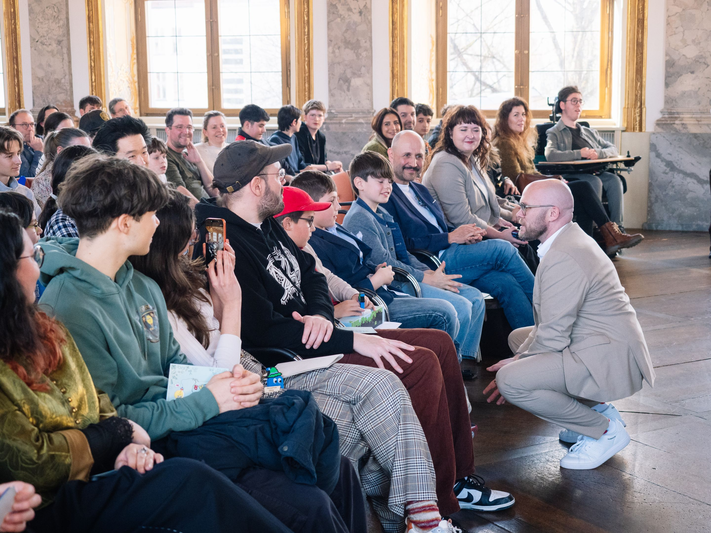
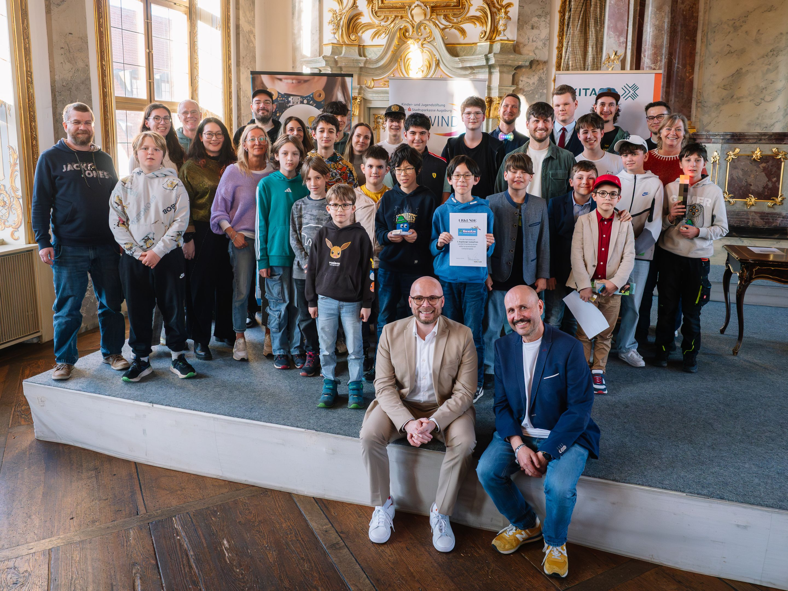
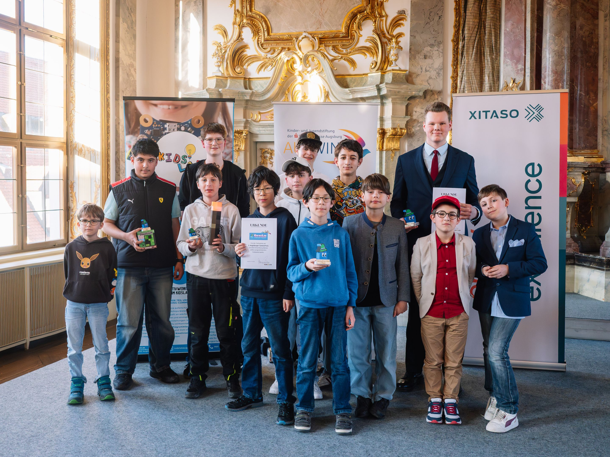
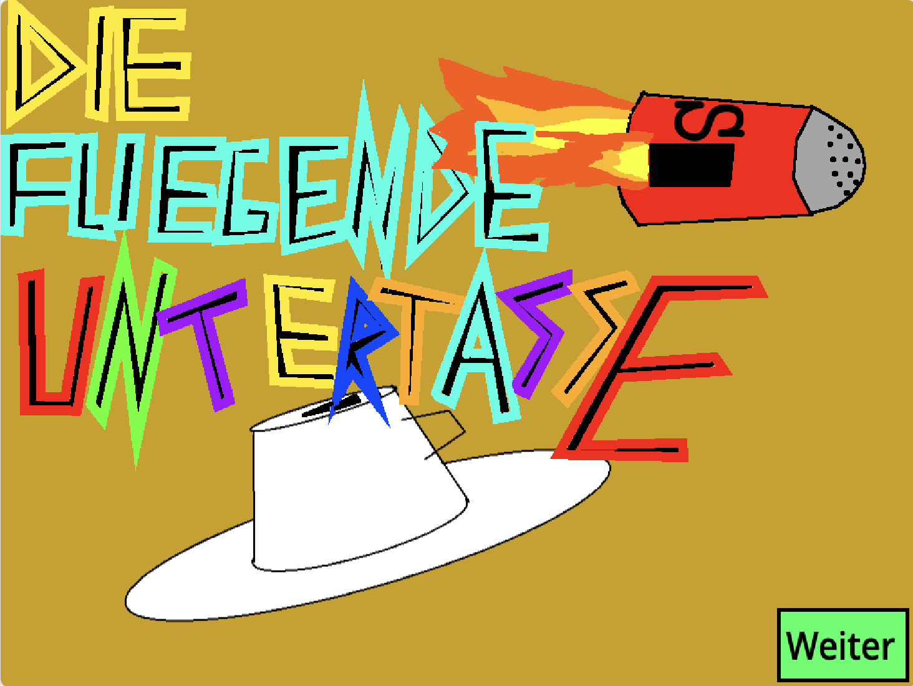
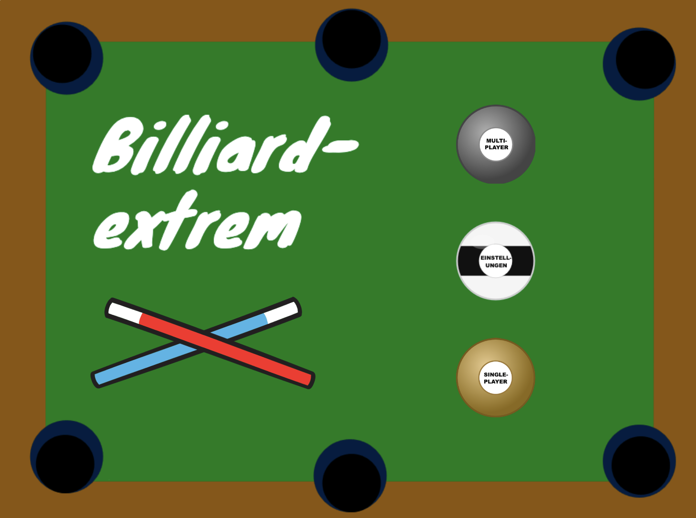
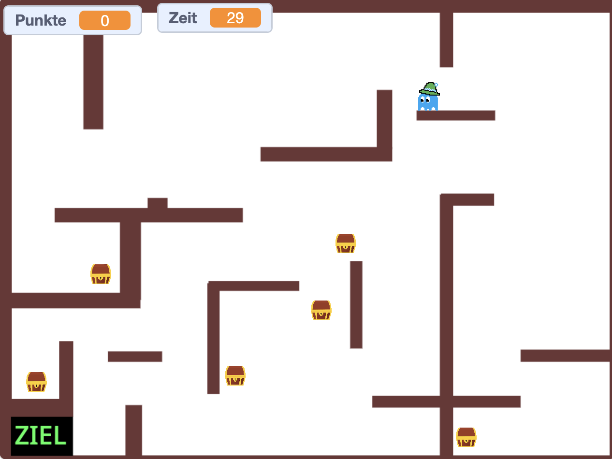

> Der jährliche Spielewettbewerb — zeig, was du gebaut hast!

## 3. Augsburger GamesPreis 2026

*Bayerns Digitalminister zeichnet junge Programmiertalente aus*

12. März 2026 · Kleiner Goldener Saal, Augsburg

**500 Schüler**

aus 20 Klassen

**3 Landkreise**

Augsburg & Umgebung

**12 Preise**

3 Haupt- & 9 Kategoriepreise

**3. Durchgang**

Seit 2024


### Programmieren, spielen, gewinnen

*Der Abend im Überblick*

Am 12. März 2026 war der Kleine Goldene Saal in Augsburg für einen Abend fest in der Hand von Schülerinnen und Schülern, die eines gemeinsam haben: Sie haben in den vergangenen Wochen nicht gespielt – sie haben <strong>Spiele gebaut</strong>.

Der 3. Augsburger GamesPreis bildete den Abschluss des diesjährigen GamesLab, in dem rund <strong>500 Schülerinnen und Schüler aus 20 Klassen</strong> – aus Augsburg sowie den Landkreisen Augsburg und Aichach-Friedberg – kostenlos an eintägigen Workshops teilgenommen hatten. Sie lernten die Grundlagen von Game Design, Storytelling und Programmierung mit Scratch – viele von ihnen ohne jede Vorerfahrung.

Das Ergebnis: Dutzende selbst entwickelte Computerspiele, von denen die besten an diesem Abend ausgezeichnet wurden.








### Digitalminister Mehring überreicht die Hauptpreise

*Ehrengast Dr. Fabian Mehring*

Bayerns Digitalminister Dr. Fabian Mehring, selbst gebürtiger Augsburger, überreichte persönlich die drei Hauptpreise. Bereits beim 2. GamesPreis 2025 hatte er sein Versprechen eingelöst und war nach Augsburg gekommen – 2026 war er erneut dabei.

Mehring nutzte die Gelegenheit, um die gesellschaftliche Relevanz solcher Formate klar zu benennen:

<em>„Unser Land steckt in der tiefsten Wirtschaftskrise seit dem Zweiten Weltkrieg. Um unseren Wohlstand in die Zukunft zu tragen, brauchen wir frische Ideen auf neuen Märkten. Umso mehr müssen wir jungen Leuten Bock auf Zukunft machen – und auf die Technologien des KI-Zeitalters, in dem sie ihr Leben verbringen werden."</em>

<em>„Games sind Sport, Hightech und Zukunftsbranche zugleich. Wer heute programmieren lernt oder sich im Game Design ausprobiert, erwirbt Fähigkeiten, die in der digitalen Wirtschaft von morgen dringend gebraucht werden."</em>

<em>„Veranstaltungen wie der Augsburger GamesPreis zeigen, wie viel Kreativität, Begeisterungsfähigkeit und technisches Talent bereits heute in der nächsten Generation unserer Heimat steckt."</em>



## Die Gewinner des GamesPreis 2026


### 1. Platz: „Die fliegende Untertasse"

*Yann und Ben Kratzer*

<strong>Yann und Ben Kratzer</strong> – Die Titelverteidiger haben es wieder geschafft! Nach ihrem Sieg 2025 mit „Katz und Maus" überzeugen sie erneut: Eine fliegende Untertasse steuern, Zutaten einsammeln, in Töpfe bringen – mit physikalisch schlüssiger Flugbewegung, Minimap und selbst komponierter Musik.



Mehr zu Platz 1


### 2. Platz: „Billard-Extrem"

*Kilian Grün*

<strong>Kilian Grün (16 Jahre)</strong> – Auch Kilian ist kein Unbekannter: 2025 gewann er einen Kategoriepreis. Mit „Billard-Extrem" legt er nach – mathematisch berechnete Physik, realistische Stöße, 8-Ball-Regeln und Zweispieler-Modus. Ein Spiel, an dem lange gefeilt wurde.



Mehr zu Platz 2


### 3. Platz: „Schatzjäger"

*Matti Brousek*

<strong>Matti Brousek, Jakob-Fugger-Gymnasium (9. Klasse)</strong> – Ein cleveres Rätsel- und Reaktionsspiel: einfache Steuerung, überraschend knifflige Lösungen. Was die Jury besonders beeindruckt hat: Das Spiel läuft absolut stabil – keine Bugs, keine Abstürze. Mehrere aufeinander aufbauende Abschnitte machen jede Runde zur Herausforderung.



Mehr zu Platz 3








### Kategoriepreise 2026

*11 weitere Auszeichnungen*

Neben den drei Hauptpreisen vergab die Jury <strong>neun Kategoriepreise</strong> und einen <strong>Publikumspreis</strong> für besondere Leistungen:
<ul><li><strong>Affigstes Spiel</strong> – Leonie: „Coco's Adventure"</li><li><strong>Augschburg Regio</strong> – Josef: „Lost in Augsburg"</li><li><strong>Beste technische Umsetzung</strong> – Dominik: „Minecraft Unfinished Edition"</li><li><strong>Bester Game-Over-Sound</strong> – Andi: „Der Dino hat dich…"</li><li><strong>Gesichtsgulasch</strong> – Jakob: „Ritterschlacht"</li><li><strong>Gesunde Ernährung</strong> – Danial: „Kaugummclaimer"</li><li><strong>Jump &amp; Run</strong> – Aleks: „Classic Plattformer"</li><li><strong>Nachhaltigkeit</strong> – Aaron: „Car Repair Shop"</li><li><strong>Beste Fortsetzung</strong> – Fabian: „Raumschiff gegen Asteroiden – Part 2"</li><li><strong>Zusammen / Werte</strong> – Alex: „Werte an Schulen"</li><li><strong>Menti-Preis</strong> (Publikumsvoting) – Hannah: „Gaumenschmaus oder Garaus"</li></ul>


Alle Kategoriepreise ansehen


### Was ist das GamesLab?

*Kostenloses Programm für Schulklassen*

Das GamesLab ist ein kostenloses Programm des KidsLab, einer gemeinnützigen GmbH mit Sitz in Augsburg. Es richtet sich an Schülerinnen und Schüler der Klassen 5 bis 13 – unabhängig von Schulart, Vorwissen oder Hintergrund.

In eintägigen Workshops entwickeln Jugendliche in Teams eigene Computerspiele. Sie lernen dabei Grundlagen von Storytelling, Game Design und Programmierung mit Scratch – und erfahren, dass Programmieren kein abstraktes Handwerk ist, sondern ein Werkzeug, um eigene Ideen zum Leben zu erwecken.

2026 war bereits der dritte Durchgang. Insgesamt haben damit <strong>mehr als 1.500 Schülerinnen und Schüler</strong> das GamesLab durchlaufen.

**Alle eingereichten Spiele können direkt im Browser gespielt werden: kidslab.de/gameslab**


## Alle GamesPreis-Artikel


