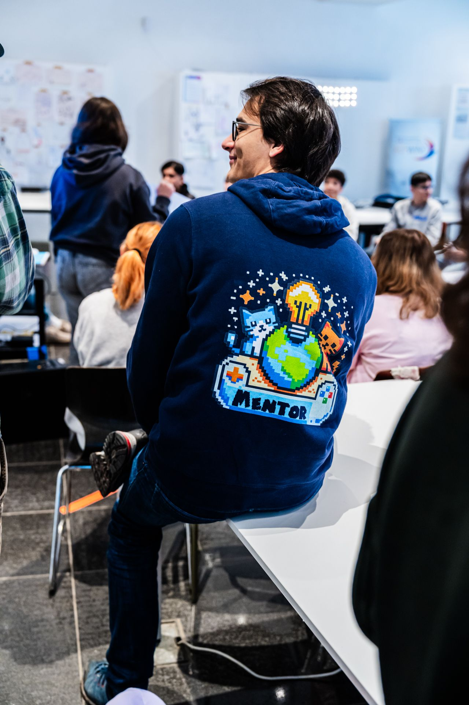

> Personal support for your game project — we help you stick with it.

<h1>Become a mentor at GamesLab 2026</h1><h2>A morning that makes a difference</h2>
Do you remember what it feels like to learn something new — and suddenly it clicks? That moment when confusion turns into understanding, and "I can't do this" turns into a proud "I made this!"?

<strong>That's exactly the moment 20–25 students experience every morning at GamesLab.</strong>

They arrive with their class, often with no prior experience, and three hours later they go home with a game they programmed themselves. For many, it's their first real contact with programming — and you can be there when the spark catches.
<h2>Why we need you</h2>
The students don't need coding professionals. They need people like you — people who:
<ul><li>
Are patient when someone asks for the third time why the loop isn't running
</li><li>
Genuinely celebrate when the first game works
</li><li>
Show that programming isn't rocket science
</li><li>
Pass on their enthusiasm for technology authentically
</li></ul><h2>Event details at a glance</h2>
<strong>When:</strong> January 15 to February 12, 2026 (Monday to Thursday) <strong>Time:</strong> 8:30 am – 12:30 pm (4 hours) <strong>Where:</strong> Zwischenzeit, Annastraße 16, Augsburg (pedestrian zone, 3 min. from Königsplatz) <strong>Who:</strong> school classes (grades 5–13), approx. 20–25 students per workshop <strong>Team:</strong> 2 mentors per day <strong>Pay:</strong> €15/hour (Übungsleiterpauschale = tax-free in Germany)

## Sign up!

Just send a short email to gregor@kidslab.de or a WhatsApp message!

WhatsApp message

## How a workshop day works

<h3>8:30 am: Arrival</h3>
Short briefing, check laptops, lay out materials. The class arrives at 9 am.

<strong>Your role:</strong> arrive relaxed, quick chat with the other mentor.

<h3>9:00 – 11:30 am: Workshop</h3>
Students get to know Scratch and build their own games:
<ul><li>
<strong>Technical help:</strong> when the code doesn't run
</li><li>
<strong>Encourage:</strong> when frustration builds up
</li><li>
<strong>Celebrate together:</strong> when it works
</li><li>
<strong>Move around:</strong> make sure nobody gets left behind
</li></ul>

<h3>11:30 am – 12:30 pm: Wrap-up</h3>
Students show off their games and celebrate their successes. Then: tidy up and a short feedback round.

<strong>Your role:</strong> clap, praise, marvel — and mean it. Then pack away the laptops together.

## Time commitment

<strong>Before it starts:</strong>
<ul><li>
Mentor meeting in January (date by arrangement)
</li><li>
Introduction to Scratch and the workshop format
</li></ul>

<strong>During GamesLab:</strong>
<ul><li>
You sign up for the days that work for you
</li><li>
No minimum — even a single day helps
</li><li>
5 weeks, 4 days per week = 20 possible dates
</li></ul>

<strong>Ideal for:</strong>
<ul><li>
Students with a flexible schedule
</li><li>
Working people who can take a morning off
</li><li>
Anyone looking for a change from everyday life
</li></ul>

## What you should bring

<h3>What matters:</h3><ul><li>
Enthusiasm for working with young people
</li><li>
Patience — a lot of it
</li><li>
The ability to show enthusiasm
</li><li>
Reliability on the days you sign up for
</li></ul>

<h3>What helps:</h3><ul><li>
Basic knowledge of Scratch or another programming language
</li><li>
Experience with children or teenagers
</li><li>
Staying calm when 25 students shout "help!" at once
</li></ul>

<h3>Not necessary:</h3><ul><li>
A computer science degree or training
</li><li>
Prior experience as a mentor
</li><li>
Answers to every technical question
</li><li>
Pedagogical training
</li></ul>

## Still hesitating?

<strong>"I can barely use Scratch myself"</strong> No problem. You'll get an introduction, and the basics take about an hour to learn. The students start from zero — you just need to be one step ahead.

<strong>"I have no experience with kids"</strong> The teacher is there and knows the class. You're the technical support, not the pedagogical lead.

<strong>"What if I can't answer a question?"</strong> Then you say: "Good question, let's figure it out together." That's exactly how programming works.

## Ready to join?

<h3>Just get in touch:</h3>
Let us know briefly which days would work for you — or that you'd like more info first. Either is totally fine.

<strong>Email:</strong> <a href="mailto:gregor@kidslab.de">gregor@kidslab.de</a> <strong>WhatsApp/phone:</strong> 0821-99951920
<h3>Not your thing?</h3>
No problem! Maybe you know someone who'd be perfect for it? Students, apprentices, tech-enthusiastic people with free mornings — we appreciate every tip.

