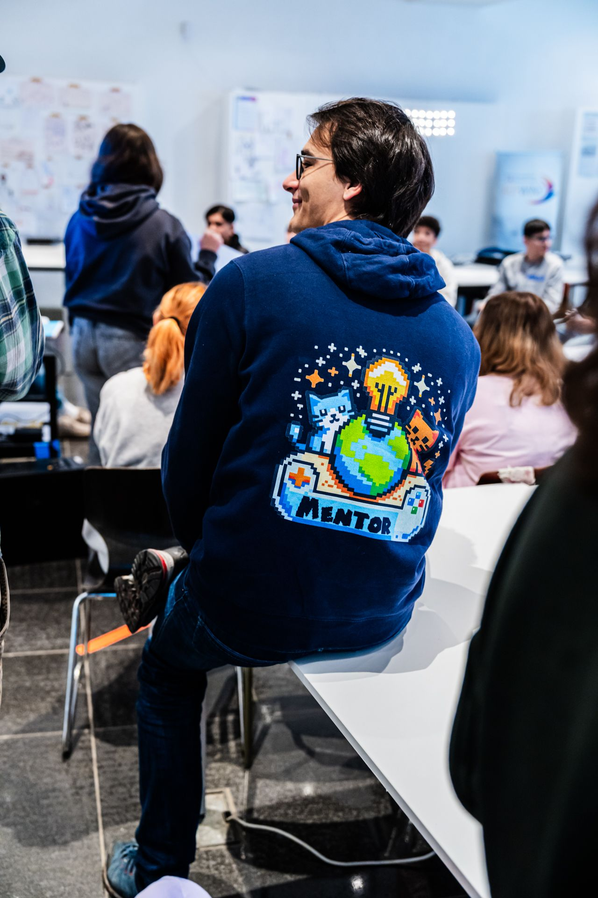

> Persönliche Begleitung für dein Spieleprojekt — wir helfen dir, dranzubleiben.

<h1>Werde Mentor:in beim GamesLab 2026</h1><h2>Ein Vormittag, der etwas bewegt</h2>
Weißt du noch, wie es sich anfühlt, etwas Neues zu lernen - und plötzlich macht es Klick? Dieser Moment, wenn aus Verwirrung Verstehen wird und aus "Das kann ich nicht" ein stolzes "Das hab ich gemacht!"?

<strong>Genau diesen Moment erleben jeden Vormittag 20-25 Schülerinnen und Schüler im GamesLab.</strong>

Sie kommen mit ihrer Klasse, oft ohne jede Vorerfahrung, und gehen drei Stunden später mit einem selbst programmierten Spiel nach Hause. Für viele ist es der erste Kontakt mit echtem Programmieren - und du kannst dabei sein, wenn der Funke überspringt.
<h2>Warum wir dich brauchen</h2>
Die Schülerinnen und Schüler brauchen keine Coding-Profis. Sie brauchen Menschen wie dich - Menschen, die:
<ul><li>
Geduld haben, wenn jemand zum dritten Mal fragt, warum die Schleife nicht läuft
</li><li>
Sich ehrlich mitfreuen, wenn das erste Spiel funktioniert
</li><li>
Zeigen, dass Programmieren kein Hexenwerk ist
</li><li>
Die Begeisterung für Technik authentisch weitergeben
</li></ul><h2>Event-Details auf einen Blick</h2>
<strong>Wann:</strong> 15. Januar bis 12. Februar 2026 (Montag bis Donnerstag) <strong>Uhrzeit:</strong> 8:30 - 12:30 Uhr (4 Stunden) <strong>Wo:</strong> Zwischenzeit, Annastraße 16, Augsburg (Fußgängerzone, 3 Min. vom Königsplatz) <strong>Wer:</strong> Schulklassen (Klasse 5-13), ca. 20-25 Schüler pro Workshop <strong>Team:</strong> 2 Mentor:innen pro Tag <strong>Vergütung:</strong> 15 Euro/Stunde (Übungsleiterpauschale = Steuerfrei)

## Melde dich!

Schreib einfach eine kurze Mail an gregor@kidslab.de oder eine WhatsApp-Nachricht! 

Whatsapp-Nachricht

## So läuft ein Workshop-Tag ab

<h3>8:30 Uhr: Ankommen</h3>
Kurzes Briefing, Laptops checken, Material bereitlegen. Die Klasse kommt um 9 Uhr.

<strong>Deine Rolle:</strong> Entspannt ankommen, kurzer Austausch mit dem anderen Mentor.

<h3>9:00 - 11:30 Uhr: Workshop</h3>
Die Schüler lernen Scratch kennen und bauen ihre eigenen Spiele:
<ul><li>
<strong>Technische Hilfe:</strong> Wenn der Code nicht läuft
</li><li>
<strong>Ermutigen:</strong> Wenn Frust aufkommt
</li><li>
<strong>Mitfreuen:</strong> Wenn es klappt
</li><li>
<strong>Rumgehen:</strong> Niemanden abhängen lassen
</li></ul>

<h3>11:30 - 12:30 Uhr: Abschluss</h3>
Die Schüler zeigen ihre Spiele, feiern ihre Erfolge. Danach: Aufräumen und kurzes Feedback.

<strong>Deine Rolle:</strong> Klatschen, loben, staunen - und das ernst meinen. Dann gemeinsam die Laptops verstauen.

## Zeitlicher Aufwand

<strong>Vor dem Start:</strong>
<ul><li>
Mentoren-Treffen im Januar (Termin nach Absprache)
</li><li>
Einführung in Scratch und den Workshop-Ablauf
</li></ul>

<strong>Während des GamesLab:</strong>
<ul><li>
Du meldest dich für die Tage an, die dir passen
</li><li>
Keine Mindestanzahl - auch ein einzelner Tag hilft
</li><li>
5 Wochen, 4 Tage pro Woche = 20 mögliche Termine
</li></ul>

<strong>Ideal für:</strong>
<ul><li>
Studierende mit flexiblem Stundenplan
</li><li>
Berufstätige, die sich einen Vormittag freinehmen können
</li><li>
Alle, die Lust auf Abwechslung vom Alltag haben
</li></ul>

## Was du mitbringen solltest

<h3>Das ist wichtig:</h3><ul><li>
Lust auf die Arbeit mit jungen Menschen
</li><li>
Geduld - viel Geduld
</li><li>
Die Fähigkeit, Begeisterung zu zeigen
</li><li>
Zuverlässigkeit an den Tagen, für die du dich anmeldest
</li></ul>

<h3>Das ist hilfreich:</h3><ul><li>
Grundkenntnisse in Scratch oder einer anderen Programmiersprache
</li><li>
Erfahrung mit Kindern oder Jugendlichen
</li><li>
Ruhe bewahren, wenn 25 Schüler gleichzeitig "Hilfe!" rufen
</li></ul>

<h3>Nicht notwendig:</h3><ul><li>
Informatik-Studium oder -Ausbildung
</li><li>
Vorerfahrung als Mentor:in
</li><li>
Antworten auf alle technischen Fragen
</li><li>
Pädagogische Ausbildung
</li></ul>

## Du zögerst noch?

<strong>"Ich kann selbst kaum Scratch"</strong> Kein Problem. Du bekommst eine Einführung, und die Basics sind in einer Stunde gelernt. Die Schüler fangen bei null an - du musst nur einen Schritt voraus sein.

<strong>"Ich habe keine Erfahrung mit Kindern"</strong> Die Lehrkraft ist dabei und kennt die Klasse. Du bist die technische Unterstützung, nicht die pädagogische Leitung.

<strong>"Was, wenn ich eine Frage nicht beantworten kann?"</strong> Dann sagst du: "Gute Frage, lass uns das gemeinsam rausfinden." Genau so funktioniert Programmieren.

## Bereit, dabei zu sein?

<h3>Melde dich einfach:</h3>
Schreib kurz, an welchen Tagen du könntest - oder dass du erstmal mehr Infos willst. Beides ist völlig okay.

<strong>E-Mail:</strong> <a href="mailto:gregor@kidslab.de">gregor@kidslab.de</a> <strong>WhatsApp/Telefon:</strong> 0821-99951920
<h3>Nicht dein Ding?</h3>
Kein Problem! Vielleicht kennst du jemanden, für den das perfekt wäre? Studierende, Azubis, technikbegeisterte Menschen mit freien Vormittagen - wir freuen uns über jeden Tipp.

