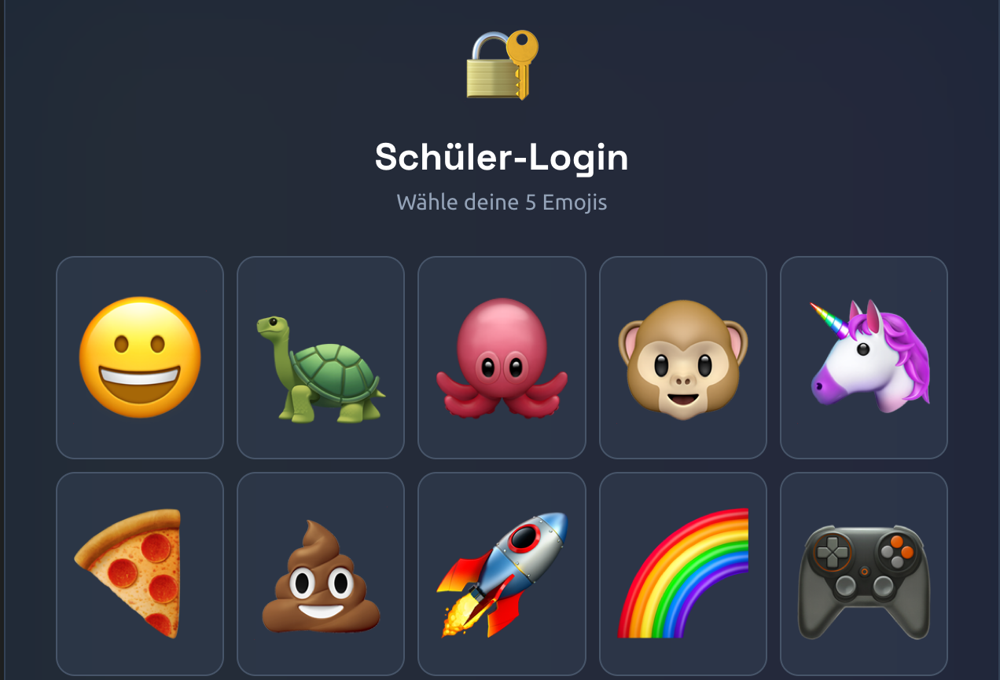
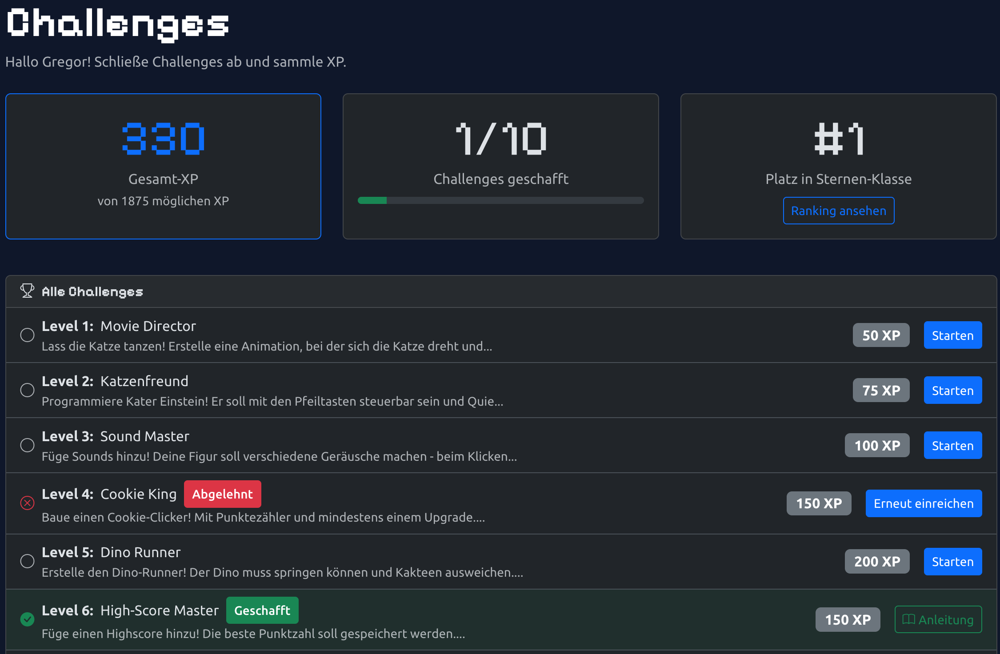
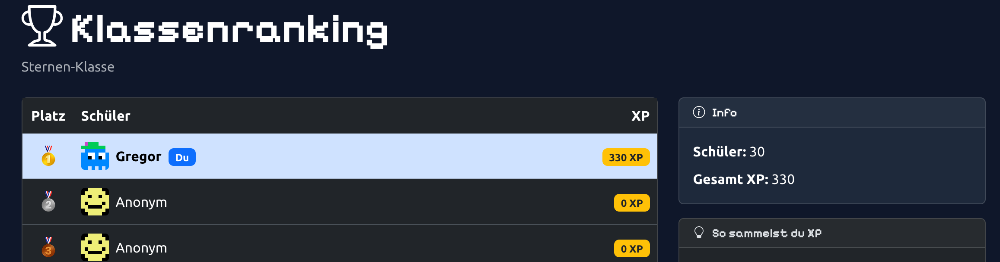
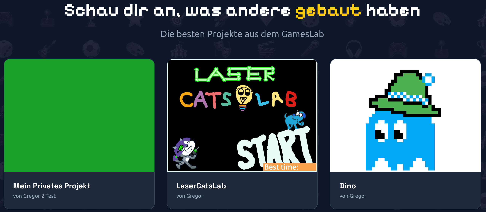
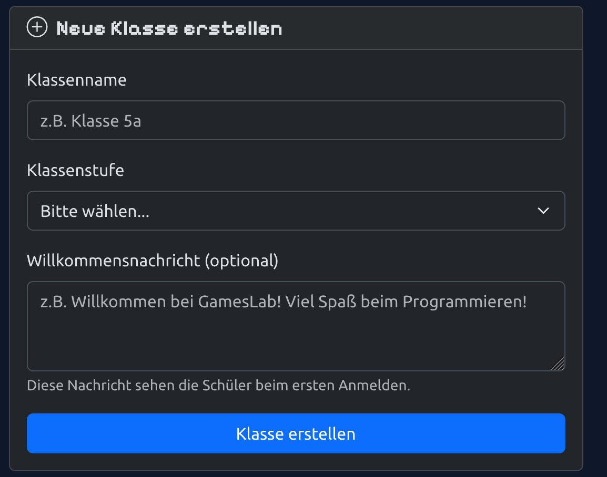
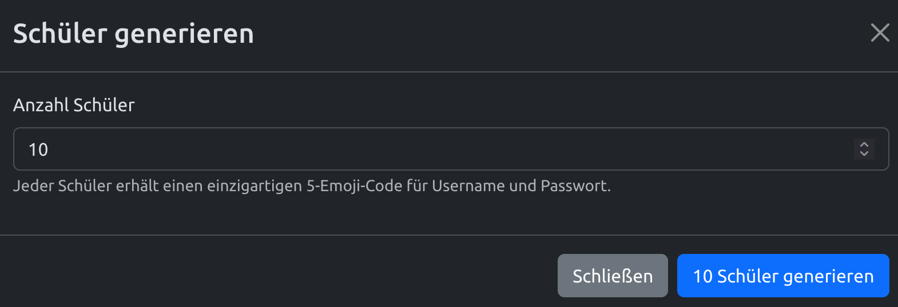
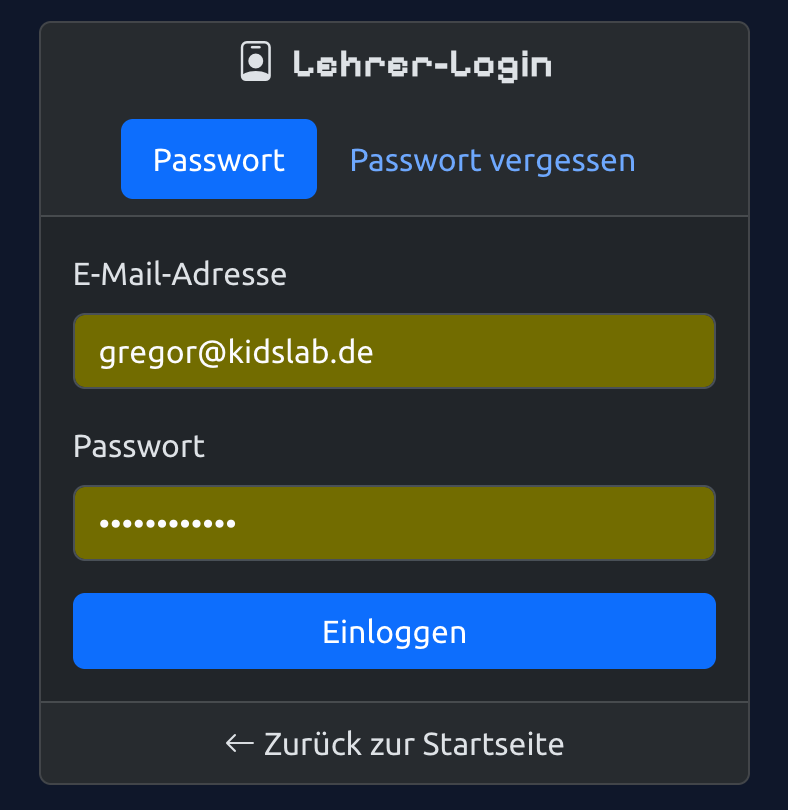

> The free platform for Scratch in the classroom — with emoji login, challenges, and a leaderboard.

Learning to program often comes with hurdles for kids: complicated logins, lack of motivation, no feedback. **GamesLab Studio** solves exactly these problems.



## What makes GamesLab Studio special?

- **Emoji login** — kids log in with 5 emojis. No forgotten passwords, no email needed
- **Challenges** — structured programming tasks with XP rewards
- **Leaderboard** — friendly competition within the class (top 3 get medals)
- **Share projects** — present Scratch games directly on the platform
- **Free** — a completely free offer from KidsLab gGmbH
- **Privacy-friendly** — no personal student data needed

## How it works

### Emoji login

Forget complicated passwords! In GamesLab, students log in with **5 emojis as a username** and **5 emojis as a password**.

### Challenges — tasks with rewards

Challenges are structured programming tasks — similar to homework, but with a reward system:

- Different difficulty levels (level 1–5)
- XP points as a reward
- GamesPreis challenges for the competition

### Leaderboard

The class ranking shows who has collected the most XP. Encourages friendly competition and motivates continued learning.

### Projects & studios

Students can share their Scratch projects directly on the platform. Projects are organised into studios (collections) — perfect for classroom presentations.

## For teachers

### Why GamesLab Studio?

- **Easy to get started** — no complicated password management
- **Motivation through gamification** — challenges, XP, and leaderboards spur students on
- **No account chaos** — you create the logins, students don't need an email
- **GamesPreis** — the best projects can enter the competition

### How to get started

1. **Create a class** — set a name, grade level, and welcome message

   

2. **Generate students** — automatically create emoji logins for the whole class

   

3. **Log in as a teacher** — an overview of all classes and students

   

4. **Print login cards** — PDF with QR codes and emoji logins (2×4 per A4 sheet)
5. **Assign challenges** — select tasks and set deadlines
6. **Review submissions** — approve projects or send them back with feedback

### Tips for the classroom

- **Weekly challenges** — regular small tasks work better than a few big ones
- **Discuss the leaderboard** — praise top performers, encourage others
- **Present projects** — have students show their games to the class

## Frequently asked questions


**"A student forgot their emojis"** — no problem! Look up or reassign login details any time in the class management view.

**"Can I have multiple classes?"** — Yes! Create and manage as many classes as you like.

**"Is the data safe?"** — Yes. No personal data needed. The emoji logins are anonymous.

**"Does it cost anything?"** — No! Completely free.


## Contact

Interested in GamesLab Studio for your school? Write to us: [gameslab@kidslab.de](mailto:gameslab@kidslab.de)
