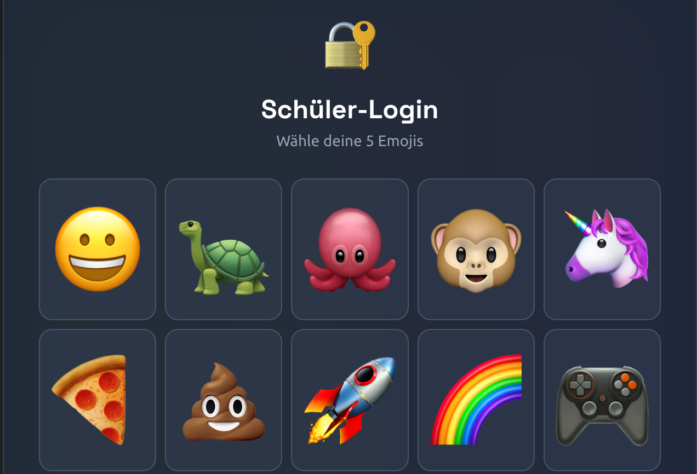
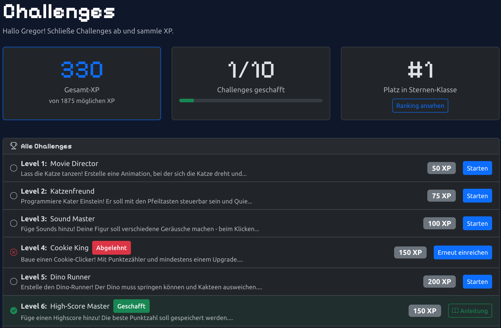
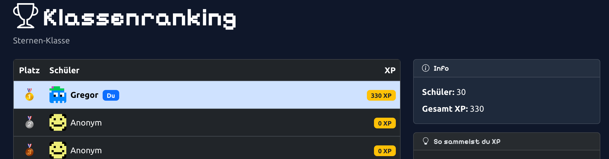
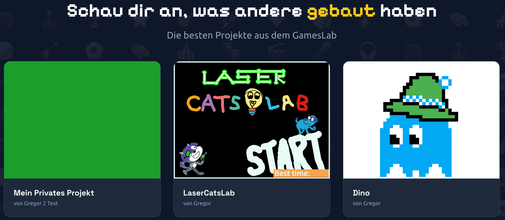
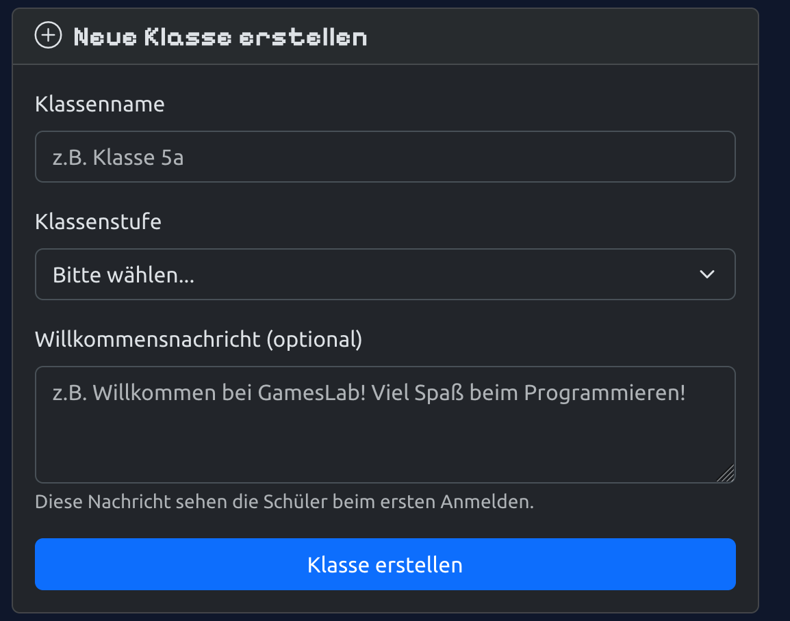
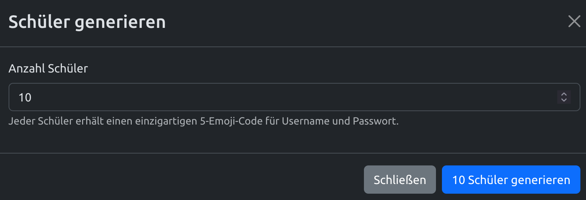
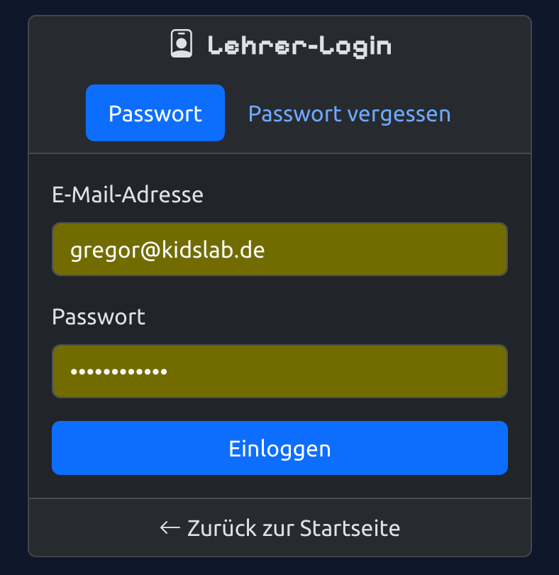

> Die kostenlose Plattform für Scratch im Unterricht — mit Emoji-Login, Challenges und Bestenliste.

Programmieren lernen ist für Kinder oft mit Hürden verbunden: komplizierte Zugänge, fehlende Motivation, kein Feedback. Das **GamesLab Studio** löst genau diese Probleme.



## Was macht das GamesLab Studio besonders?

- **Emoji-Login** — Kinder loggen sich mit 5 Emojis ein. Kein Passwort-Vergessen, keine E-Mail nötig
- **Challenges** — strukturierte Programmieraufgaben mit XP-Belohnung
- **Bestenliste** — freundschaftlicher Wettbewerb in der Klasse (Top 3 mit Medaillen)
- **Projekte teilen** — Scratch-Spiele direkt auf der Plattform präsentieren
- **Kostenlos** — komplett kostenloses Angebot der KidsLab gGmbH
- **Datenschutzfreundlich** — keine persönlichen Daten der Schüler nötig

## So funktioniert's

### Emoji-Login

Vergiss komplizierte Passwörter! Im GamesLab loggen sich Schüler mit **5 Emojis als Benutzername** und **5 Emojis als Passwort** ein.

### Challenges — Aufgaben mit Belohnung

Challenges sind strukturierte Programmieraufgaben — ähnlich wie Hausaufgaben, aber mit Belohnungssystem:

- Verschiedene Schwierigkeitsstufen (Level 1–5)
- XP-Punkte als Belohnung
- GamesPreis-Challenges für den Wettbewerb

### Bestenliste

Die Klassenrangliste zeigt, wer die meisten XP gesammelt hat. Fördert freundschaftlichen Wettbewerb und motiviert zum Weiterlernen.

### Projekte & Studios

Schüler können ihre Scratch-Projekte direkt auf der Plattform teilen. Projekte werden in Studios (Sammlungen) organisiert — perfekt für Präsentationen im Unterricht.

## Für Lehrkräfte

### Warum GamesLab Studio?

- **Einfacher Einstieg** — kein kompliziertes Passwort-Management
- **Motivation durch Gamification** — Challenges, XP und Bestenlisten spornen an
- **Kein Account-Chaos** — Sie erstellen die Zugänge, Schüler brauchen keine E-Mail
- **GamesPreis** — die besten Projekte können am Wettbewerb teilnehmen

### So starten Sie

1. **Klasse erstellen** — Name, Klassenstufe und Willkommensnachricht festlegen

   

2. **Schüler generieren** — automatisch Emoji-Zugänge für die ganze Klasse

   

3. **Als Lehrkraft einloggen** — Übersicht über alle Klassen und Schüler

   

4. **Login-Kärtchen drucken** — PDF mit QR-Codes und Emoji-Logins (2×4 pro A4)
5. **Challenges zuweisen** — Aufgaben auswählen und Deadlines setzen
6. **Einreichungen bewerten** — Projekte freigeben oder mit Feedback zurückgeben

### Tipps für den Unterricht

- **Wöchentliche Challenges** — regelmäßige kleine Aufgaben funktionieren besser als wenige große
- **Bestenliste besprechen** — Top-Performer loben, andere ermutigen
- **Projekte präsentieren** — Schüler zeigen ihre Spiele der Klasse

## Häufige Fragen


**"Ein Schüler hat seine Emojis vergessen"** — Kein Problem! Zugangsdaten jederzeit in der Klassenverwaltung nachschauen oder neu vergeben.

**"Kann ich mehrere Klassen haben?"** — Ja! Beliebig viele Klassen anlegen und verwalten.

**"Sind die Daten sicher?"** — Ja. Keine persönlichen Daten nötig. Die Emoji-Logins sind anonym.

**"Kostet das etwas?"** — Nein! Komplett kostenlos.


## Kontakt

Interesse am GamesLab Studio für eure Schule? Schreib uns: [gameslab@kidslab.de](mailto:gameslab@kidslab.de)
