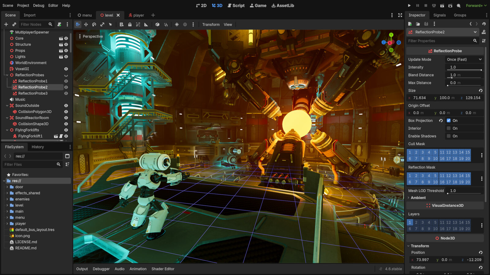

Want to program your own computer game? In this holiday workshop, you'll use the free game engine Godot to build your own game step by step — from the idea through characters and controls to points, sound, and your own graphics.

*This is what Godot looks like: the scene on the left, the game in the middle, settings on the right. Screenshot: [Godot Engine](https://godotengine.org), [CC BY 4.0](https://creativecommons.org/licenses/by/4.0/)*

If you already know Scratch, this is the next step into game development; but no prior knowledge is needed. We experiment, program, and test together, building a game project you can keep expanding at home.

### Course details:
- 📅 **Date:** August 24–28, 2026 (Monday–Friday)
- 🕒 **Time:** 9 am to 12 pm each day
- 👥 **Participants:** age 12+ (max. 8 spots)
- 💶 **Cost:** €150 (reduced €75)
- 📍 **Location:** KidsLab Augsburg


**No child is excluded** — the ticket shop has a self-service 50% discount option. If that's not enough, just send us a quick [email](mailto:team@kidslab.de) or [WhatsApp message](https://wa.me/4982199951920) — we'll find a solution, even for €0. [More on this](/ueber-kidslab/kursgebuehren/)


**Interested? Reserve your spot now:**

