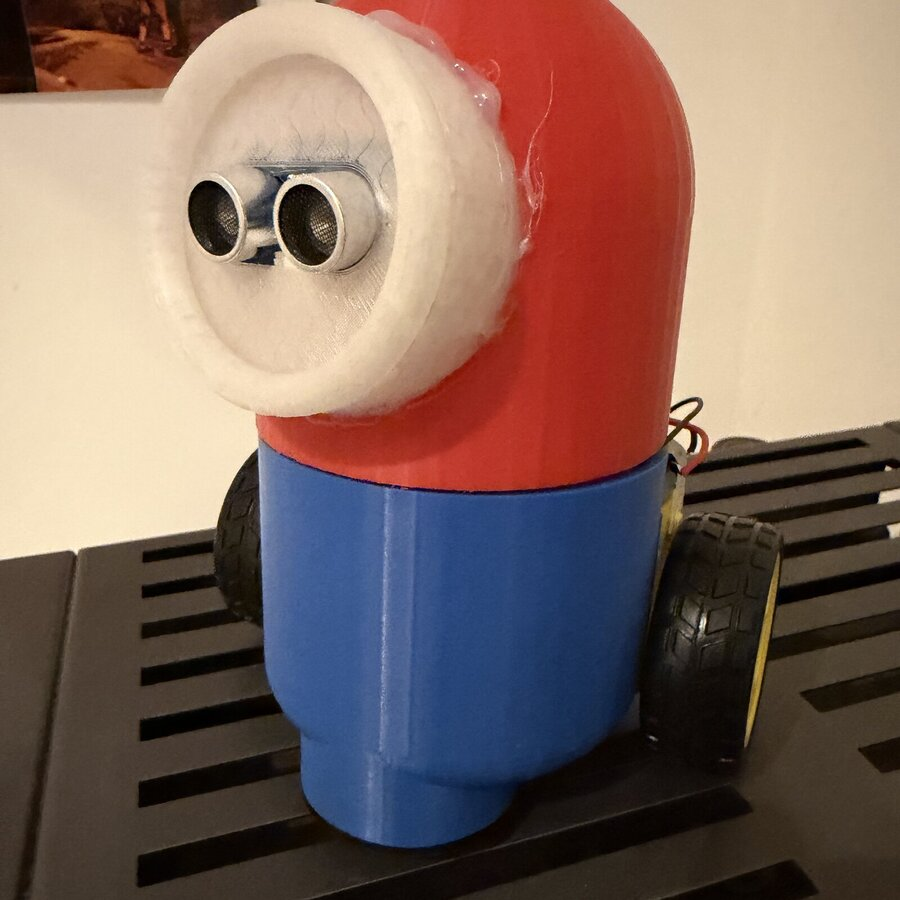
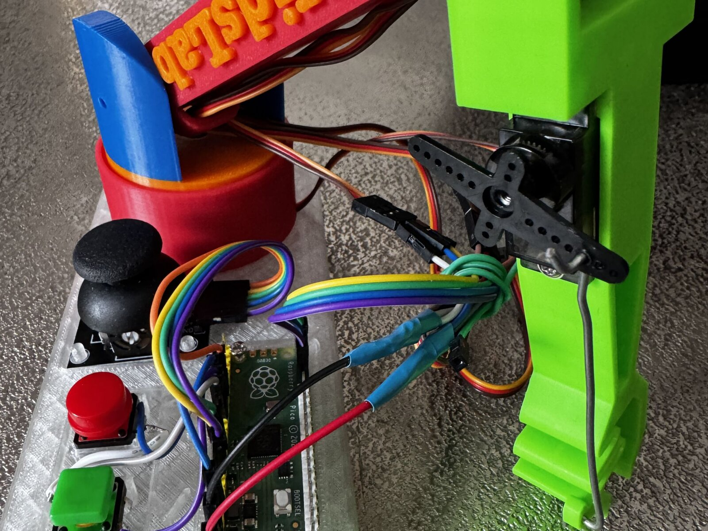

In this holiday course, you'll build your own robot from scratch. We use the **Raspberry Pi Pico (MAKER-PI-RP2040)**, sensors, and motors to build a machine that can drive around.

The two "eyes" are an ultrasonic sensor — that's how the robot notices when something is in its way and steers around it on its own:



Programming is done with **makerSpaceOS**. It's a block-based tool that lets you click together logical sequences without having to wrestle with Python syntax directly – but real code is generated in the background.

*The same technology in a different KidsLab project: Pico, servos, and self-printed parts.*

### What we do:
- **Hardware building:** mounting motors and sensors on a chassis.
- **Controls:** programming driving functions and obstacle avoidance.
- **3D design:** designing and printing your own parts in Tinkercad.
- **Open source:** all results are stored in a Git repository so you can keep working at home.

### Course details:
- 📅 **Date:** August 17–21, 2026 (Monday–Friday)
- 🕒 **Time:** 2 pm to 5 pm each day
- 👥 **Participants:** age 12+ (max. 8 spots)
- 💶 **Cost:** €150 (reduced €75) plus €25 material cost
- 📍 **Location:** KidsLab Augsburg


You take the finished robot home with you — that's what the €25 material cost covers.

**No child is excluded** — the ticket shop has a self-service 50% discount option. If that's not enough, just send us a quick [email](mailto:team@kidslab.de) or [WhatsApp message](https://wa.me/4982199951920) — we'll find a solution, even for €0. [More on this](/ueber-kidslab/kursgebuehren/)


**Interested? Reserve your spot now:**

