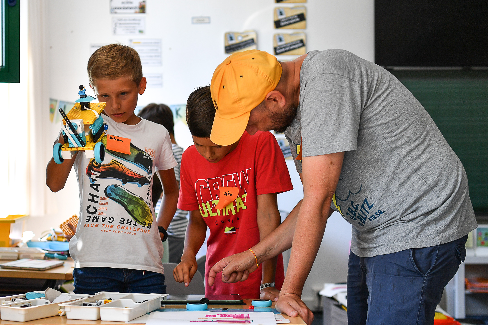
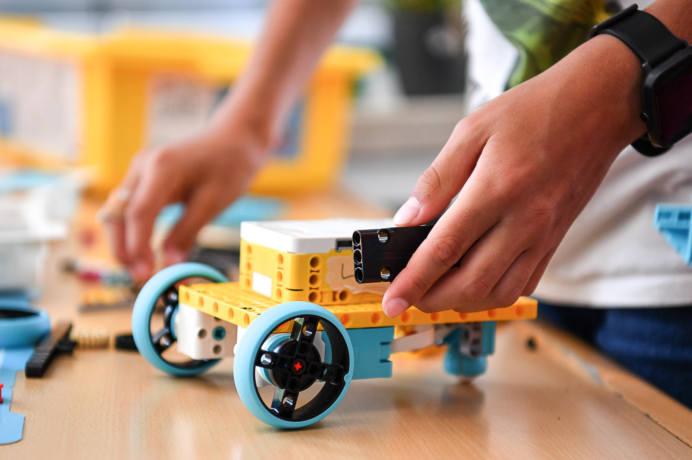

Ready for a week full of tech, code, and action? In this holiday workshop, we build capable robots and program them to navigate the world on their own. We start with the basics of movement and work our way up to complex challenges.

We build with **Lego Spike Prime**: motors, sensors, and a sturdy chassis — then it's time to program until the robot does exactly what it's supposed to.

The big finale is our "Balloon Pop": a course of marked targets that the robots have to precisely reach and pop with a needle – a real test of precision and programming!

### Course details:
- 📅 **Date:** August 19–21, 2026 (Wednesday–Friday)
- 🕒 **Time:** 9 am to 12 pm each day
- 👥 **Participants:** age 8+ (max. 10 spots)
- 💶 **Cost:** €90 (reduced €45)
- 🧑‍🏫 **Instructors:** Matze Schugg and Leopold Walter
- 📍 **Location:** KidsLab Augsburg


**No child is excluded** — the ticket shop has a self-service 50% discount option. If that's not enough, just send us a quick [email](mailto:team@kidslab.de) or [WhatsApp message](https://wa.me/4982199951920) — we'll find a solution, even for €0. [More on this](/ueber-kidslab/kursgebuehren/)


**Interested? Reserve your spot now:**

