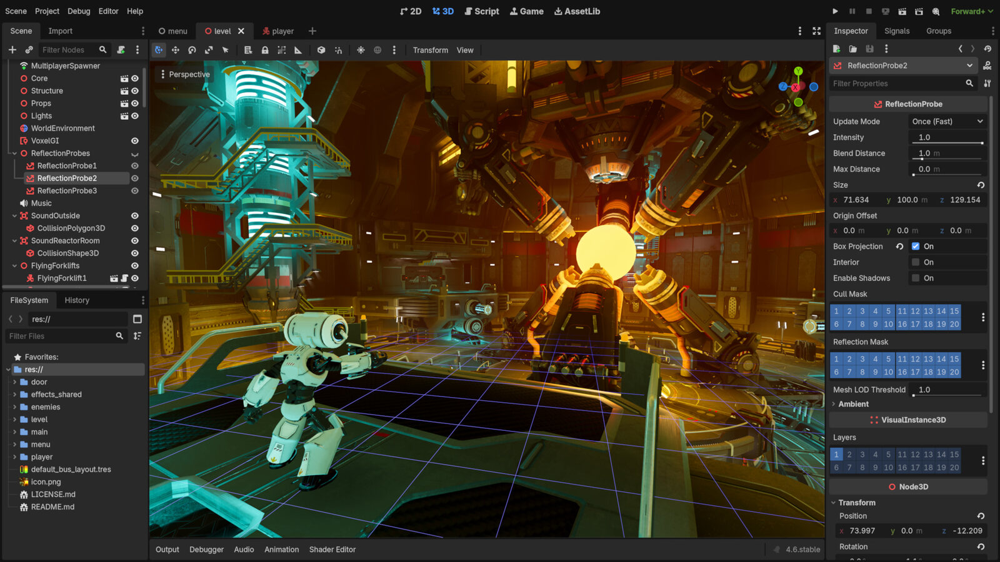

Du möchtest ein eigenes Computerspiel programmieren? In diesem Ferienworkshop entwickelst du mit der kostenlosen Spiele-Engine Godot Schritt für Schritt dein eigenes Spiel – von der Idee über Figuren und Steuerung bis zu Punkten, Sound und eigenen Grafiken.

*So sieht Godot aus: links die Szene, in der Mitte das Spiel, rechts die Einstellungen. Screenshot: [Godot Engine](https://godotengine.org), [CC BY 4.0](https://creativecommons.org/licenses/by/4.0/)*

Wer Scratch schon kennt, findet hier den nächsten Schritt in die Spieleentwicklung; Vorkenntnisse sind aber nicht nötig. Wir experimentieren, programmieren und testen gemeinsam und bauen dabei ein Spielprojekt, das zu Hause weiter ausgebaut werden kann.

### Details zum Kurs:
- 📅 **Termin:** 24. bis 28. August 2026 (Montag – Freitag)
- 🕒 **Zeit:** jeweils 09:00 bis 12:00 Uhr
- 👥 **Teilnehmer:** ab 12 Jahren (max. 8 Plätze)
- 💶 **Kosten:** 150 € (ermäßigt 75 €)
- 📍 **Ort:** KidsLab Augsburg


**Kein Kind wird ausgeschlossen** — im Ticketshop gibt es eine 50%-Ermäßigung zum Selbstauswählen. Reicht das nicht, schreib uns kurz per [E-Mail](mailto:team@kidslab.de) oder [WhatsApp](https://wa.me/4982199951920) — wir finden eine Lösung, auch für 0 Euro. [Mehr dazu](/ueber-kidslab/kursgebuehren/)


**Interesse? Dann sichere dir jetzt einen Platz:**

