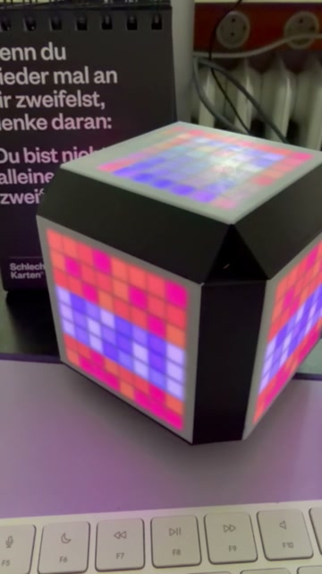
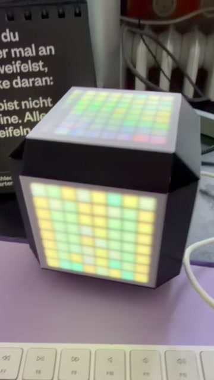
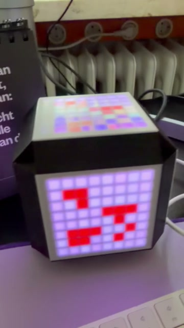





In this series, we build glowing mini-projects with an **ESP32** and **NeoPixel LEDs** (8x8 matrix or LED strips) – programmed in **Python**.

Step by step, you'll learn how LEDs are controlled, how animations are created, and how to display your own pixel graphics (e.g. Minecraft-style) on a matrix. By the end, you'll have your own project that you can keep expanding.

### Possible projects

Depending on interest and pace:

- **Pixel icons** – "Minecraft textures" and your own designs on an 8x8 matrix
- **Dice gadget** – changing sides and designs at the push of a button
- **Audio-reactive LEDs** – LEDs that react to music and ambient sound
- **Mood lamp / status widget** – gradients, timers, and special effects

We work in small steps so everyone can keep up – with optional side quests for the quicker ones (extra animations, custom icons, additional sensors). Optionally, we also design and 3D-print a case.

### Course details

- **Dates:** Mar 27, Apr 17, Apr 24, May 8, May 15, 2026
- **Time:** 3:00–4:30 pm
- **Location:** KidsLab Augsburg, Herrenhäuser 17 at Fischertor
- **Age:** from 12 years
- **Requirements:** none – curiosity is enough. Own laptop helpful.
- **Materials:** ESP32 + NeoPixel (matrix or strip) – all included
