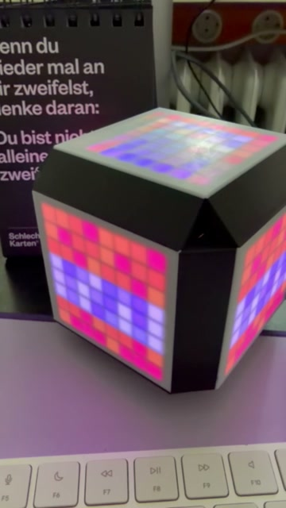
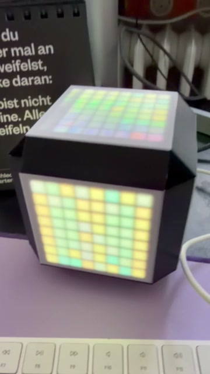
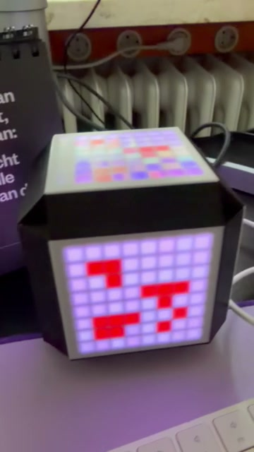





In dieser Staffel bauen wir leuchtende Mini-Projekte mit einem **ESP32** und **NeoPixel-LEDs** (8x8-Matrix oder LED-Streifen) – programmiert in **Python**.

Schritt für Schritt lernst du, wie LEDs angesteuert werden, wie Animationen entstehen und wie du eigene Pixel-Grafiken (z.B. im Minecraft-Stil) auf einer Matrix darstellst. Am Ende hast du ein eigenes Projekt, das du weiter ausbauen kannst.

### Mögliche Projekte

Je nach Interesse und Tempo:

- **Pixel-Icons** – „Minecraft-Texturen" und eigene Designs auf einer 8x8-Matrix
- **Würfel-Gadget** – wechselnde Seiten und Designs per Knopfdruck
- **Audio-reactive LEDs** – LEDs reagieren auf Musik und Umgebungsgeräusche
- **Mood-Lamp / Status-Widget** – Farbverläufe, Timer und Spezialeffekte

Wir arbeiten kleinschrittig, so dass alle mitkommen – mit optionalen Sidequests für Schnellere (Extra-Animationen, eigene Icons, zusätzliche Sensoren). Optional designen und drucken wir auch ein Gehäuse im 3D-Drucker.

### Kursdetails

- **Termine:** 27.03., 17.04., 24.04., 08.05., 15.05.2026
- **Uhrzeit:** 15:00–16:30 Uhr
- **Ort:** KidsLab Augsburg, Herrenhäuser 17 am Fischertor
- **Alter:** ab 12 Jahren
- **Voraussetzungen:** keine – Neugier reicht. Eigener Laptop hilfreich.
- **Material:** ESP32 + NeoPixel (Matrix oder Streifen) – alles inklusive
