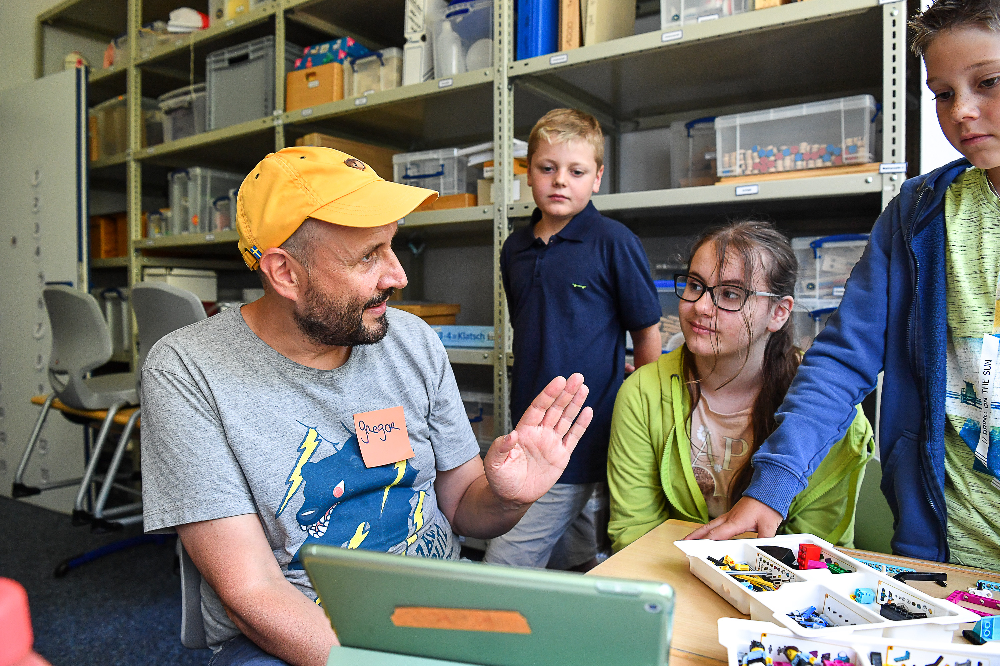
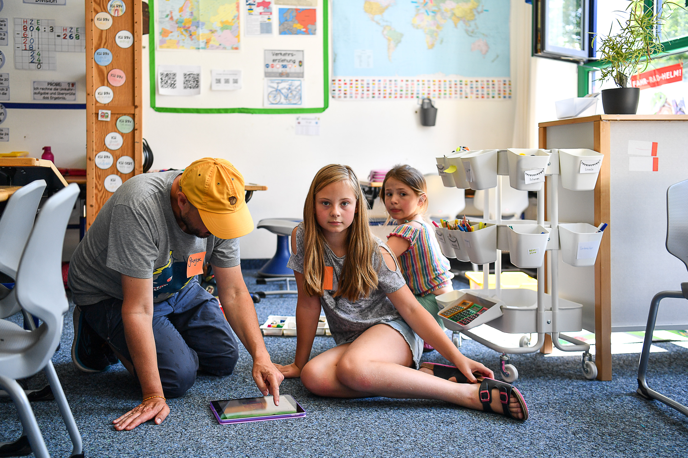
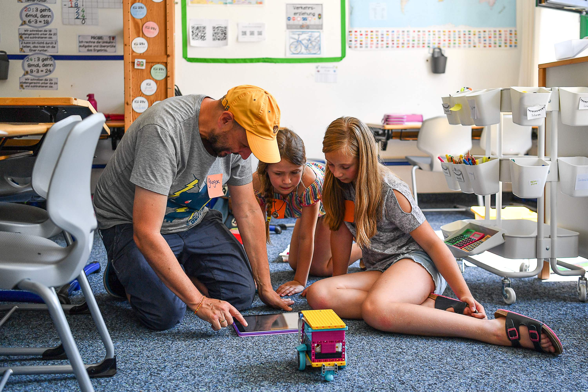
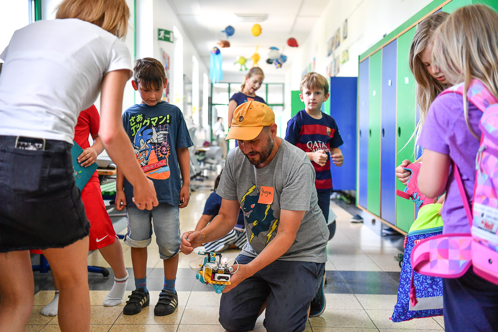
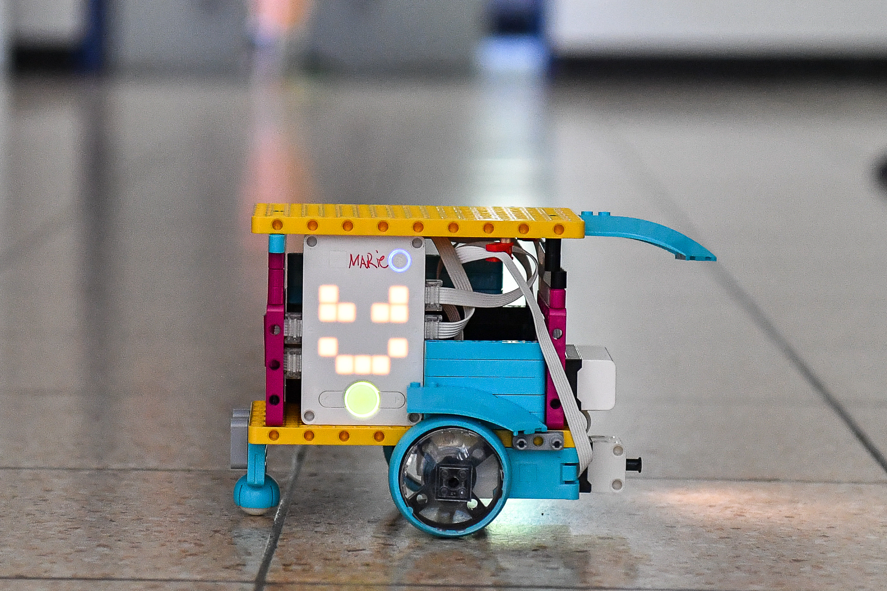
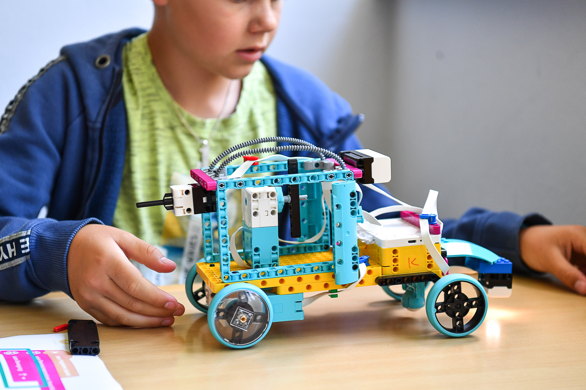

> Build and program robots with LEGO Spike Prime – for kids aged 8 to 12.

In the **Lego Robotics** course, kids dive into the world of robotics and programming. With **LEGO Spike Prime**, they build their own robots, get them moving, and solve tricky challenges together.





## What do we do?

- **Building:** LEGO parts, motors, and sensors come together into robots that move, grip, and react to their surroundings
- **Programming:** with the block-based programming language of Spike Prime, kids learn step by step to control their robot – from simple movements to complex sequences
- **Challenges:** every week brings new tasks and challenges that encourage teamwork and creative thinking – e.g. driving a course, transporting objects, or reacting to obstacles

## What do kids learn?

- Basics of robotics and mechanics
- Logical thinking and problem-solving
- Programming with visual blocks
- Teamwork and tinkering together
- Creative building and experimenting

## Course details

- **Age:** 8 to 12 years
- **When:** weekly at KidsLab Augsburg
- **Materials:** LEGO Spike Prime sets provided

## Tickets & dates


