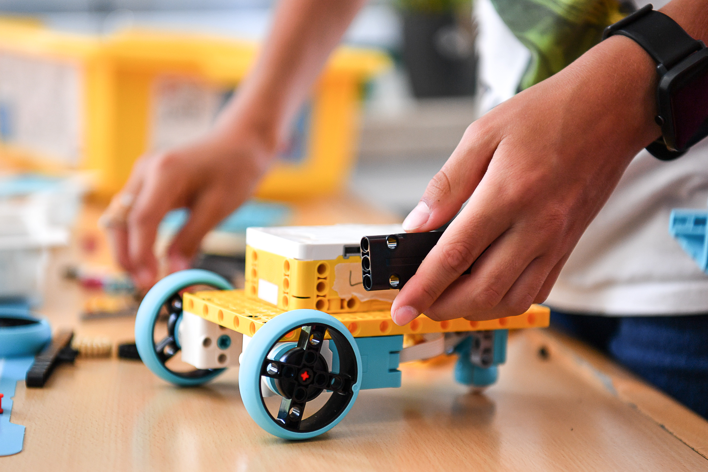
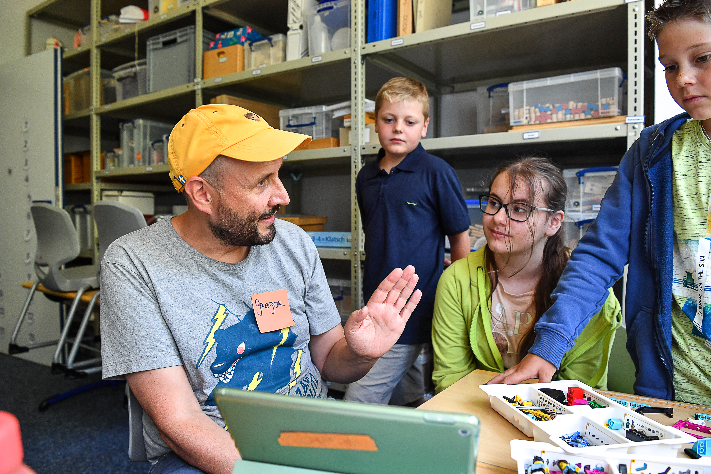
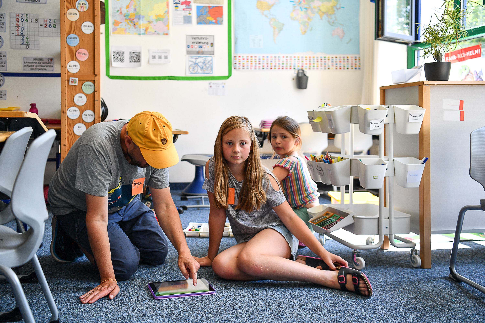
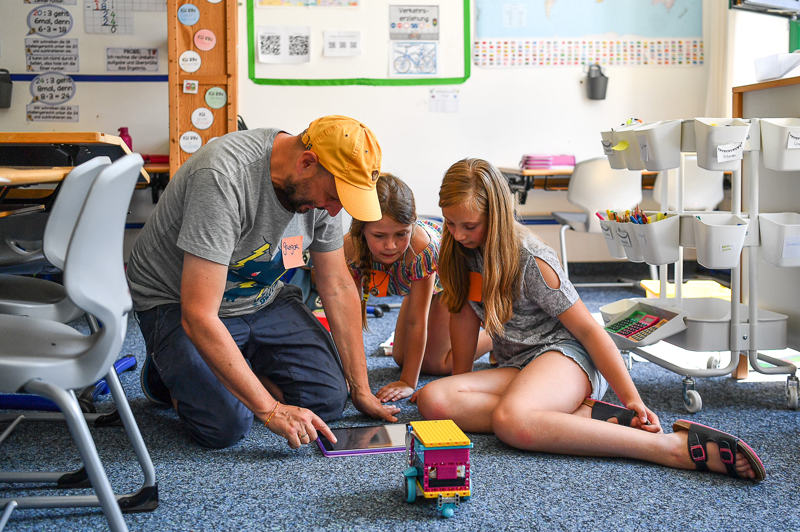
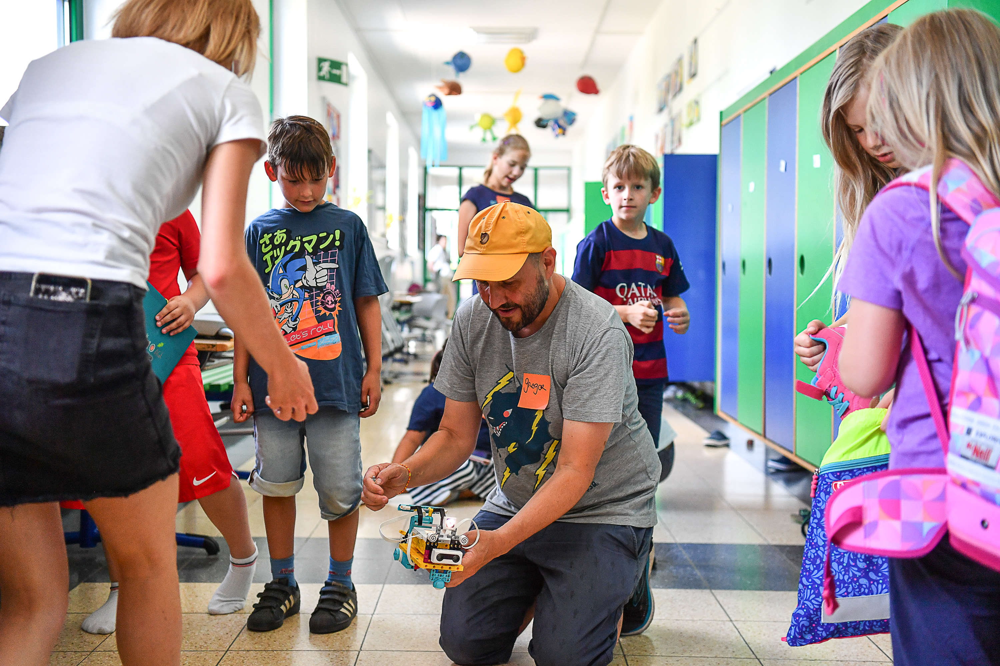
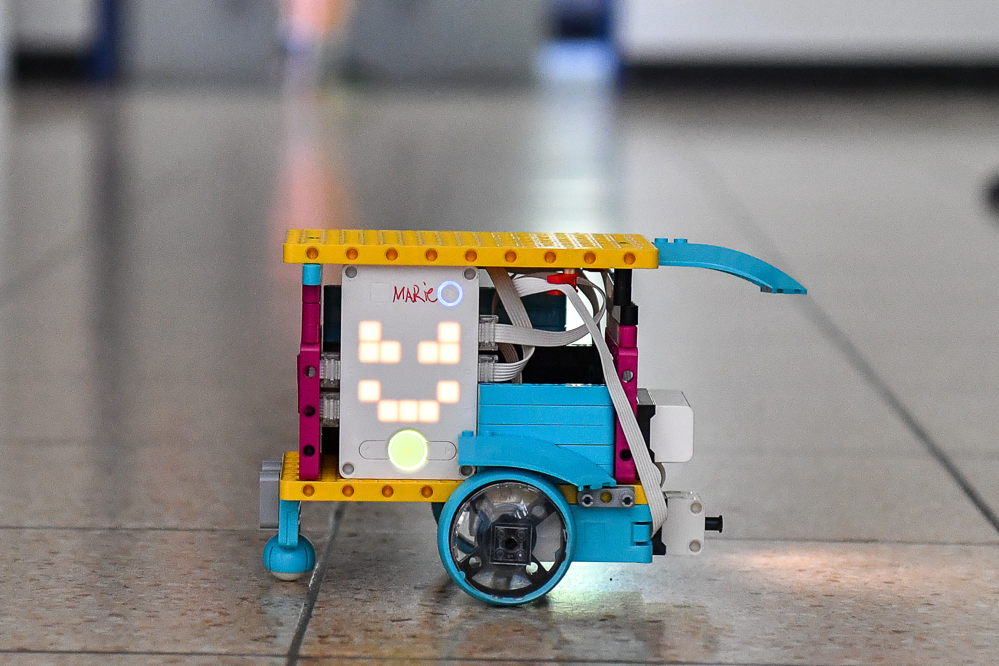
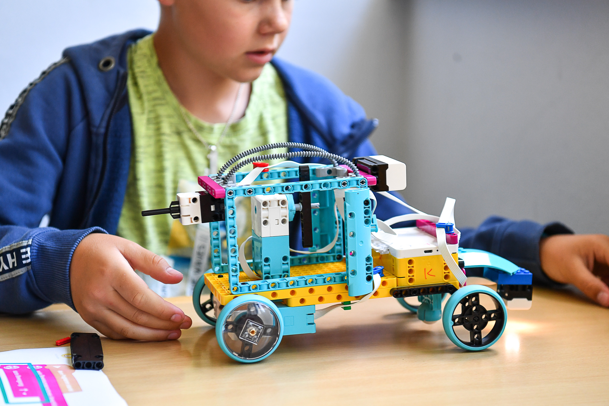

> Roboter bauen und programmieren mit LEGO Spike Prime – für Kinder von 8 bis 12 Jahren.

Im **Lego Robotics**-Kurs tauchen Kinder in die Welt der Robotik und Programmierung ein. Mit **LEGO Spike Prime** bauen sie eigene Roboter, bringen sie zum Laufen und lösen gemeinsam knifflige Aufgaben.





## Was machen wir?

- **Bauen:** Aus LEGO-Teilen, Motoren und Sensoren entstehen Roboter, die sich bewegen, greifen und auf ihre Umgebung reagieren
- **Programmieren:** Mit der blockbasierten Programmiersprache von Spike Prime lernen die Kinder Schritt für Schritt, ihren Roboter zu steuern – von einfachen Bewegungen bis zu komplexen Abläufen
- **Challenges:** Jede Woche gibt es neue Aufgaben und Herausforderungen, die Teamarbeit und kreatives Denken fördern – z.B. einen Parcours abfahren, Gegenstände transportieren oder auf Hindernisse reagieren

## Was lernen die Kinder?

- Grundlagen der Robotik und Mechanik
- Logisches Denken und Problemlösung
- Programmieren mit visuellen Blöcken
- Teamarbeit und gemeinsames Tüfteln
- Kreatives Konstruieren und Experimentieren

## Kursdetails

- **Alter:** 8 bis 12 Jahre
- **Wann:** Wöchentlich im KidsLab Augsburg
- **Material:** LEGO Spike Prime Sets werden gestellt

## Tickets & Termine


