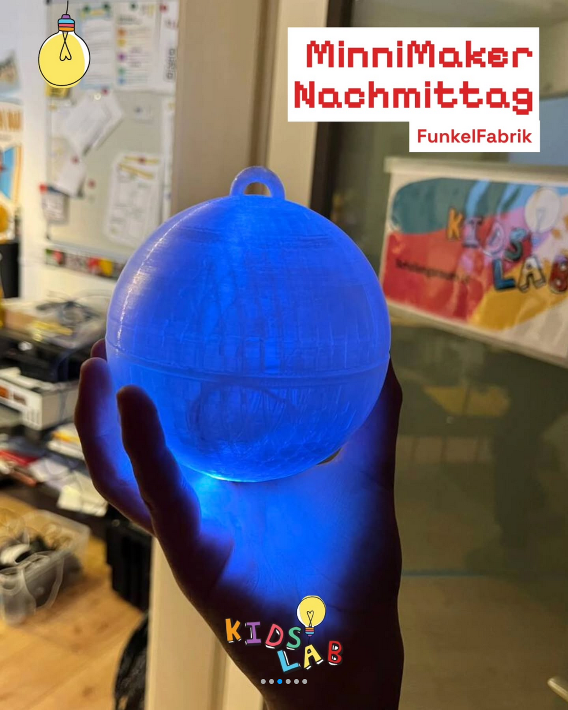
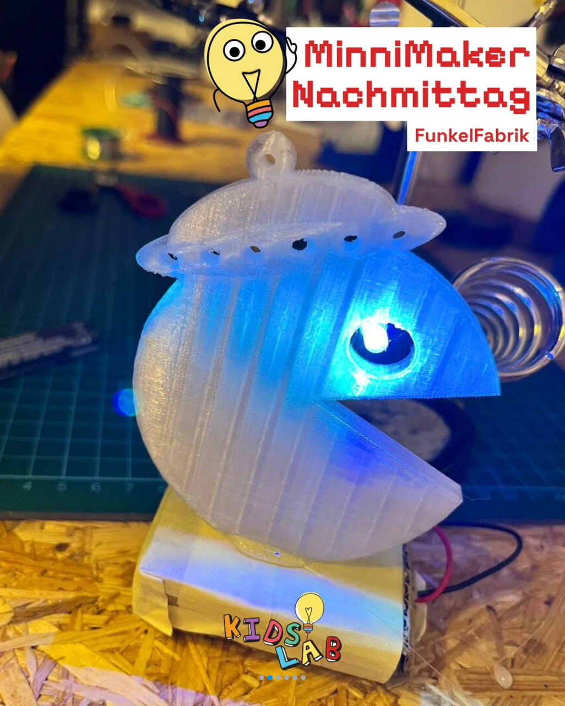
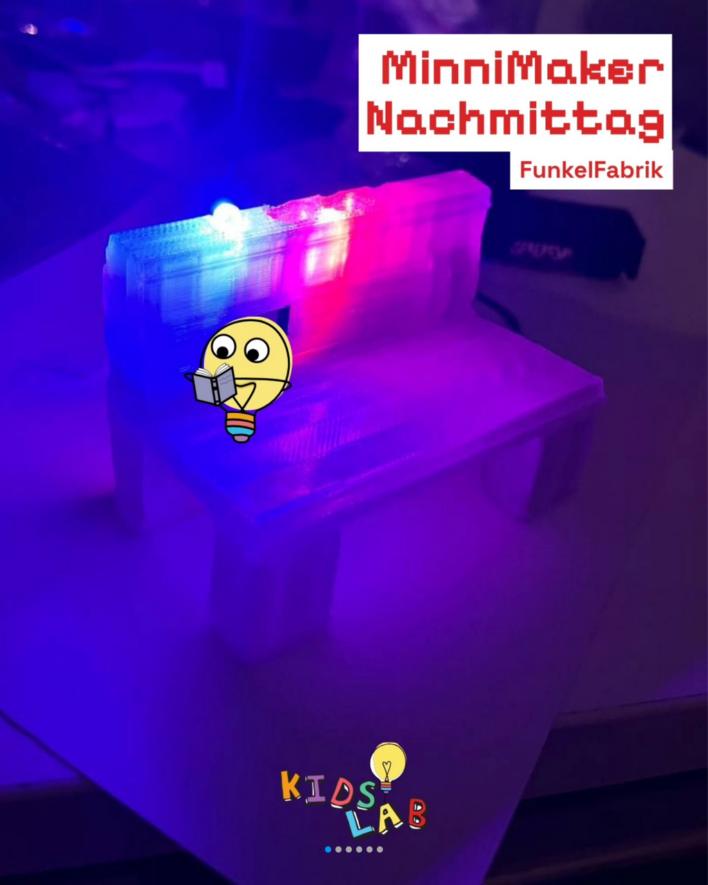
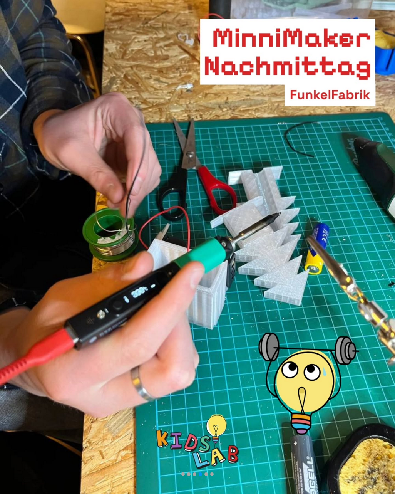
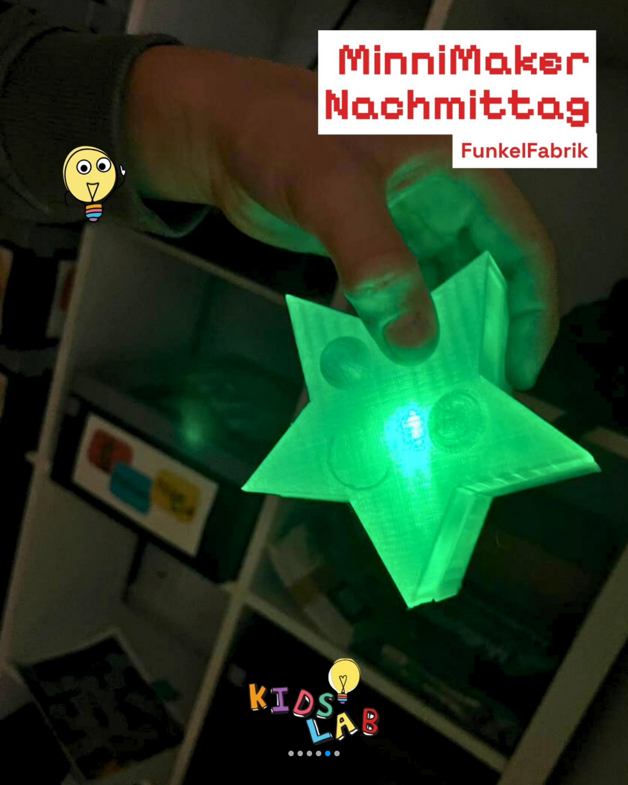

> Crafting, building, and discovering — every Monday for the youngest makers.

The **MinniMaker Afternoon** is here – and it's bringing fresh energy to KidsLab!

Monday used to be our **open afternoon**; now we're starting fresh: with a clear concept, fixed groups, and a shared goal.

The **MinniMaker Afternoon** is a creative workshop format that runs over several weeks. Each round has **one theme** that we tinker with, design, and try out together. That leaves room for your own ideas – but with a common thread, team spirit, and tangible results.

- For all kids aged **8 to 12**
- Every Monday, 4:00–6:00 pm
- At KidsLab Augsburg

## Impressions from the FunkelFabrik





## Tickets & dates



## Past courses

- [#3 – Let the games begin: analogue meets digital](lass-die-spiele-beginnen/)
- [#2 – Level up! Your intro for the award ceremony](level-up-intro-preisverleihung/)
