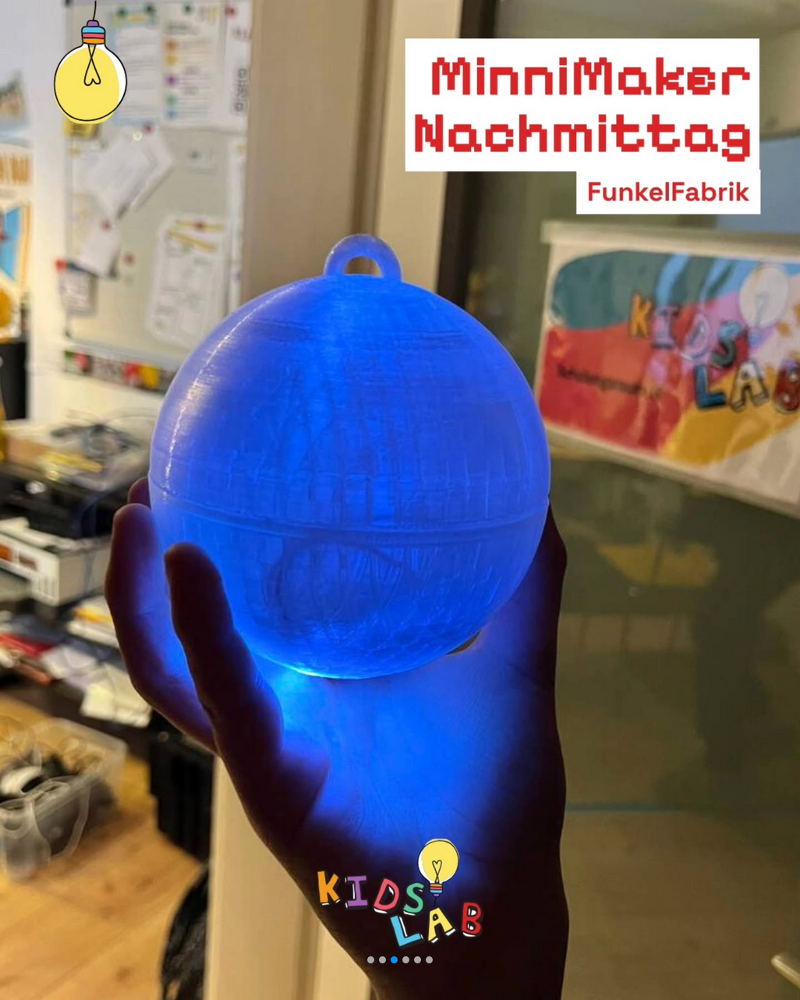
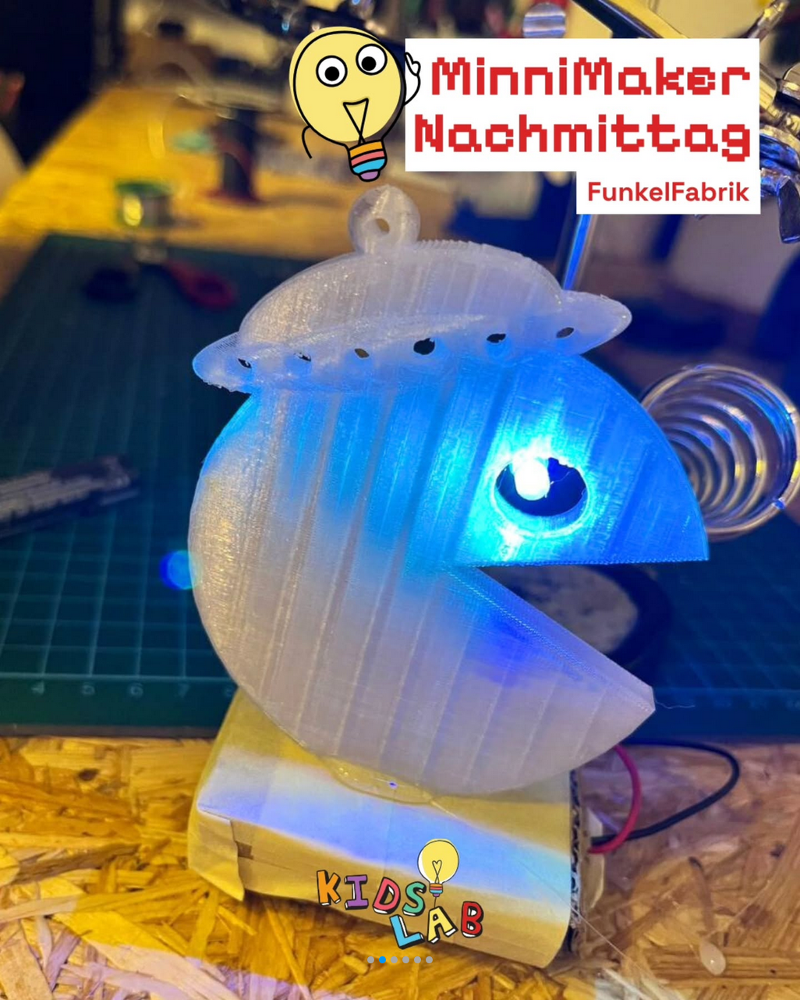
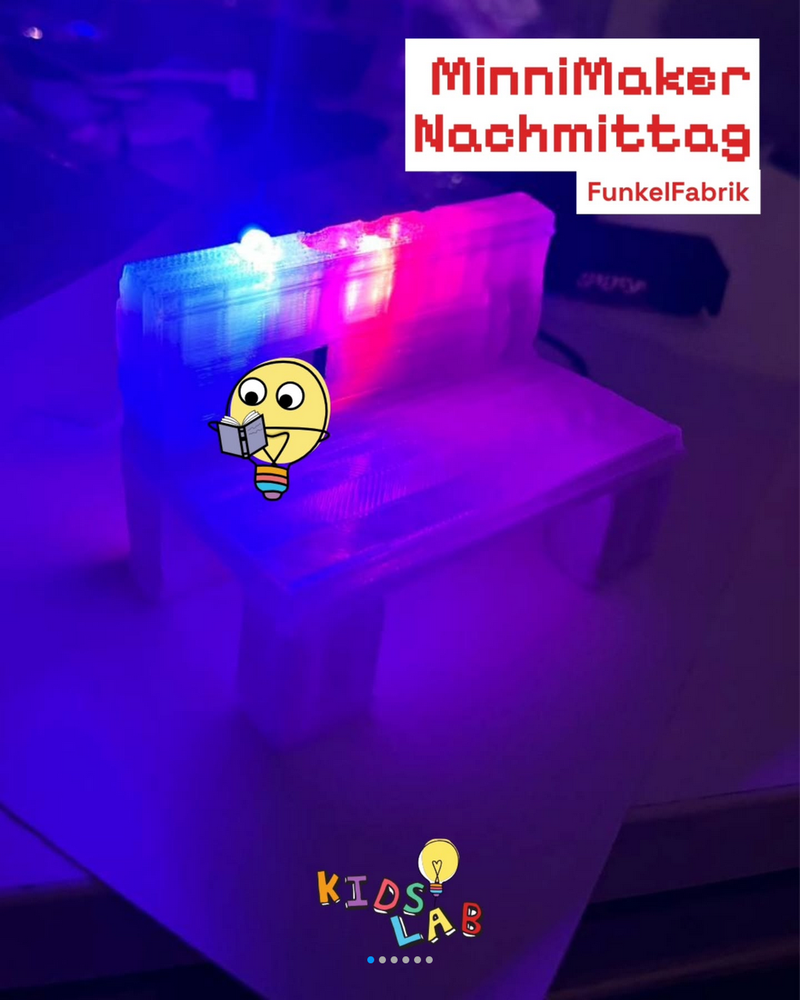
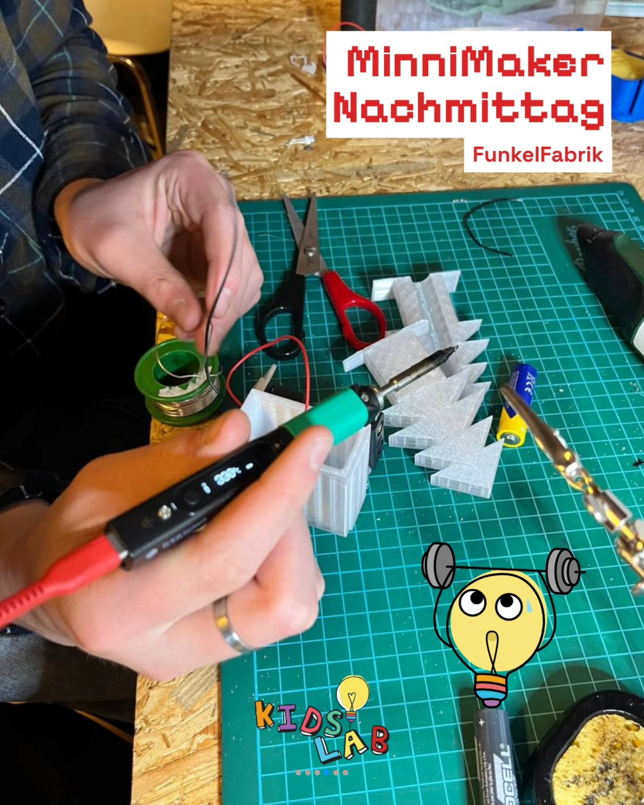
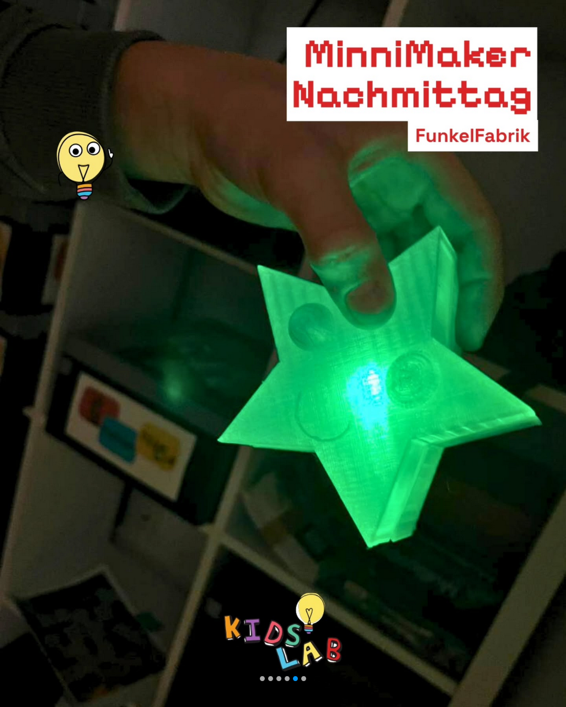

> Basteln, bauen und entdecken — jeden Montag für die jüngsten Maker.

Der **MinniMakerNachmittag** ist da – und bringt frischen Wind ins KidsLab!

Früher war der Montag unser **offener Nachmittag,** jetzt starten wir neu: mit einem klaren Konzept, festen Gruppen und einem gemeinsamen Ziel.

Der **MinniMakerNachmittag** ist ein kreatives Werkstattformat, das über mehrere Wochen läuft. In jeder Runde gibt es **ein Thema**, zu dem wir gemeinsam tüfteln, gestalten und ausprobieren. So bleibt Raum für eigene Ideen – aber mit rotem Faden, Teamgefühl und greifbaren Ergebnissen.

- Für alle Kinder von **8 bis 12 Jahren**
- Jeden Montag, 16:00–18:00 Uhr
- Im KidsLab Augsburg

## Eindrücke aus der FunkelFabrik





## Tickets & Termine



## Vergangene Kurse

- [#3 – Lass die Spiele beginnen: Analog meets Digital](lass-die-spiele-beginnen/)
- [#2 – Level Up! Dein Intro für die Preisverleihung](level-up-intro-preisverleihung/)
