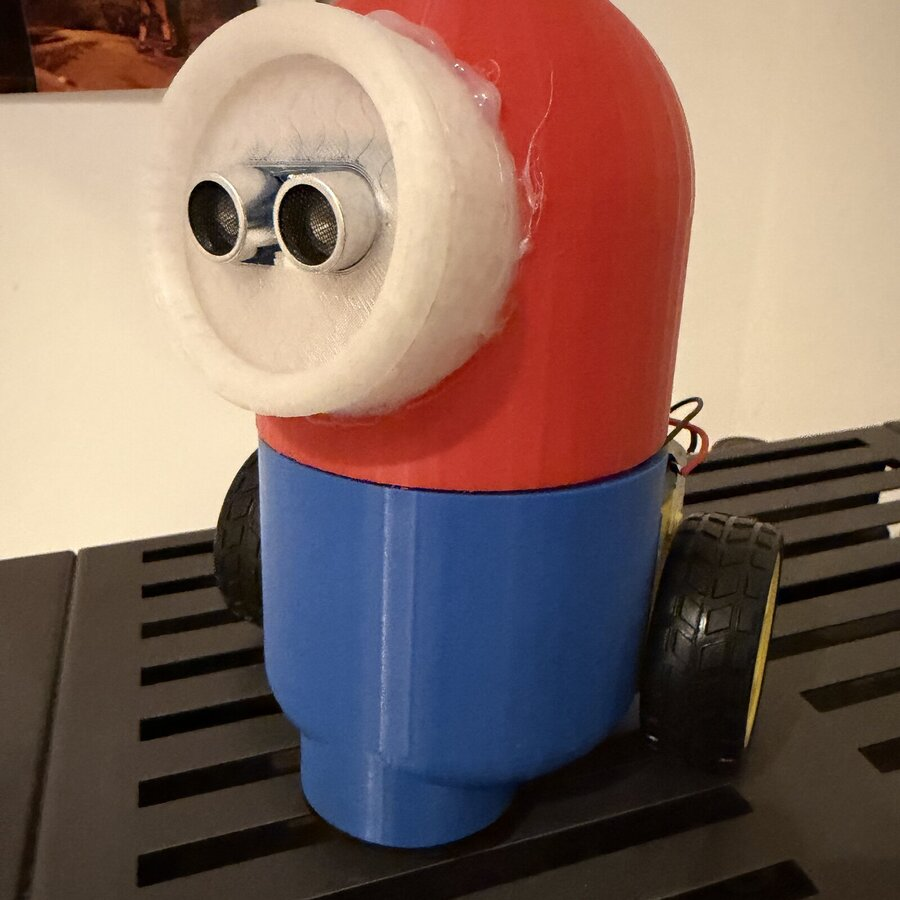
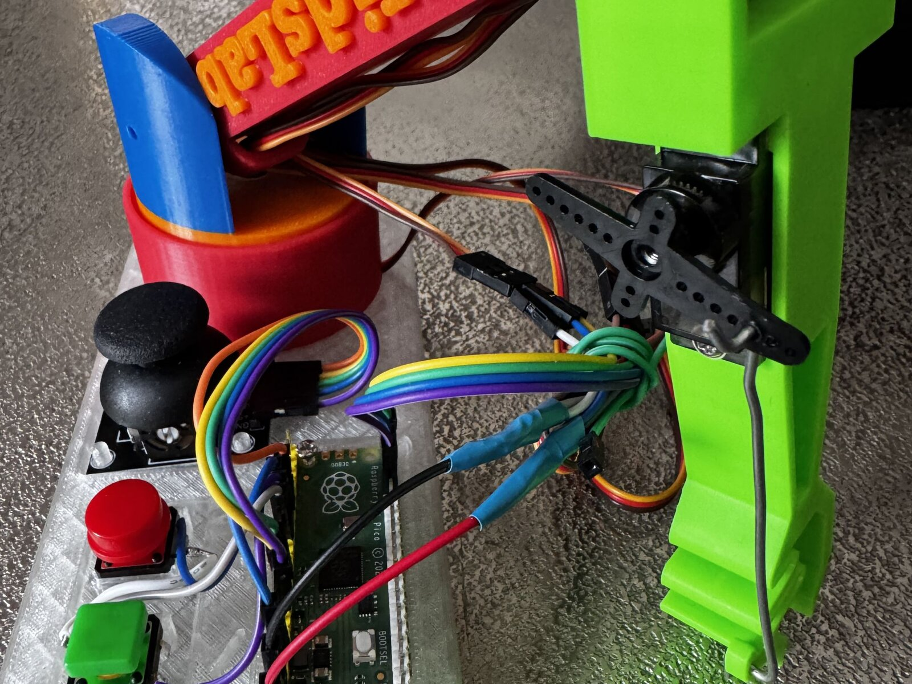

In diesem Ferienkurs baust du einen eigenen Roboter von Grund auf. Wir nutzen den **Raspberry Pi Pico (MAKER-PI-RP2040)**, Sensoren und Motoren, um eine fahrfähige Maschine zu bauen.

Die beiden „Augen“ sind ein Ultraschallsensor — damit merkt der Roboter, wenn etwas im Weg steht, und weicht selbstständig aus:



Die Programmierung erfolgt mit **makerSpaceOS**. Das ist ein blockbasiertes Tool, mit dem du logische Abläufe zusammenklicken kannst, ohne dich direkt mit der Syntax von Python herumschlagen zu müssen – im Hintergrund entsteht aber echter Code.

*Dieselbe Technik in einem anderen Projekt aus dem KidsLab: Pico, Servos und selbst gedruckte Teile.*

### Was wir machen:
- **Hardwarebau:** Motoren und Sensoren auf einem Chassis montieren.
- **Steuerung:** Programmieren von Fahrfunktionen und Hindernisvermeidung.
- **3D-Design:** Eigene Teile in Tinkercad entwerfen und drucken.
- **Open Source:** Alle Ergebnisse werden in einem Git-Repository gespeichert, sodass du zu Hause weitermachen kannst.

### Details zum Kurs:
- 📅 **Termin:** 17. bis 21. August 2026 (Montag – Freitag)
- 🕒 **Zeit:** jeweils 14:00 bis 17:00 Uhr
- 👥 **Teilnehmer:** ab 12 Jahren (max. 8 Plätze)
- 💶 **Kosten:** 150 € (ermäßigt 75 €) zzgl. 25 € Materialkosten
- 📍 **Ort:** KidsLab Augsburg


Den fertigen Roboter nimmst du mit nach Hause — dafür die 25 € Materialkosten.

**Kein Kind wird ausgeschlossen** — im Ticketshop gibt es eine 50%-Ermäßigung zum Selbstauswählen. Reicht das nicht, schreib uns kurz per [E-Mail](mailto:team@kidslab.de) oder [WhatsApp](https://wa.me/4982199951920) — wir finden eine Lösung, auch für 0 Euro. [Mehr dazu](/ueber-kidslab/kursgebuehren/)


**Interesse? Dann sichere dir jetzt einen Platz:**

