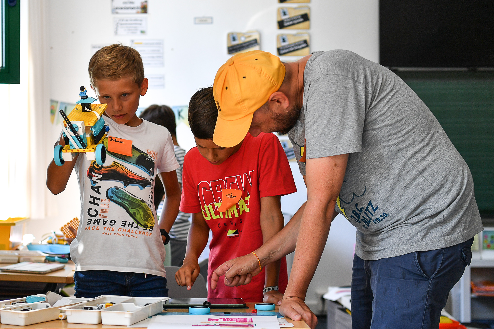

Bist du bereit für eine Woche voller Technik, Code und Action? In diesem Ferienworkshop bauen wir leistungsfähige Roboter und programmieren sie so, dass sie eigenständig durch die Welt navigieren. Wir starten mit den Basics der Bewegung und steigern uns bis zu komplexen Herausforderungen.

Wir bauen mit **Lego Spike Prime**: Motoren, Sensoren und ein stabiles Chassis — und dann wird programmiert, bis der Roboter genau das macht, was er soll.

Das große Finale ist unser „Balloon Pop“: Ein Parcours aus markierten Zielen, die von den Robotern präzise angefahren und per Nadel zerplatzt werden müssen – eine echte Herausforderung an Präzision und Programmierung!

### Details zum Kurs:
- 📅 **Termin:** 19. bis 21. August 2026 (Mittwoch – Freitag)
- 🕒 **Zeit:** jeweils 09:00 bis 12:00 Uhr
- 👥 **Teilnehmer:** ab 8 Jahren (max. 10 Plätze)
- 💶 **Kosten:** 90 € (ermäßigt 45 €)
- 🧑‍🏫 **Leitung:** Matze Schugg und Leopold Walter
- 📍 **Ort:** KidsLab Augsburg


**Kein Kind wird ausgeschlossen** — im Ticketshop gibt es eine 50%-Ermäßigung zum Selbstauswählen. Reicht das nicht, schreib uns kurz per [E-Mail](mailto:team@kidslab.de) oder [WhatsApp](https://wa.me/4982199951920) — wir finden eine Lösung, auch für 0 Euro. [Mehr dazu](/ueber-kidslab/kursgebuehren/)


**Interesse? Dann sichere dir jetzt einen Platz:**

