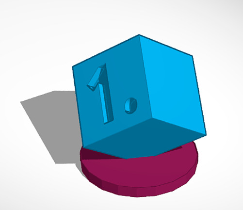
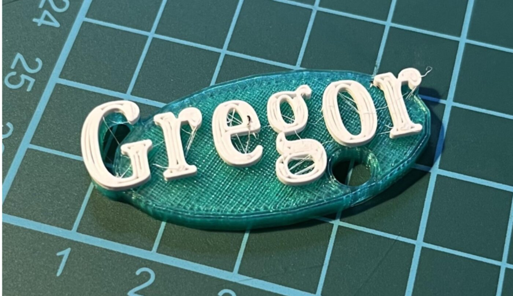
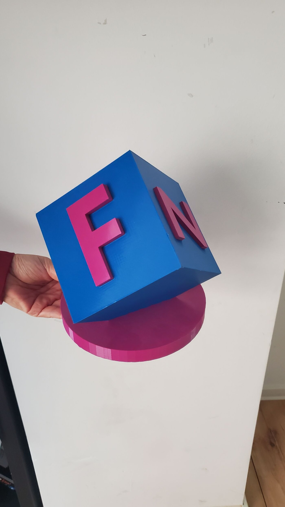

Want to bring your own ideas into the real world? In this holiday workshop, you'll learn how to design professional 3D models using the free software Tinkercad. From the first simple shapes to complex objects, we'll guide you step by step.

A special highlight: we don't just design digital models — we create fully individual keychains and even our own Lego-compatible building bricks, which are then printed!





From a design on screen to a finished object in your hand — that's how we do it.

### Course details:
- 📅 **Date:** August 17–18, 2026 (Monday–Tuesday)
- 🕒 **Time:** 9 am to 12 pm each day
- 👥 **Participants:** age 8+ (max. 10 spots)
- 💶 **Cost:** €60 (reduced €30)
- 🧑‍🏫 **Instructors:** Matze Schugg and Leopold Walter
- 📍 **Location:** KidsLab Augsburg


**No child is excluded** — the ticket shop has a self-service 50% discount option. If that's not enough, just send us a quick [email](mailto:team@kidslab.de) or [WhatsApp message](https://wa.me/4982199951920) — we'll find a solution, even for €0. [More on this](/ueber-kidslab/kursgebuehren/)


**Interested? Reserve your spot now:**

