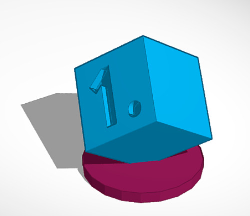
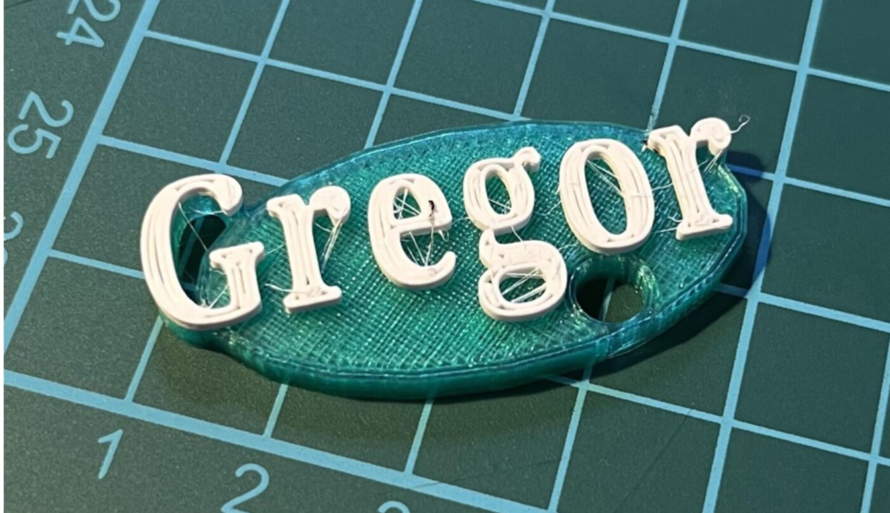
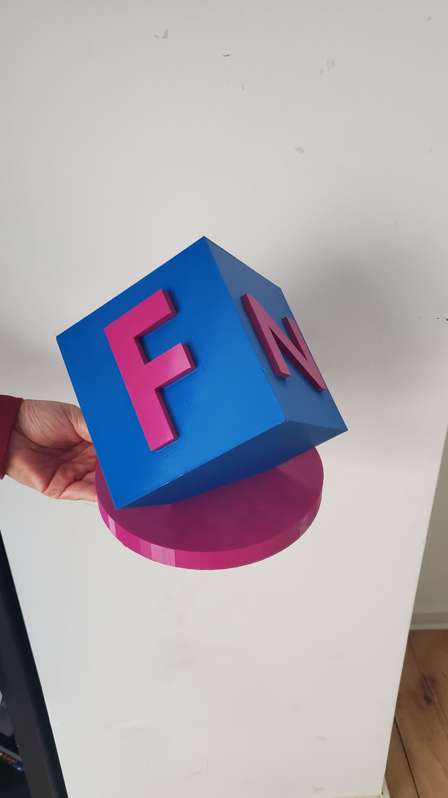

Möchtest du deine eigenen Ideen in die echte Welt bringen? In diesem Ferienworkshop lernst du, wie man mit der kostenlosen Software Tinkercad professionelle 3D-Modelle entwirft. Von den ersten einfachen Formen bis hin zu komplexen Objekten begleiten wir dich Schritt für Schritt.

Ein besonderes Highlight: Wir designen nicht nur digitale Modelle, sondern erstellen ganz individuelle Schlüsselanhänger und sogar eigene Lego-kompatible Klemmbausteine, die anschließend gedruckt werden!





Vom Entwurf am Bildschirm bis zum fertigen Objekt in der Hand — so läuft's bei uns.

### Details zum Kurs:
- 📅 **Termin:** 17. bis 18. August 2026 (Montag – Dienstag)
- 🕒 **Zeit:** jeweils 09:00 bis 12:00 Uhr
- 👥 **Teilnehmer:** ab 8 Jahren (max. 10 Plätze)
- 💶 **Kosten:** 60 € (ermäßigt 30 €)
- 🧑‍🏫 **Leitung:** Matze Schugg und Leopold Walter
- 📍 **Ort:** KidsLab Augsburg


**Kein Kind wird ausgeschlossen** — im Ticketshop gibt es eine 50%-Ermäßigung zum Selbstauswählen. Reicht das nicht, schreib uns kurz per [E-Mail](mailto:team@kidslab.de) oder [WhatsApp](https://wa.me/4982199951920) — wir finden eine Lösung, auch für 0 Euro. [Mehr dazu](/ueber-kidslab/kursgebuehren/)


**Interesse? Dann sichere dir jetzt einen Platz:**

