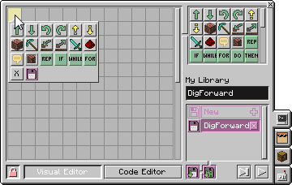
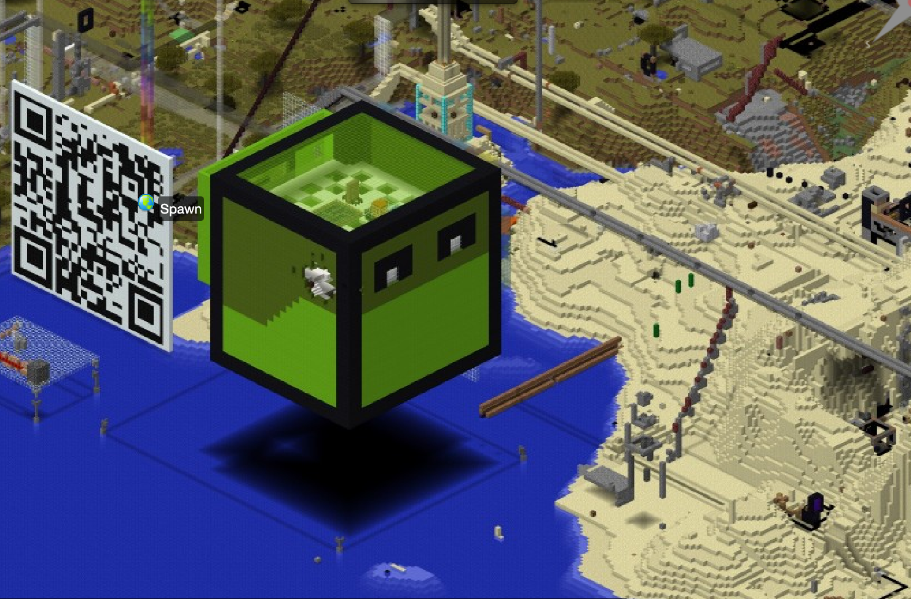

> Learn to code and build creatively — right inside Minecraft.

Minecraft is much more than a game. We use it as a creative learning environment: you'll learn to program turtles, build your own mods, and experiment with redstone.

- **Workshops** — online and in person in Augsburg
- **Mods** — create your own modifications with MCreator
- **Turtle programming** — programmable turtles in Minecraft
- **Materials for teachers** — using Minecraft in the classroom

<h2>Introduction to programming with Minecraft</h2>
Minecraft isn't just an exceptionally creative computer game – it's also one of the most successful computer games in the world, loved by kids and adults alike. <strong>That enthusiasm can be put to use to learn something new: programming!</strong>

In our world of <strong>ever-advancing digitalisation across practically every area of life, understanding IT processes matters more and more</strong>. Programmers are in high demand across every industry. They're the ones shaping our future.

The great thing is: <strong>programming</strong> (or "coding") is neither over-intellectual science nor abstract wizardry, but <strong>completely logical and easy to learn</strong>. And the easiest way to learn it is when you don't even notice you're learning — you're just <strong>having fun</strong>!

The whole thing is based on a Minecraft mod (an <a href="https://en.wikipedia.org/wiki/Mod_(video_gaming)">extension</a>) called ComputerCraftEdu. This extension adds <strong>programmable robot turtles to Minecraft</strong>: they can be programmed right inside the game and then act like real robots — solving difficult or tedious tasks, digging for valuable ores, protecting the player from dangerous monsters, and much more!

<h2>Let's get started — everything <strong>free!</strong></h2>
Convinced? Want to fire up the turtle right away, play with it in Minecraft, and visit TurtleCity too?

Go for it — apart from a Minecraft Java licence and a PC or laptop, you don't need anything! The modpack is free — here's all the info:

Install the ModPack (free)



<h2>Learning to code in Minecraft: the book!</h2>
Maybe you know the feeling: the kids talk about nothing but Minecraft all day. Wouldn't it be cool to channel that energy and interest into something useful? That's exactly what I tried to do with my &lt;LET'S CODE&gt; Minecraft book: with the robot turtle, kids and teenagers can playfully get into programming across 8 <s>chapters</s> levels. And with no prior knowledge needed!

<strong>Note</strong> – for the exercises and adventures in the book, you'll need a computer and a Minecraft Java licence!

It's finally here! After a lot of hard work, the <strong>second edition</strong> of my book <a href="https://www.rheinwerk-verlag.de/lets-code-programmieren-lernen-in-der-minecraft-welt/?GPP=kidslab"><em>&lt;LET'S CODE&gt; Programmieren lernen in der Minecraft-Welt</em></a><em> </em>is out. Newly revised and expanded! The book (currently in German) is <u>available now</u> directly from the publisher, on Amazon, or at your local bookstore!

Order from the publisher

Order on Amazon

<h2>Learning to code in Minecraft – the free <strong>video course, 8 levels!</strong></h2>
On YouTube you'll also find the complete programming course in 15 videos:
<ul><li>
Different levels, just like in the book
</li><li>
Extra challenges
</li><li>
More about TurtleCity
</li></ul>
and much more :)

YouTube videos



## Welcome to Turtle City!

<h1>TurtleCity</h1>
TurtleCity is a city built by the turtles themselves after they first appeared in Minecraft.

Everything about TurtleCity


