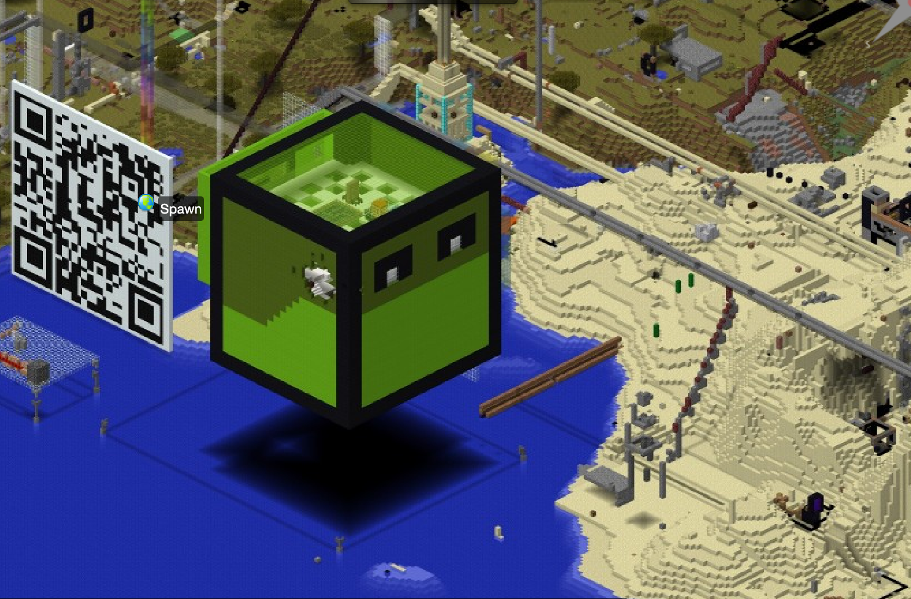

> Programmieren lernen und kreativ bauen — direkt in Minecraft.

Minecraft ist viel mehr als ein Spiel. Bei uns nutzen wir es als kreative Lernumgebung: Du lernst, Schildkröten zu programmieren, eigene Mods zu bauen und mit Redstone zu experimentieren.

- **Workshops** — online und vor Ort in Augsburg
- **Mods** — eigene Modifikationen mit MCreator erstellen
- **Turtle Programming** — programmierbare Schildkröten in Minecraft
- **Materialien für Lehrkräfte** — Minecraft im Unterricht einsetzen

<h2>Einführung in das Programmieren mit Minecraft</h2>
Minecraft ist ist nicht nur ein außergewöhnlich kreatives Computerspiel – es ist auch eines der erfolgreichsten Computerspiele der Welt und bei Groß und Klein gleichermaßen beliebt. <strong>Diese Begeisterung kann man nutzen, um Neues zu lernen: das Programmieren!&nbsp;</strong>

In unserer Welt der<strong> fortschreitenden Digitalisierung praktisch aller Lebensbereiche wird ein Verständnis für IT-Prozesse immer wichtiger</strong>. Programmierer werden branchenübergreifend händeringend gesucht. Sie sind es, die unsere Zukunft gestalten.

Das Tolle ist: <strong>Programmieren</strong> (oder "Coden") ist weder verkopfte Wissenschaft noch abstraktes Hexenwerk, sondern <strong>ganz logisch und leicht zu lernen</strong>. Und am einfachsten lernt man dann, wenn man gar nicht merkt, dass man etwas lernt, sondern <strong>einfach Spaß hat</strong>!

Das ganze basiert auf einer Minecraft-Mod (=<a href="https://de.wikipedia.org/wiki/Mod_%28Computerspiel%29#Minecraft">Erweiterung</a>) namens ComputerCraftEdu. Diese Erweiterung fügt <strong>programmierbare Roboter-Schildkröten zu Minecraft hinzu</strong>: diese können direkt im Spiel programmiert werden und agieren dann im Spiel wie echte Roboter: sie lösen schwierige oder lästige Aufgaben, graben nach wertvollen Erzen, beschützen den Spieler vor gefährlichen Monstern und vieles mehr!

<h2>Lass uns loslegen - alles <strong>kostenlos!</strong></h2>
Überzeugt? Du willst die Schildkröte gleich mal starten und in Minecraft mit ihr spielen und auch mal TutleCity besuchen?

Gerne - außer einer Minecraft Java Lizenz und einem PC oder Laptop brauchst du nichts! Das Modpack ist kostenlos - hier findest du alle Infos:

Installation ModPack (kostenlos)



<h2>Programmieren lernen in Minecraft: das Buch!</h2>
Vielleicht kennst Du das: Die Kids reden den ganzen Tag über nichts anderes als Minecraft. Wäre es nicht cool, diese Energie und das Interesse in nützliche Bahnen zu lenken? Genau das habe ich mit meinem &lt;LET'S CODE&gt;-Minecraft- Buch probiert: Mit der Roboter-Schildkröte können Kinder und Jugendliche in 8 <s>Kapiteln</s> Leveln spielerisch den Einstieg ins Programmieren schaffen. Und das ohne Vorkenntnisse!

<strong>Achtung</strong> – für die Übungen und Abenteuer im Buch brauchst Du einen Computer und eine Minecraft-Java-Lizenz!

Endlich ist es so weit! Nach harter Arbeit ist die <strong>Zweitauflage</strong> meines Buchs <a href="https://www.rheinwerk-verlag.de/lets-code-programmieren-lernen-in-der-minecraft-welt/?GPP=kidslab"><em>&lt;LET'S CODE&gt; Programmieren lernen in der Mindecraft-Welt</em></a><em> </em>erschienen. Neu überarbeitet und ergänzt! Das Buch ist ab <u>sofort verfügbar</u> direkt über den Verlag oder über Amazon oder in Eurem lokalen Buchhandel!

Beim Verlag bestellen

Bei Amazon bestellen

<h2>Programmieren lernen in Minecraft – der kostenlose <strong>Video-Kurs über 8 Level!</strong></h2>
Auf YouTube findest Du auch den kompletten Programmier-Kurs in 15 Videos:
<ul><li>
Verschiedene Level wie im Buch
</li><li>
Extra Challenges
</li><li>
Neues über TurtleCity
</li></ul>
und vieles mehr :)

YouTube Videos



## Willkommen in Turtle City!

<h1>TurtleCity</h1>
Die TurtleCity ist eine Stadt, die von den Schildkröten selbst gebaut wurde, nachdem Sie zum ersten mal in Minecraft aufgetaucht sind.

Alles über TurtleCity
