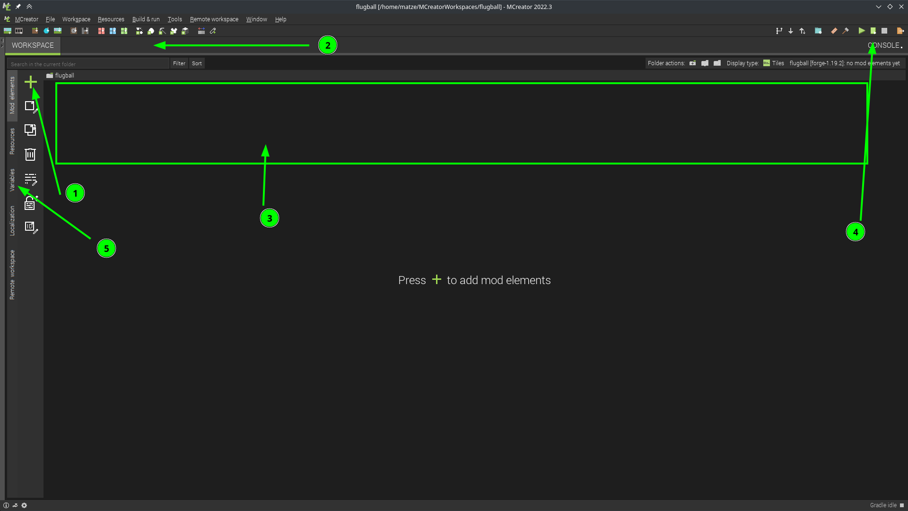

> With MCreator you build your own Minecraft mod — no programming skills needed. Inspired by Quidditch from Harry Potter, with an alpaca as mascot.

**Alpaka-Ball** is an Open Educational Resource (OER) workshop in which kids and teenagers aged 10+ learn to build their own Minecraft mod with [MCreator](https://mcreator.net/).

The game idea: shoot balls into a goal, score points, build an arena — and export the whole thing as a real Minecraft mod!

## Video introduction

MCreator is installed and your first mod is ready in 30 minutes:



## Workshop content

The workshop consists of 8 chapters, which work either as standalone workshops (1–2h each) or as a full-day workshop:

| No. | Chapter |
|-----|---------|
| 00 | Introduction to MCreator & our project |
| 01 | Create a project |
| 02 | Create the ball |
| 03 | Create the goal |
| 04 | Count points |
| 05 | Display & reset points |
| 06 | Create an item (bat) |
| 07 | Build the arena |
| 08 | Export the mod |

## Requirements

| | |
|---|---|
| **Age** | from 10 years |
| **Software** | [MCreator](https://mcreator.net/download) (free) |
| **Devices** | one computer per participant, projector |
| **Internet** | yes, MCreator requires an internet connection |
| **Minecraft account** | not needed — mods can also be tested without an account |
| **Recommended** | 10 participants + 2 mentors |

## Downloads


The downloadable materials below are currently in German.








## Do it yourself

All materials are licensed **CC BY 4.0** — you're free to use, adapt, and share them.



The folder `MCreatorWorkspaces/alpaka_ball/` contains the complete MCreator workspace with the finished mod — open it directly in MCreator and get started.
