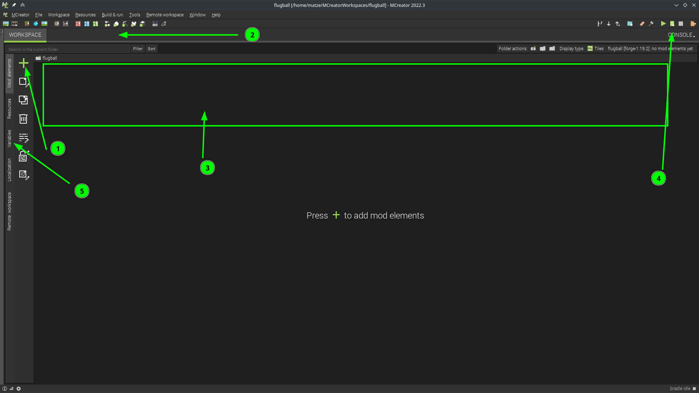

> Mit MCreator baust du deine eigene Minecraft-Mod — ganz ohne Programmierkenntnisse. Angelehnt an Quidditch aus Harry Potter, mit dem Alpaka als Maskottchen.

**Alpaka-Ball** ist ein Open Educational Resource (OER) Workshop, in dem Kinder und Jugendliche ab 10 Jahren lernen, mit [MCreator](https://mcreator.net/) ihre eigene Minecraft-Mod zu erstellen.

Die Spielidee: Bälle ins Tor schießen, Punkte sammeln, eine Arena bauen — und das Ganze als echte Minecraft-Mod exportieren!

## Video-Einführung

In 30 Minuten ist MCreator installiert und die erste eigene Mod fertig:



## Workshop-Inhalt

Der Workshop besteht aus 8 Kapiteln, die als Einzel-Workshops (je 1–2h) oder als Tages-Workshop funktionieren:

| Nr. | Kapitel |
|-----|---------|
| 00 | Einführung in MCreator & unser Projekt |
| 01 | Projekt erstellen |
| 02 | Ball erstellen |
| 03 | Tor erstellen |
| 04 | Punkte zählen |
| 05 | Punkte anzeigen & Zurücksetzen |
| 06 | Gegenstand erstellen (Schläger) |
| 07 | Arena bauen |
| 08 | Mod exportieren |

## Voraussetzungen

| | |
|---|---|
| **Alter** | ab 10 Jahre |
| **Software** | [MCreator](https://mcreator.net/download) (kostenlos) |
| **Geräte** | Computer pro Teilnehmer, Beamer |
| **Internet** | Ja, MCreator benötigt Internetverbindung |
| **Minecraft-Account** | Nicht nötig — Mods können auch ohne Account getestet werden |
| **Empfohlen** | 10 Teilnehmer + 2 Mentoren |

## Downloads







## Selber machen

Alle Materialien sind **CC BY 4.0** lizenziert — du kannst sie frei verwenden, anpassen und weitergeben.



Der Ordner `MCreatorWorkspaces/alpaka_ball/` enthält den vollständigen MCreator-Workspace mit der fertigen Mod — direkt in MCreator öffnen und loslegen.
