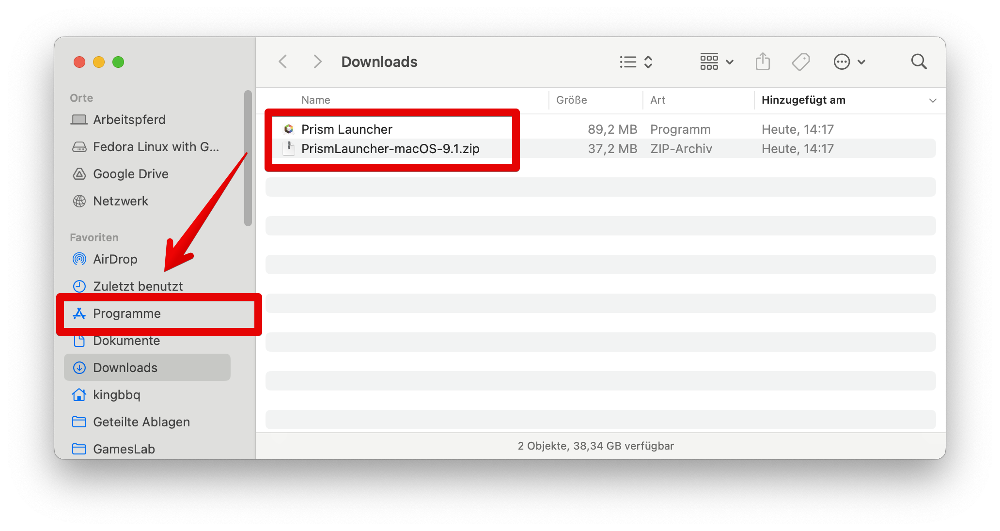
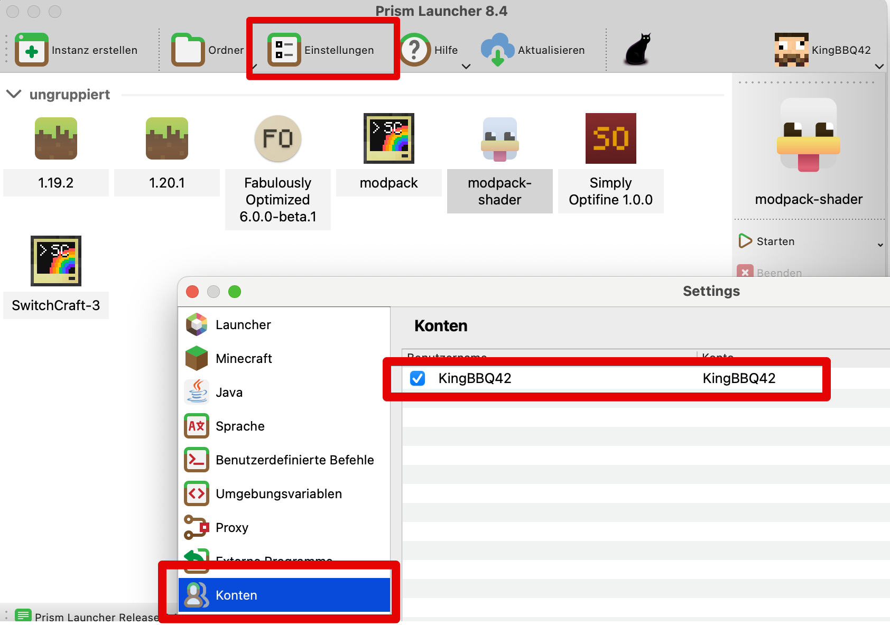
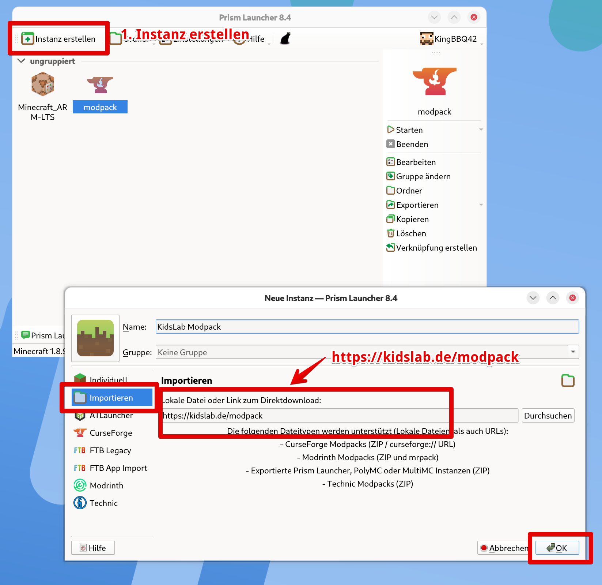

Auf manchen Apple MacBooks mit den aktuellen M-Prozessoren gibt es manchmal Probleme bei der Installation. Wir empfehlen in diesem Fall die Benutzung des **Prism-Launchers.**

So gehts:

1. Prism Launcher herunterladen:
   1. [https://prismlauncher.org/download/](https://prismlauncher.org/download/)
2. Entpacken - *Doppelklick* auf die ZIP Datei
3. Mit Drag&Drop zu **`Programme`** verschieben
4. Starten
5. Unter **`Einstellungen`** den Minecraft Account hinterlegen
6. Klicke auf **`Instanz erstellen`** und auf **`Importieren`**
7. Gib unter Download-Link ein:
   1. https://kidslab.de/modpack

Danach kann der Modpack wie im ATLauncher gestartet werden.

