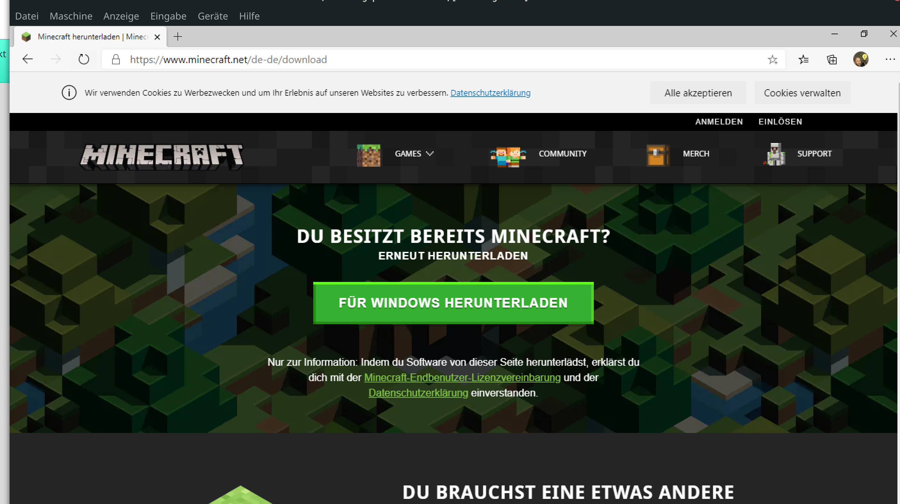
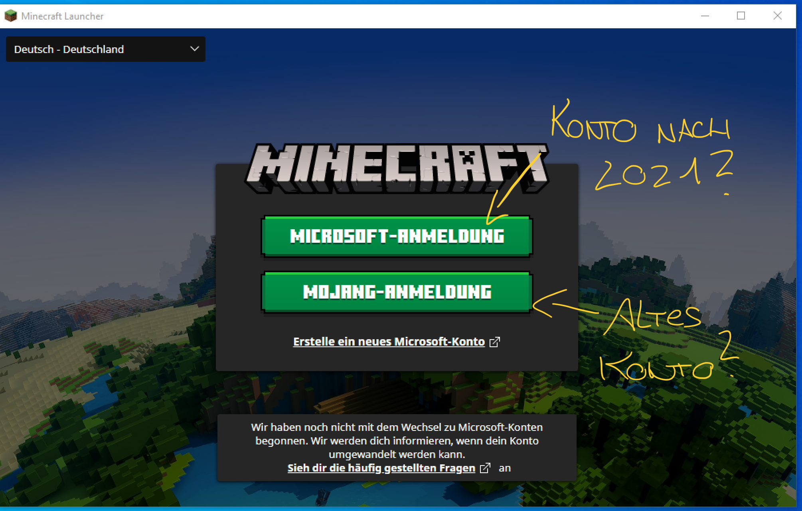
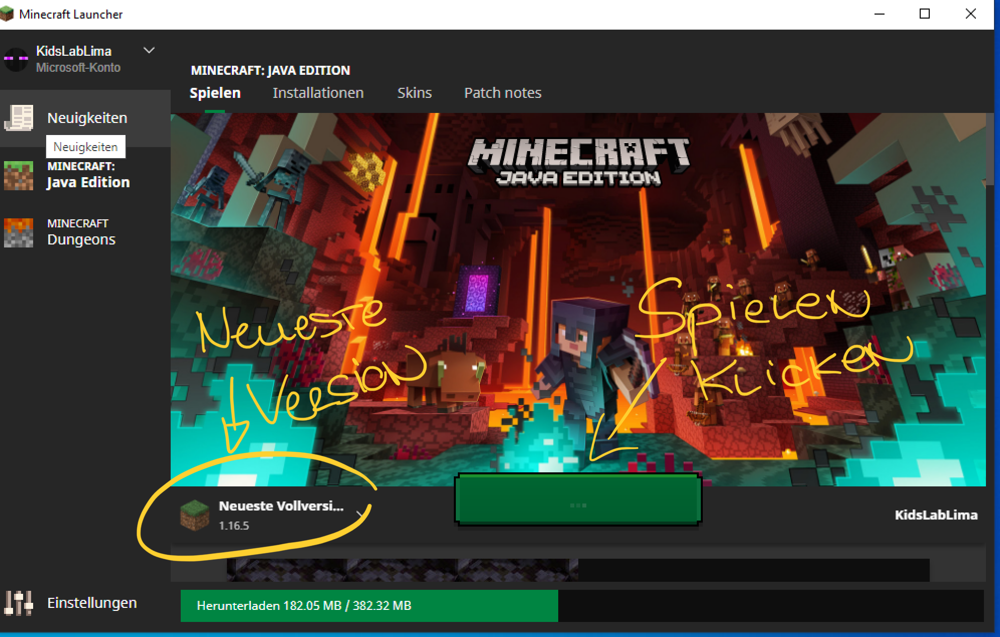
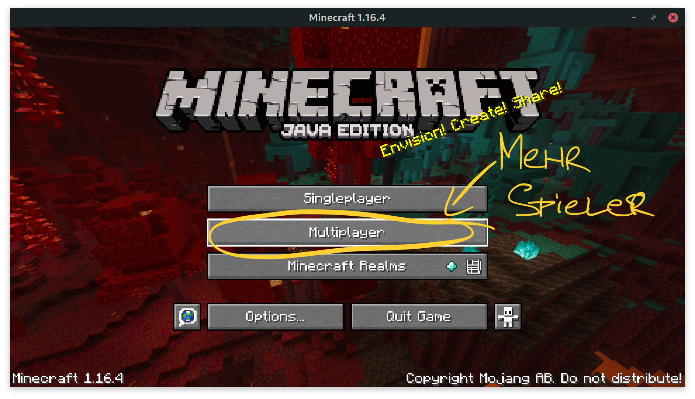
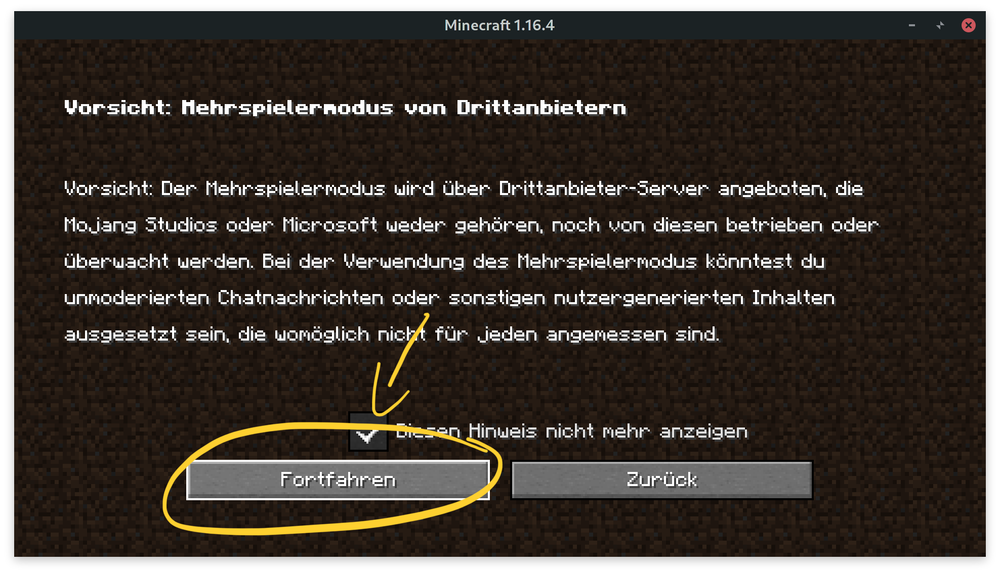
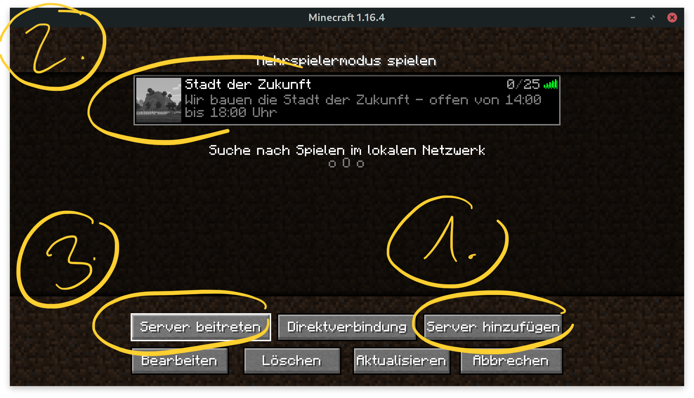
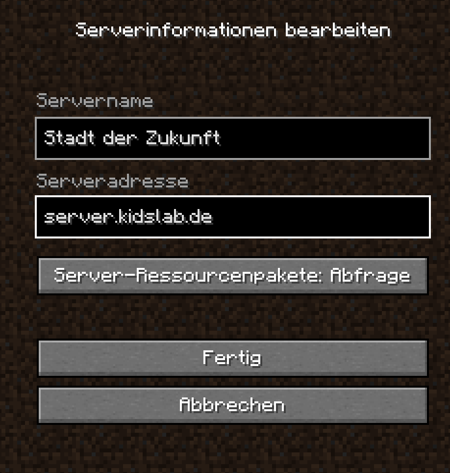

## Herunterladen der Java-Version


Verwirrt von den verschiedenen Versionen? Hier eine kleine [Übersicht](../versionen/).


Lade den Installer für die Minecraft Java Version hier herunter: [minecraft.net/download](https://www.minecraft.net/de-de/download)

Nach der Installation musst Du Dich erst mal anmelden:


Mehr über den Unterschied zwischen Mohjang und Microsoft-Konten findest Du hier: [Minecraft und Microsoft Konten](../../microsoft-konten/)



Du hast keine Java-Lizenz? Gerne stelle ich eine Version für die Dauer des Kurses zur Verfügung.


Nach der Anmeldung und dem Start auf **"Spielen"** klicken:

## Server anlegen und beitreten

Nach dem Anmelden und Start musst Du nur noch den Server anlegen:

* Klicke auf "**Mehrspieler**"
* Die Warnung mit "**Fortfahren**" bestätigen
* Klicke auf "**Server hinzufügen**"
  * Servername: "Stadt der Zukunft"
  * Serveradresse: **server.kidslab.de**
  * "**Fertig**" zum bestätigen
* Server auswählen
* **"Server beitreten"**


Du kannst keinem Server beitreten? Wenn deine **Java-Version mit einem Microsoft-Account** verknüpft ist, und dieses Konto ein "Kinderkonto" ist, gibt es noch ein paar zusätzliche Sachen zu beachten - mehr findest du auf dieser Seite: [Minecraft und Microsoft Konten](../../microsoft-konten/)



Du siehst jetzt eine leere Welt? **Geschafft**!

**Du kannst nichts abbauen oder machen**? Das ist richtig so - diese Welt ist nur zum Testen da!


