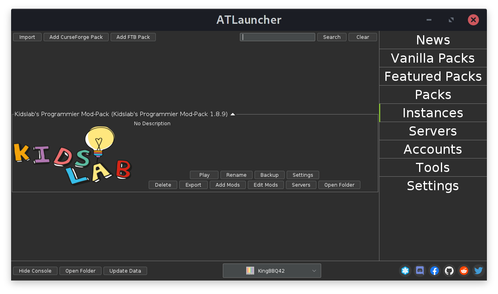
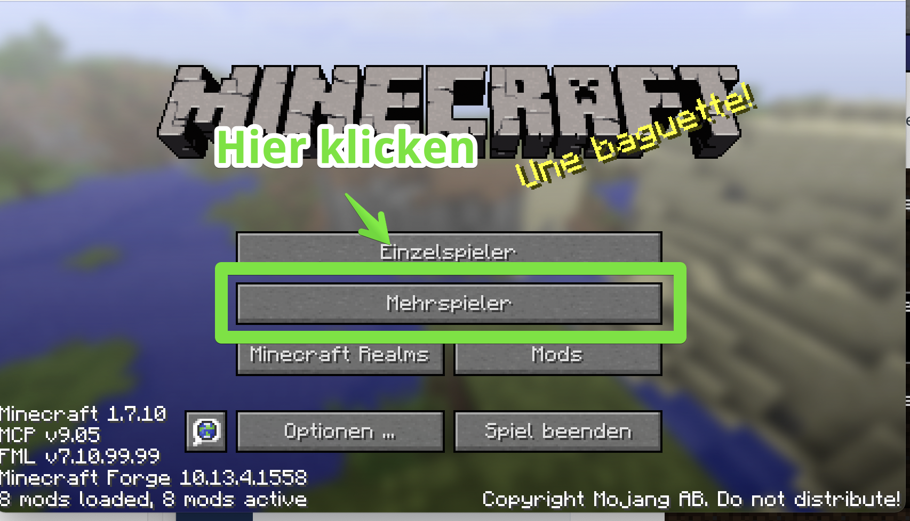
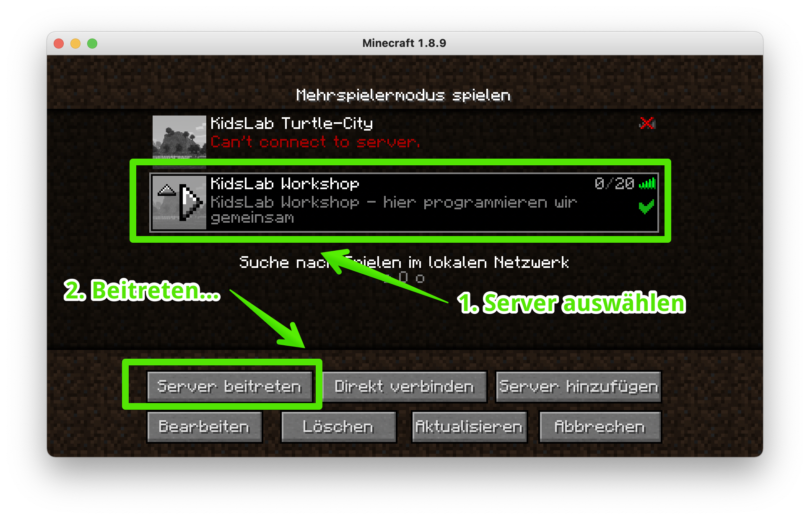
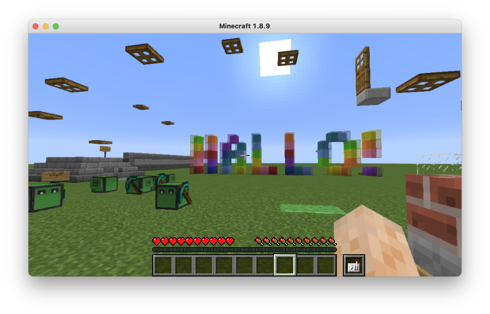

## Minecraft-Java Lizenz

Zum Spielen benötigst Du eine Lizenz für die "Minecraft Java Edition".


Du benötigst eine Lizenz, um mit dem Buch in Minecraft programmieren zu können. Du kannst eine eigene Lizenz für ca. 29€ hier kaufen: [**Minecraft-Java**](https://www.minecraft.net/de-de/store/minecraft-java-edition)



Tablets, Playstation oder ähnliche Geräte gehen leider nicht! Diese Versionen sind untereinander leider nicht kompatibel


Wenn Deine **Java-Version mit einem Microsoft-Account** verknüpft ist, und dieses Konto ein "Kinderkonto" ist, gibt es noch ein paar zusätzliche Sachen zu beachten - mehr findest du auf dieser Seite: [Minecraft und Microsoft Konten](../../microsoft-konten/)

## AtLauncher Installation

Ich habe alles in einem ModPack zusammengestellt. Im Folgenden erkläre ich Dir, wie man dieses installieren kann.

### Installation Windows

1. **AtLauncher hier runterladen:** [https://atlauncher.com/download/exe-setup](https://atlauncher.com/download/exe-setup)
2. **Setup ausführen** (Doppelklick auf Datei im Downloads Ordner)
3. **AtLauncher starten**
4. Rechts "**Accounts**" auswählen
   1. Mohjang Account? (Vor 2021 gekauft) - Username und Password eintragen
   2. Microsoft Account? Auf "Login with Microsoft" klicken und anmelden
5. Rechts "**Instances**" auswählen
6. Links oben auf "**Import**" klicken
7. Folgende **URL** eintippen oder einfügen: [https://kidslab.de/modpack](https://kidslab.de/modpack)
8. Fertig!



### Installation MacOS


Hast du einen neueren Mac mit **M-Prozessor? Also M1, M2 etc?** Dann probier bitte diese Variante, die klappt erfahrungsgemäß besser auf diesen Geräten: [Installation Apple Silicon](../apple-silicon/)


1. Zuerst **Java installieren**: [https://java.com/de/download/](https://java.com/de/download/)
2. Dann **AtLauncher für Mac herunterladen:** [https://atlauncher.com/download/zip](https://atlauncher.com/download/zip)
3. Das landet im Downloads-Ordner - ein **Doppelklick auf die ZIP Datei** entpackt die Applikation.
4. Mit Drag&Drop in den Ordner "**Programme**" **verschieben**
5. Beim ersten Start zusätzlich die **CTRL / Control Taste gedrückt halten - und dann "Öffnen" klicken**
6. Rechts "**Accounts**" auswählen
   1. Mohjang Account? (Vor 2021 gekauft) - Username und Password eintragen
   2. Microsoft Account? Auf "Login with Microsoft" klicken und anmelden
7. Rechts "**Instances**" auswählen
8. Links oben auf "**Import**" klicken
9. Folgende URL eintippen oder einfügen: [https://kidslab.de/modpack](https://kidslab.de/modpack)
10. Fertig!



## Installation Linux

Am einfachsten geht die Installation mit der Software [flatpak](https://flatpak.org/). Hier exemplarisch die Installation unter Ubuntu:

#### Installation Flatpak

```bash
sudo apt install flatpak
sudo add-apt-repository ppa:flatpak/stable
sudo apt update
sudo apt install flatpak
sudo apt install gnome-software-plugin-flatpak
flatpak remote-add --if-not-exists flathub https://flathub.org/repo/flathub.flatpakrepo
```

#### Installation AtLauncher

```bash
flatpak install atlauncher
```

Noch 3-4 mal "Ja" sagen - und fertig ist die Installation!


Flatpak ist cool, weil:

1. Apps laufen auf allen Linux-Systemen gleich - egal ob Ubuntu, Fedora oder andere
2. Programme sind vom System isoliert (Sandbox) = mehr Sicherheit
3. Apps können parallel in verschiedenen Versionen installiert sein
4. Updates kommen direkt vom Entwickler, unabhängig von der Distribution
5. Dependencies sind immer dabei - keine fehlenden Bibliotheken

Kurz: Einfacher, sicherer und universeller als klassische Paketmanager.


## Erster Start

Wenn alles installiert und eingerichtet ist, starte bitte den AtLauncher und wechsle auf den Reiter "**Instances**" (rechts):



Klicke jetzt auf den Knopf "**Play**" beim KidsLab-Modpack.

### Verbinden zum Server





Sieht dein Screen jetzt so aus? Super!

Es sind 2 Server in der Liste, klicke bitte auf einen der beiden Server (grün wenn aktiv) und dann unten auf "**Server beitreten**"




Geschafft, du bist online!

Die Welt ist komplett leer - sie ist nur für den ersten Test da. Du kannst auch nichts machen.



Es gibt 2 Server:

**KidsLab Workshop**: Auf diesem Server treffen wir uns zu unseren Workshops. Der Server ist nur immer für die Zeit des Workshops aktiv.

**KidsLab Turtle City**: ist ein Server, der jeden Tag zwischen 14:00 und 18:00 Uhr läuft. Hier kannst Du auch außerhalb des Kurses Programmieren und die Programme und Werke anderer anschauen.


Alles weitere machen wir dann im Kurs!


Fragen, Probleme? eMail an gregor@kidslab.de oder Telefon oder WhatsApp: 0821-58920484

