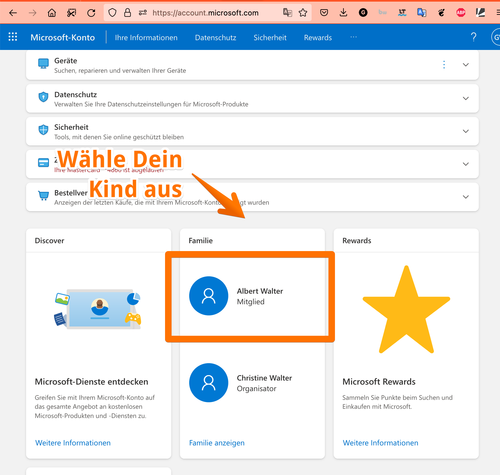
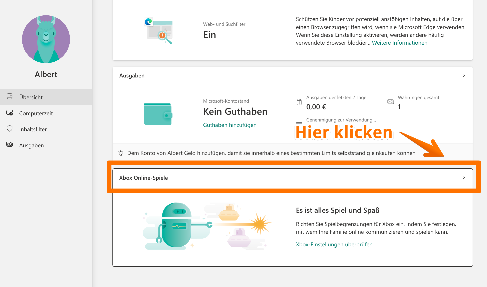
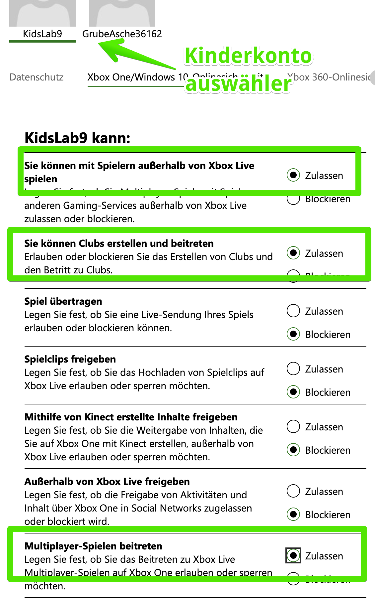
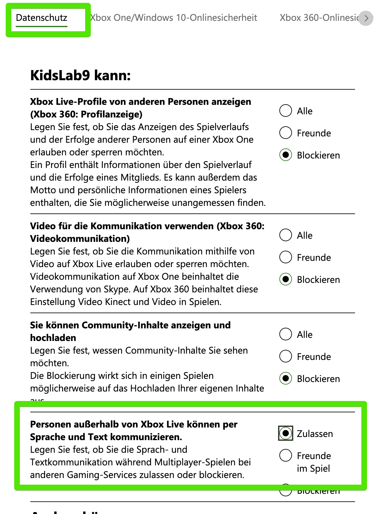
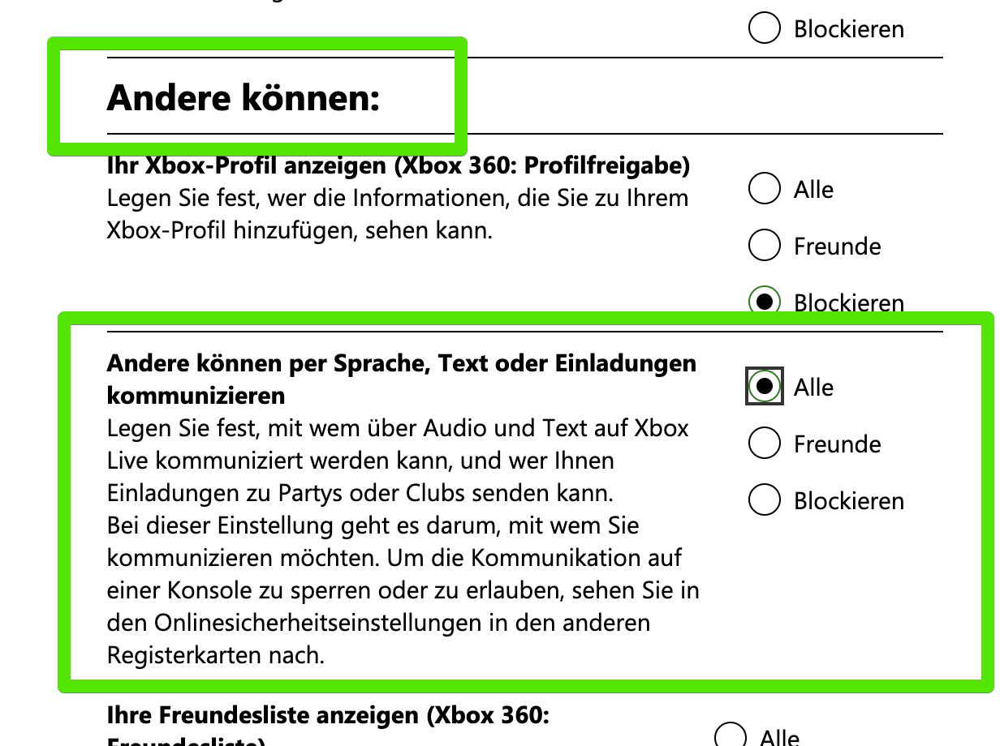
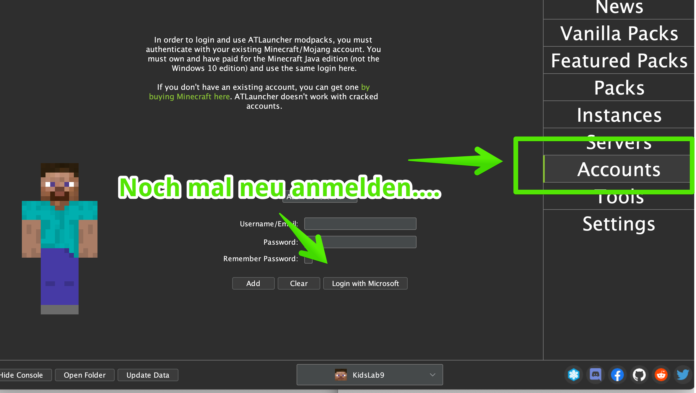

Wenn es sich bei dem Konto, auf das die Minecraft-Lizenz registriert ist, um ein sog. "Kinderkonto" handelt, muss man noch einige Schritte durchführen, um das gemeinsame Spielen zu ermöglichen.

Zuerst als Eltern anmelden und die Familienverwaltung aufrufen: [https://account.microsoft.com/family/](https://account.microsoft.com/family/)

Wähle dann dein Kind aus - das Konto, das du ändern möchtest.

In dem Konto, klicke auf "Xbox Online Spiele":

Da müssen dann diese Einstellungen unter **Xbox One** geändert werden:

Unter **Datenschutz** sind es diese Einstellungen:


Ganz wichtig: neu anmelden! Das ganze muss aber noch durch eine Neu-Anmeldung im ATLauncher neu geladen werden.


