Die TurtleCity ist eine Stadt, die von den Schildkröten selbst gebaut wurde, nachdem sie zum ersten Mal in Minecraft aufgetaucht sind.

Die Stadt selbst läuft im Abenteuer Modus. Du kannst also selbst nicht bauen oder abbauen - aber die Schildkröten natürlich!


**Öffnungszeiten**: TurtleCity ist jeden Tag von **08:00 bis 19:30 Uhr** geöffnet



Die Regeln für TurtleCity:

* **Be excellent to each other = Seid nett zueinander!**
* **Nur auf dem eigenen Bauplatz oder Grundstück programmieren oder bauen**
* **Keine anderen Schildkröten oder Bauwerke verändern oder beschädigen!**


## Wie bekomme ich Kröten und alles was ich brauche?

Am Spawn steht der Start-Up-Buttler, er gibt dir eine Schildkröte, eine Fernbedienung und 15 Silber-Taler zum Einkaufen!

## Abenteuer-Modus und Überlebensmodus

Normalerweise ist in den Workshops ja immer der Abenteuer-Modus aktiv. Wenn Du auf Turtle-City joinst, dann bist Du erst mal auch im Abenteuer-Modus.

Wenn Du aber außerhalb des roten Bereichs bist, wirst du automatisch auf den normalen Überlebens-Modus umgeschaltet: jetzt kannst Du also selbst bauen, abbauen etc!

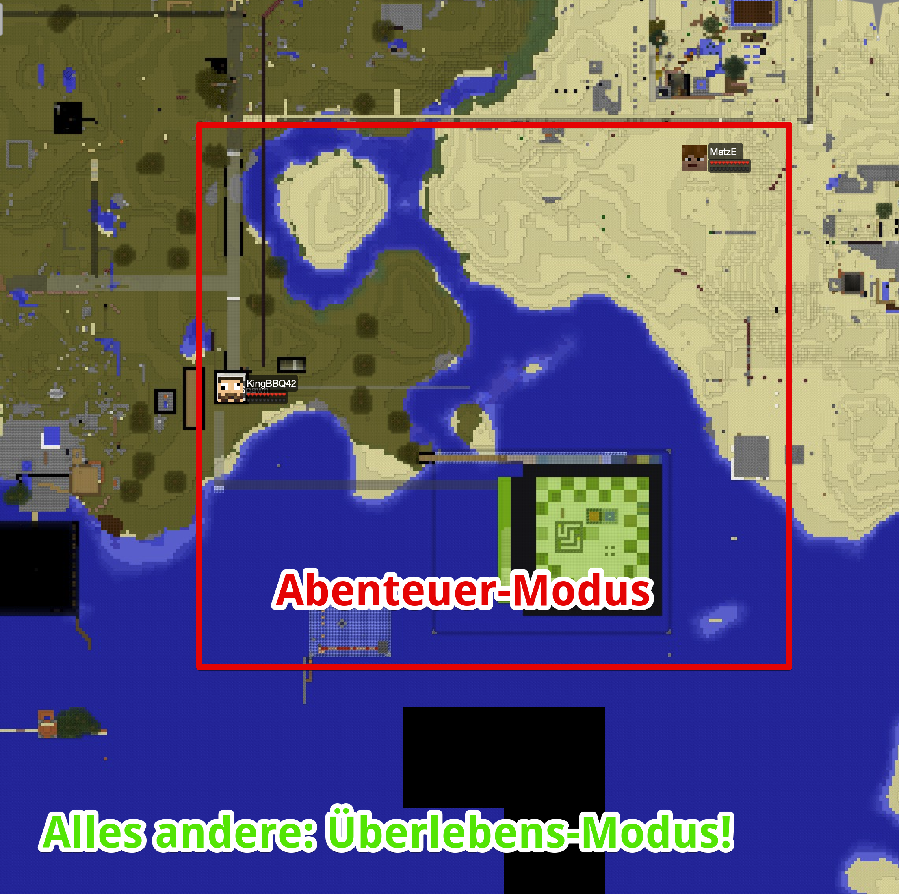

## Bauplätze - Eigene Grundstücke sichern

Du kannst das Bauen auf eigenen Grundstücken sichern: Das heißt, nur du kannst auf ihnen bauen oder abbauen.

Jeder kann bis zu 25 Chunks (jeder Chunk ist 16x16 Blöcke groß) für sich beanspruchen (= claimen).


**Wie geht das technisch?**

Wir haben ein Mod im ModPack namens "FTB Utilities" - damit kann man nicht nur Chunks claimen, auch Freundschaften verwalten und Chunks laden. Mehr findest du unter: [https://help.ftb.team/help/en-gb/7-ftb-utilities/21-chunk-claiming](https://help.ftb.team/help/en-gb/7-ftb-utilities/21-chunk-claiming)


### Karte mit Chunks öffnen

Dazu öffnest Du das Inventar (mit E) und klickst auf den Knopf rechts oben:

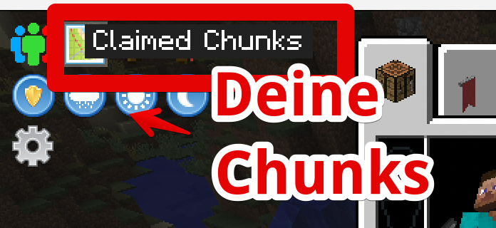

Danach siehst du eine Karte der aktuellen Welt - und auch, ob es schon Chunks gibt, die jemanden gehören.

Chunks anderer Spieler sind BLAU eingefärbt, deine eigenen Chunks sind grün.

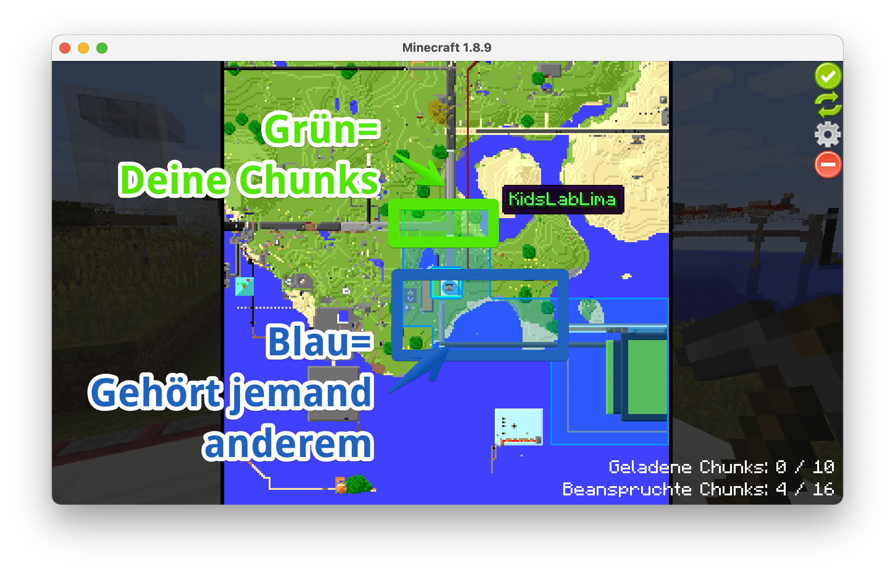

### Chunks beanspruchen

Du kannst nun ganz einfach eigene Chunks (wenn sie noch niemand anderem gehören) beanspruchen: Durch einen Links-Klick auf ein freies Feld, wird das Feld grün und gehört nun dir.

Wenn Du einen Chunk wieder freigeben möchtest, klicke einfach mit der rechten Maustaste drauf!

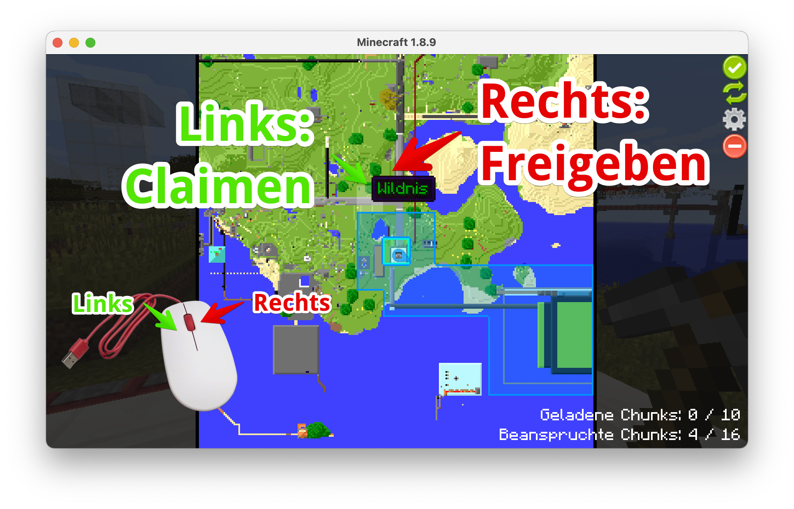

## Kaufen, Kaufen, Kaufen!

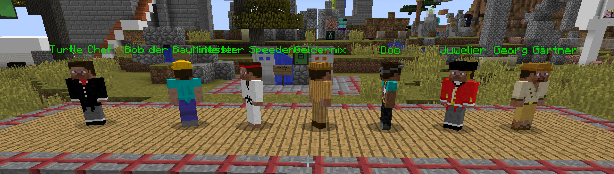

Bei diesen Händlern kannst Du Dich mit speziellen Gegenständen ausstatten oder das Gefarmte gegen Geld eintauschen!

### Tipp: Andere Schildkröten aussperren

Möchtest du nicht, dass andere Schildkröten auf dein Gelände eindringen? Dann mach außen rum diese Barrier-Blöcke!

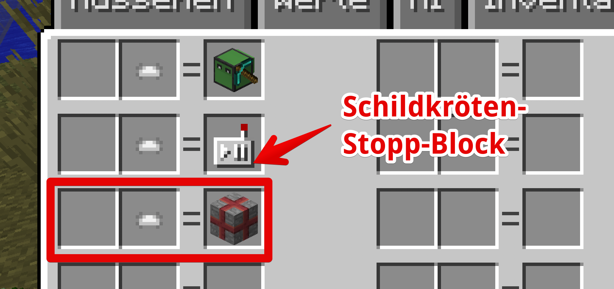

## Autobahnen - schneller ist besser!

Vielleicht hast Du schon die gläsernen Wege gesehen - und Dir ist aufgefallen, dass man sich dort super schnell bewegen kann!

Du kannst selbst Autobahnen in die entferntesten Gebiete bauen, das geht ganz einfach:

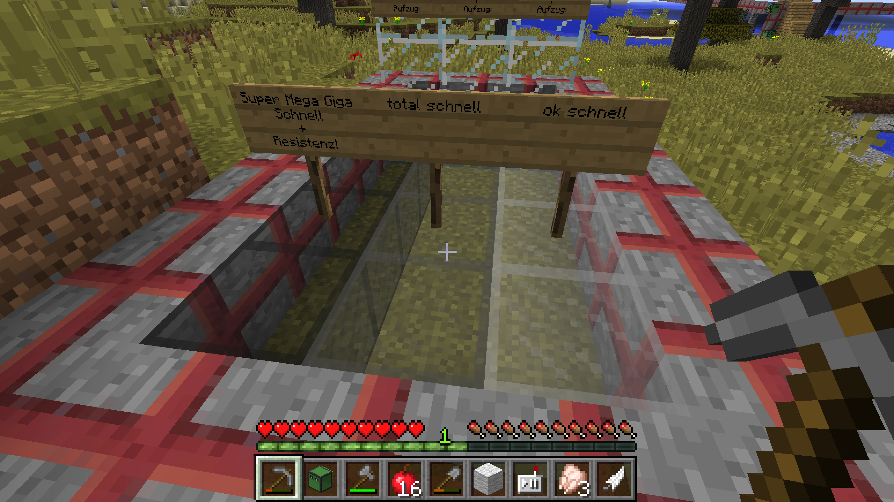

* **Hellgraues Glas** - baut eine Schnell-Straße
* **Graues Glas** - Autobahn
* **Schwarzes Glas** - Warp-Mega-Schnellstraße

Zusätzlich kannst du sehr einfach einen Aufzug bauen, und zwar aus **weißem Glas**!

Die einzelnen Gläser bekommst du beim Händler namens "Meister Speeder":

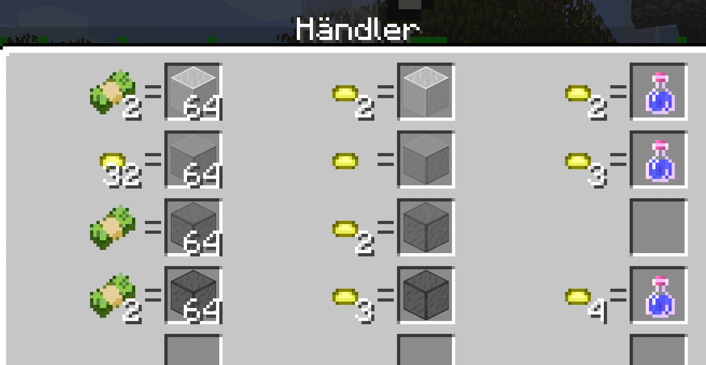

Und wie baut man am besten eine super lange Autobahn? Natürlich mit einer Schildkröte :)

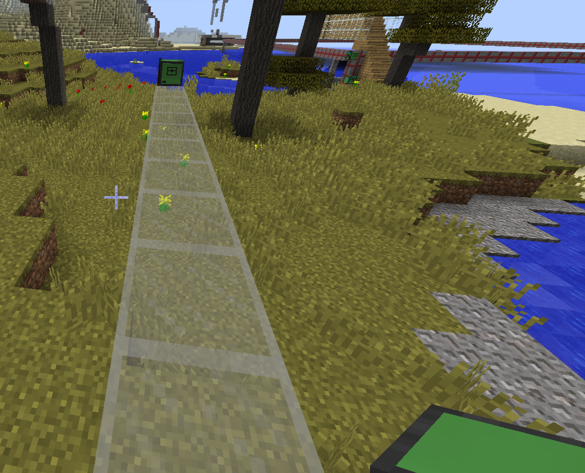

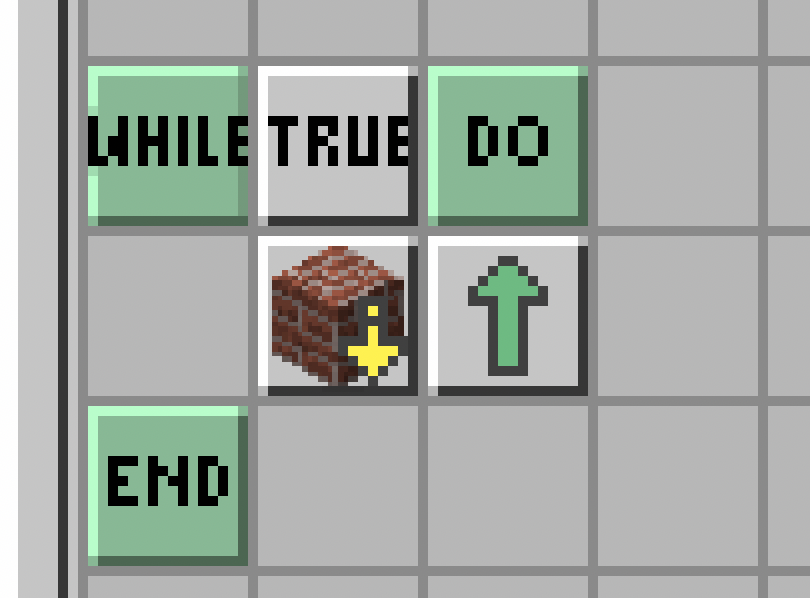


Von Hand setzen geht auch - aber dann wird man verflucht :)



Nicht vergessen: Lade die passenden Blöcke in das Inventar der Schildkröte!


## Du hast Post! Briefe und Gegenstände verschicken.

Es gibt einen Briefträger - Schruppi. Klicke auf ihn, um Briefe und Gegenstände an andere Spieler zu verschicken.

Neben ihm steht ein Briefkasten - wenn du da drauf klickst, kannst Du Briefe empfangen und lesen!

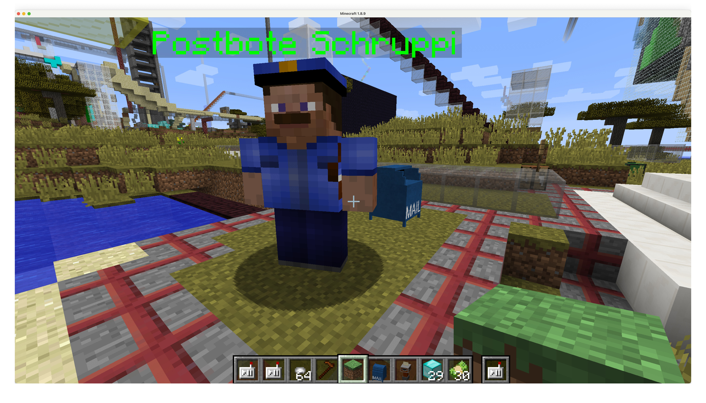

## Karte von Turtle City

Wenn du auf [city.server.kidslab.de](https://city.server.kidslab.de) im Browser gehst, siehst du eine Übersichtskarte:

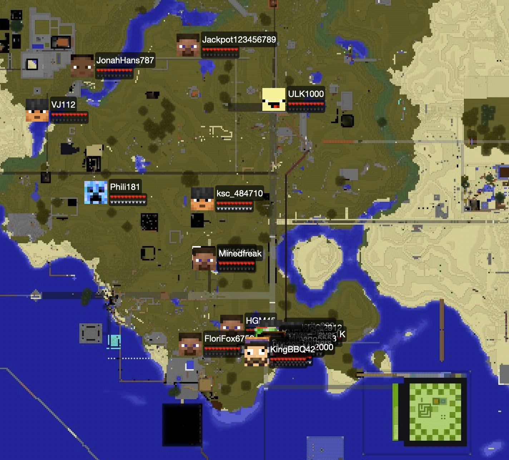
