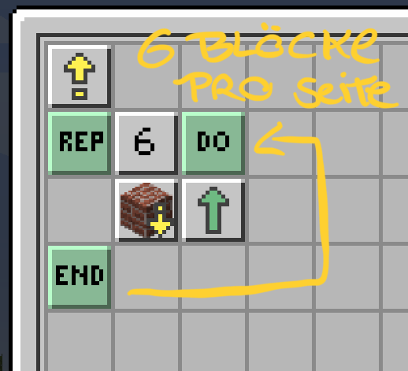
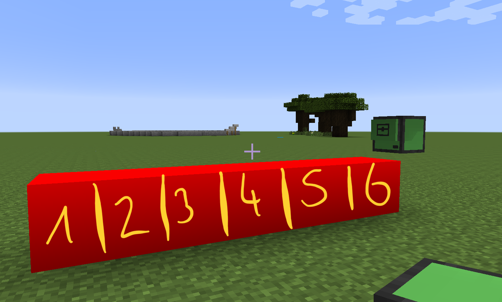
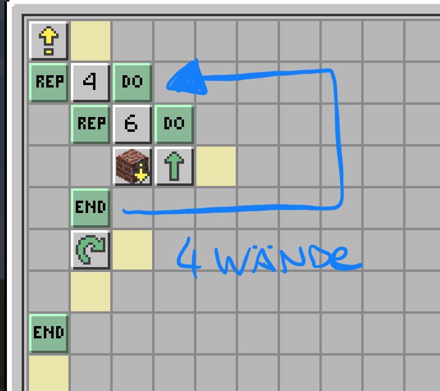
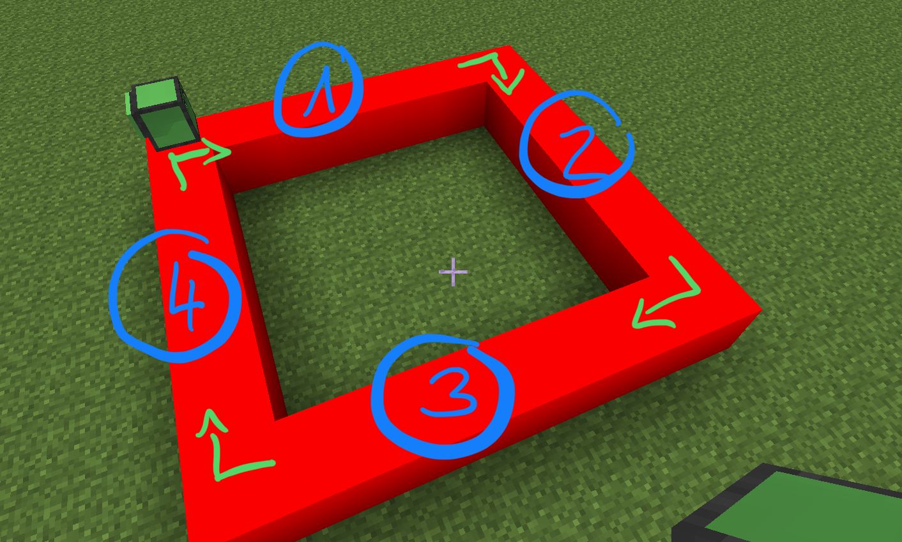
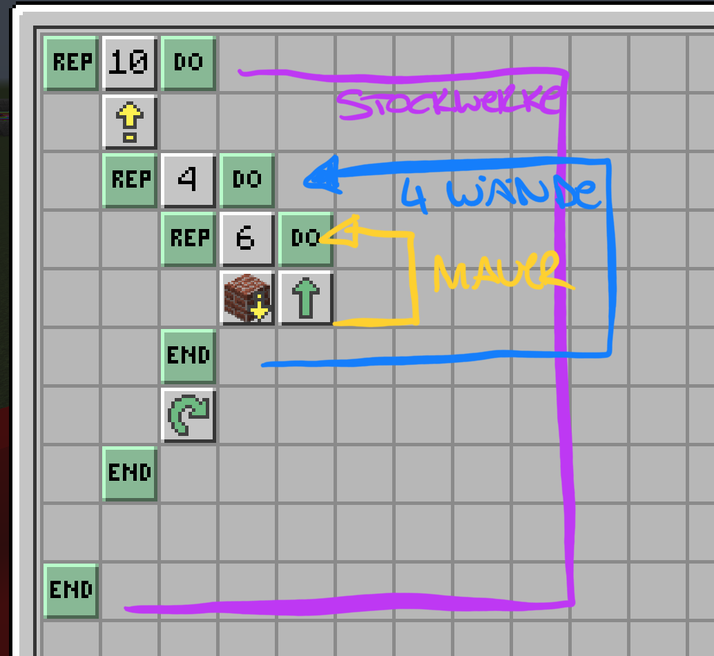
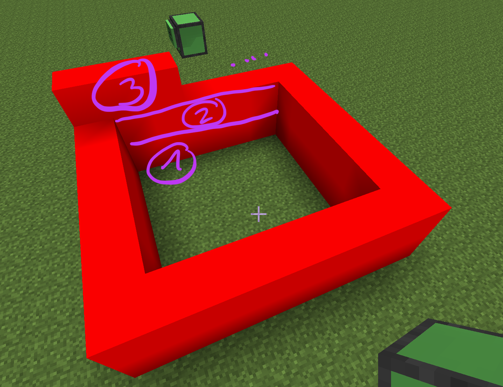

Als Beispiel möchte ich mit Dir mal ein Haus mit Robokröti bauen. Fangen wir ganz einfach mit einer Basis-Wand an:

Unser Haus soll ja 4 Wände haben. Wie macht man das nun am besten? Man könnte die Programmierung oben einfach 4 mal wiederholen - aber das ist natürlich langweilig :-)

Erste Ebene unseres Hauses ist fertig! Aber das Haus soll ja höher werden. Jetzt machen wir um unsere beiden bestehenden Schleifen außen rum noch eine weitere Schleife, die das so oft wiederholt, wie hoch das Haus sein soll. In meinem Fall will ich mein Haus 10 Blöcke hoch haben:


Unser Haus steht!



Pro Ebene brauchen wir also 4 x 6 Blöcke = 24 Blöcke. Wenn wir nun unser Haus 10 Blöcke hoch machen wollen, brauchen wir 240 Blöcke - nach 64 bekommst du eine Fehlermeldung - wie Du das beheben kannst, ist unter [Probleme & Lösungen](../probleme-und-loesungen/) erklärt.

