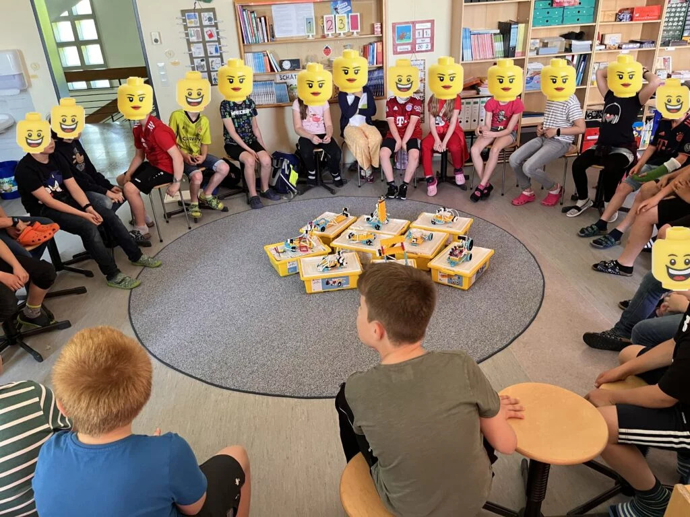
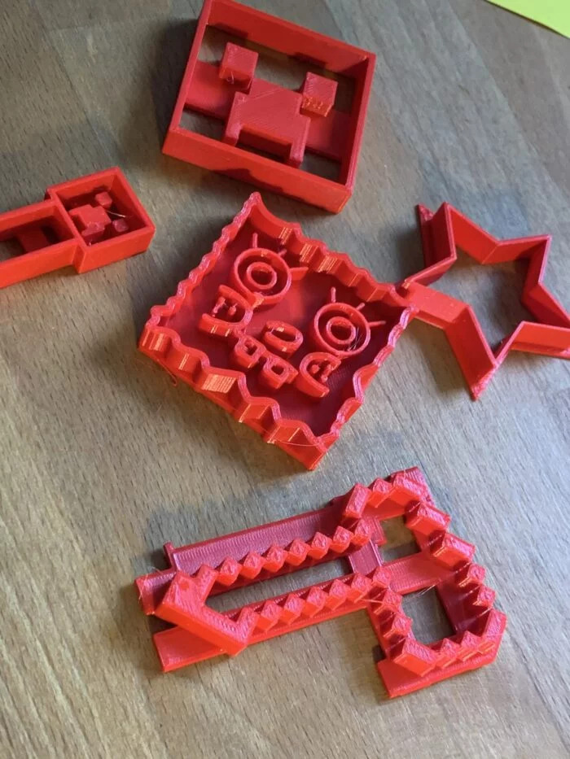
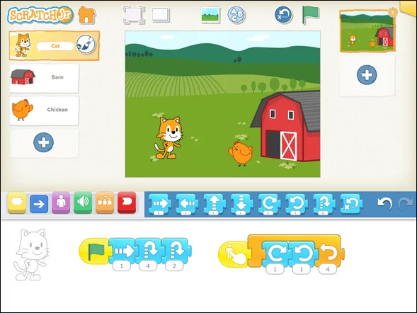
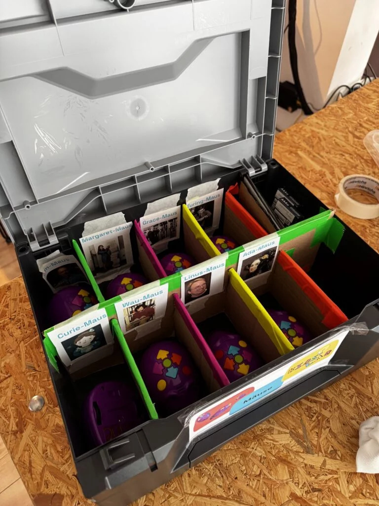
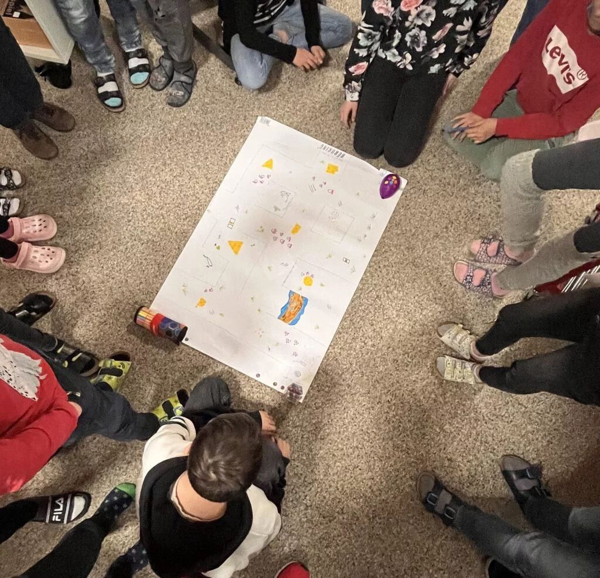

> Workshops, kits, and training for schools — we come to you.

Want to bring maker education to your school? We offer workshops right in the classroom, material kits to borrow, and training for teachers.

- Workshops right in the classroom – all materials, tech, and mentors included
- Flexible formats: project day, curriculum add-on, or multi-part series
- Funding available via Schule+ or the Startchancen programme – 50% discount














---



Download all offers as PDF

---

## Impressions from our workshops





---

**Interested?** Get in touch: [gregor@kidslab.de](mailto:gregor@kidslab.de) or 0821-99951920 (phone/WhatsApp)


