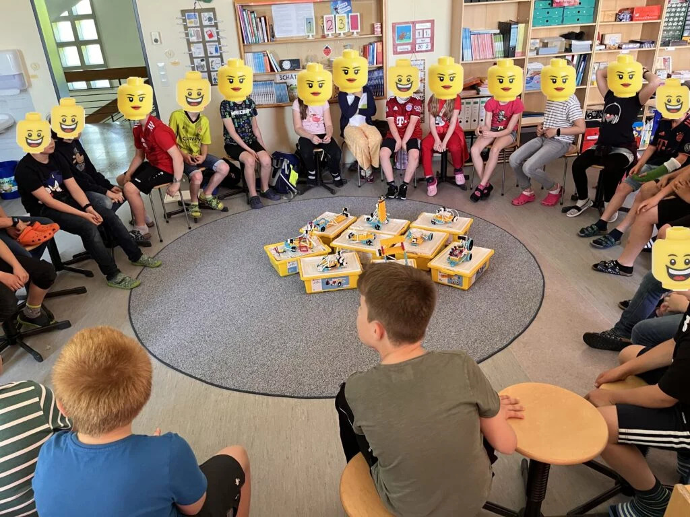
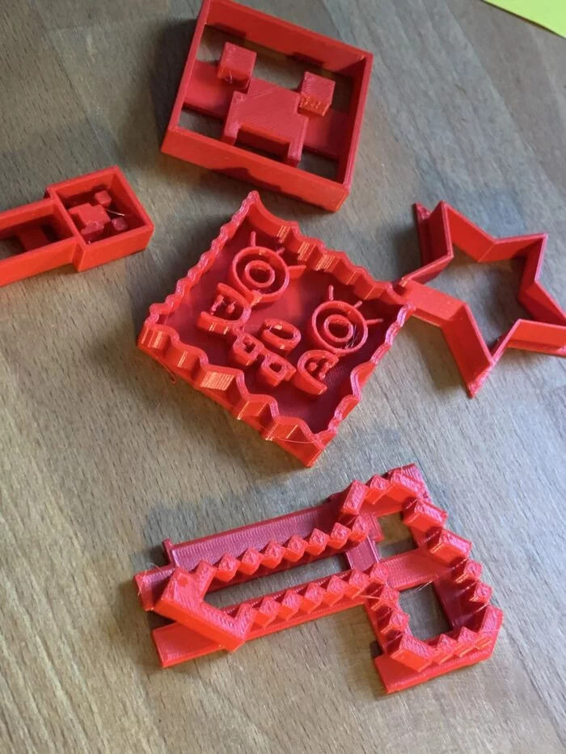
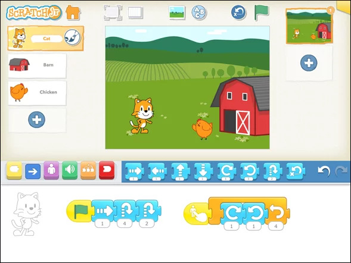
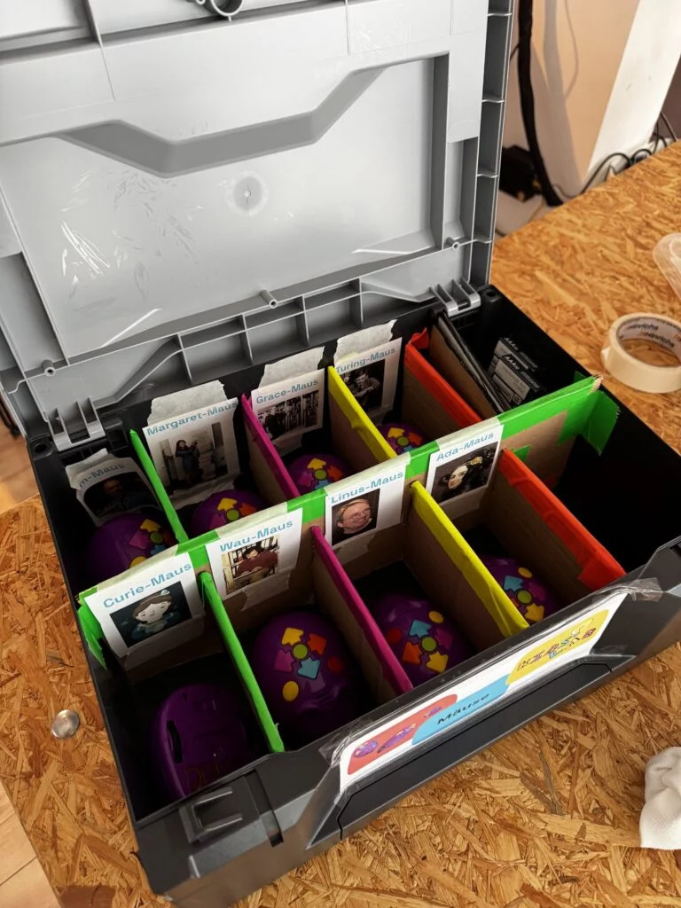
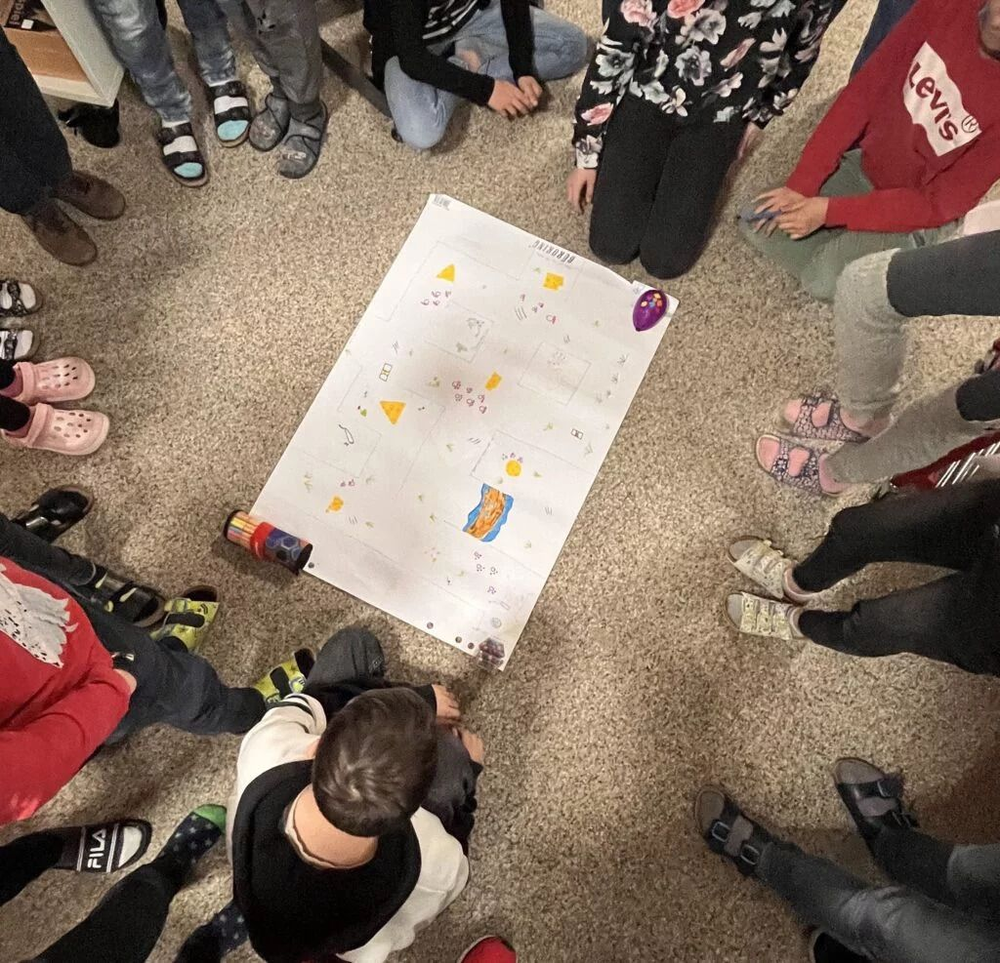

> Workshops, Koffer und Fortbildungen für Schulen — wir kommen auch zu euch.

Du willst Maker Education an deine Schule bringen? Wir bieten Workshops direkt im Klassenzimmer, Materialkoffer zum Ausleihen und Fortbildungen für Lehrkräfte.

- Workshops direkt im Klassenzimmer – alle Materialien, Technik und Mentoren inklusive
- Flexible Formate: Projekttag, Unterrichtsergänzung oder mehrteilige Reihe
- Förderung über Schule+ oder Startchancen-Programm möglich – 50% Rabatt













---



Alle Angebote als PDF herunterladen

---

## Eindrücke aus unseren Workshops





---

**Interesse?** Nehmen Sie Kontakt auf: [gregor@kidslab.de](mailto:gregor@kidslab.de) oder 0821-99951920 (Telefon/WhatsApp)


