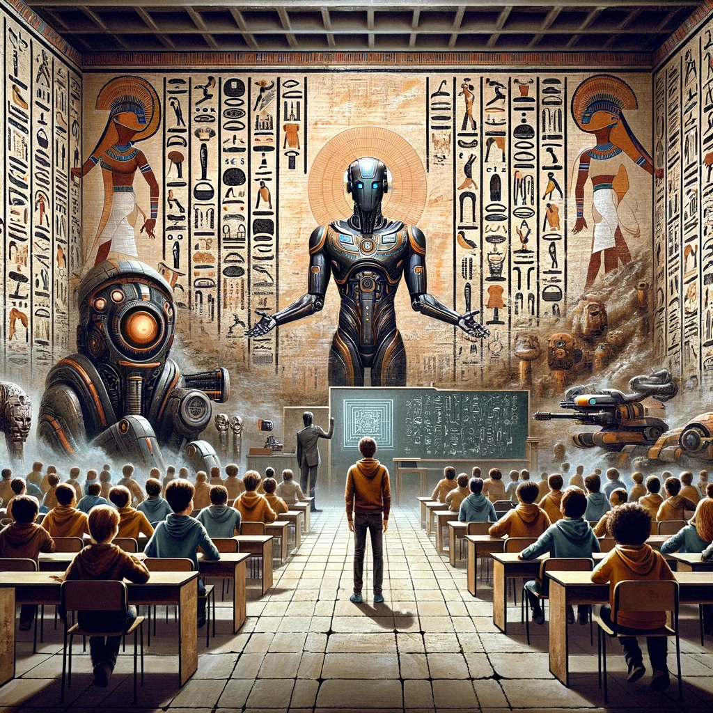

> An interactive workshop about AI at school – students take on different roles and debate: should robots teach?

### What happens in the workshop?

Imagine an AI robot is about to take over teaching at your school. Good idea? Total nonsense? That's exactly what gets debated — not abstractly, but **right in the thick of it**.

Students take on different roles: **teachers, students, parents, or school leadership** — each group with its own interests and arguments. In a lively role-play, they debate the chances and risks of AI in everyday school life: What can AI do better? What gets lost? Who decides?

The result is a real debate — critical, creative, and full of perspective-shifting.

### The four roles





### What do the students learn?

- **Introduction to artificial intelligence** – hands-on and easy to understand, no prior knowledge needed
- **Fostering critical thinking** – reflecting on the chances and risks of AI in everyday school life
- **Experiencing a change of perspective** – slipping into different roles through role-play
- **Sparking discussion and opinion-forming** as a class
- **Strengthening media literacy** – how do I use AI responsibly?

### Schedule (approx. 3 class periods)

| Phase | Duration | Content |
|-------|-------|--------|
| Introduction | 30 min | What is AI? Practical examples and prompts |
| Role-play | 60 min | Choose scenarios, discuss in groups, gather arguments |
| Discussion | 30 min | Each group presents its point of view |
| Reflection | 15 min | Joint wrap-up and takeaways |

### Course details

- **Target group:** from grade 7 (age 10+)
- **Group size:** 10–30 participants + 1–2 mentors
- **Duration:** approx. 3 class periods
- **Cost:** from €240 (50% discount possible)
- **Materials:** sticky notes, pens, flip chart – no special tech needed (optional: tablets with ChatGPT access)


Would you rather run the workshop **yourself**? All materials are open source (CC BY 4.0) and freely available – including the schedule, presentation, and facilitation cards. More under [DIY](../selber-machen/).

