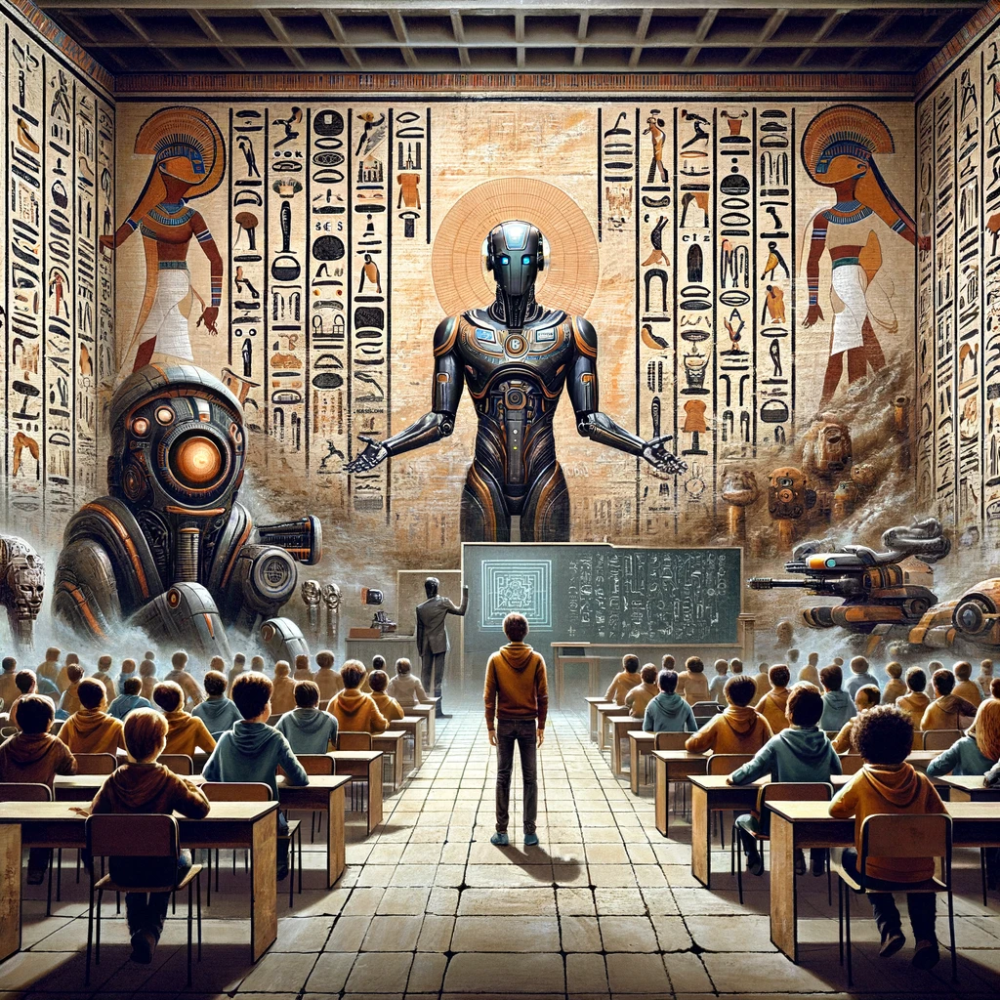

> Ein interaktiver Workshop über KI in der Schule – Schülerinnen und Schüler schlüpfen in verschiedene Rollen und diskutieren: Sollen Roboter unterrichten?

### Was passiert im Workshop?

Stell dir vor, an deiner Schule soll ein KI-Roboter den Unterricht übernehmen. Gute Idee? Totaler Quatsch? Genau darüber wird diskutiert – und zwar nicht abstrakt, sondern **mittendrin im Geschehen**.

Die Schülerinnen und Schüler schlüpfen in verschiedene Rollen: **Lehrkräfte, Schüler, Eltern oder Schulleitung** – jede Gruppe mit eigenen Interessen und Argumenten. In einem lebhaften Rollenspiel diskutieren sie Chancen und Risiken von KI im Schulalltag: Was kann KI besser? Was geht verloren? Wer entscheidet?

So entsteht eine echte Debatte – kritisch, kreativ und mit jeder Menge Perspektivwechsel.

### Die vier Rollen





### Was lernen die Schülerinnen und Schüler?

- **Einführung in Künstliche Intelligenz** – praxisnah und verständlich, kein Vorwissen nötig
- **Kritisches Denken fördern** – Chancen und Risiken von KI im Schulalltag reflektieren
- **Perspektivwechsel erleben** – durch Rollenspiele in verschiedene Rollen schlüpfen
- **Diskussion und Meinungsbildung** im Klassenteam anregen
- **Medienkompetenz stärken** – Wie gehe ich verantwortungsvoll mit KI um?

### Ablauf (ca. 3 Schulstunden)

| Phase | Dauer | Inhalt |
|-------|-------|--------|
| Einführung | 30 Min | Was ist KI? Praxisnahe Beispiele und Impulse |
| Rollenspiel | 60 Min | Szenarien wählen, in Gruppen diskutieren, Argumente sammeln |
| Diskussion | 30 Min | Jede Gruppe präsentiert ihre Sichtweise |
| Reflexion | 15 Min | Gemeinsamer Abschluss und Fazit |

### Kursdetails

- **Zielgruppe:** ab Klasse 7 (ab 10 Jahren)
- **Gruppengröße:** 10–30 Teilnehmer + 1–2 Mentoren
- **Dauer:** ca. 3 Schulstunden
- **Kosten:** ab 240 € (50% Ermäßigung möglich)
- **Material:** Klebezettel, Stifte, Flipchart – keine besondere Technik nötig (optional Tablets mit ChatGPT-Zugang)


Sie möchten den Workshop lieber **selbst durchführen**? Alle Materialien sind Open Source (CC BY 4.0) und kostenlos verfügbar – inklusive Ablaufplan, Präsentation und Moderationskarten. Mehr dazu unter [Selber machen](../selber-machen/).

