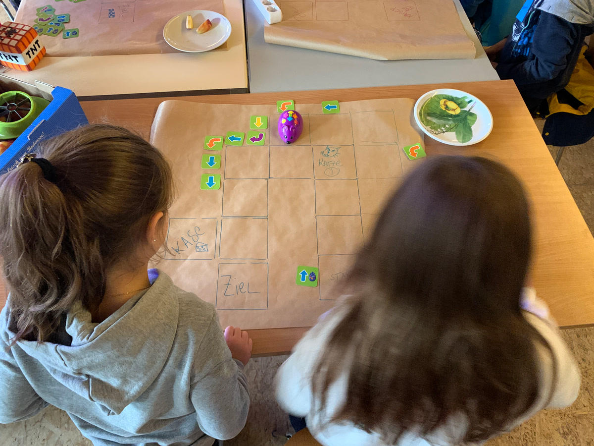
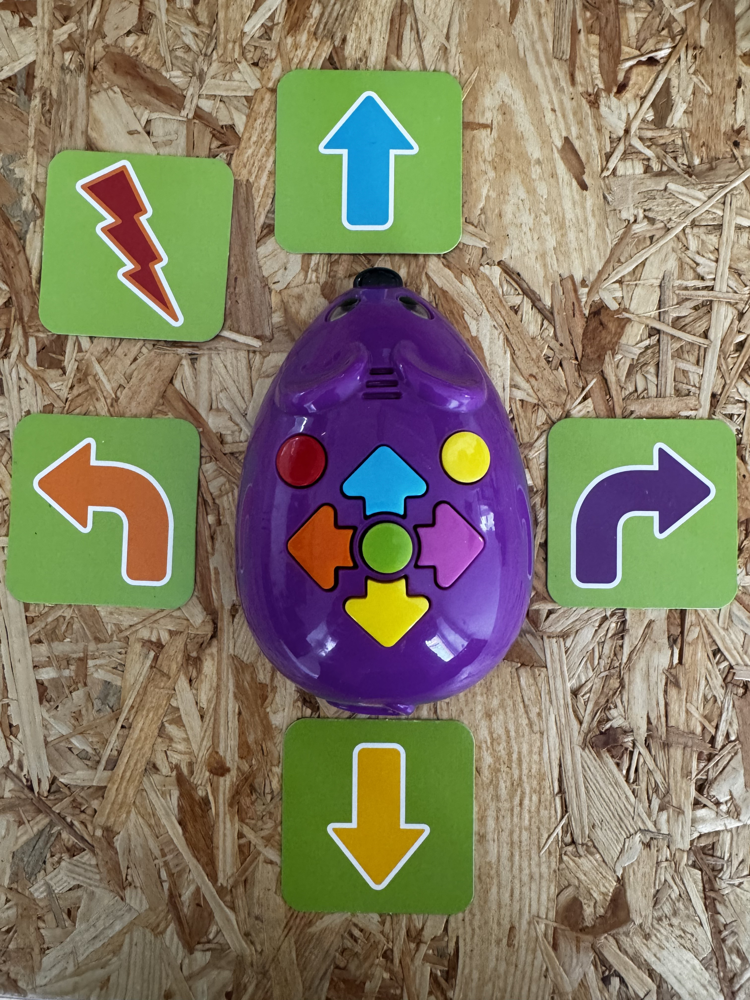
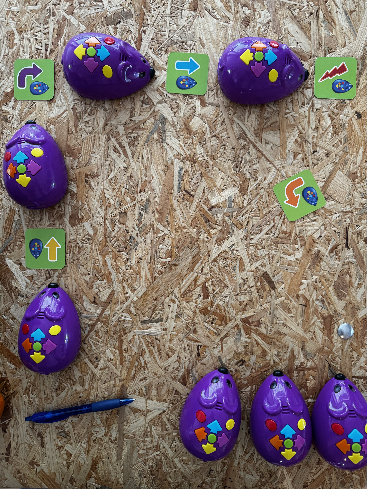
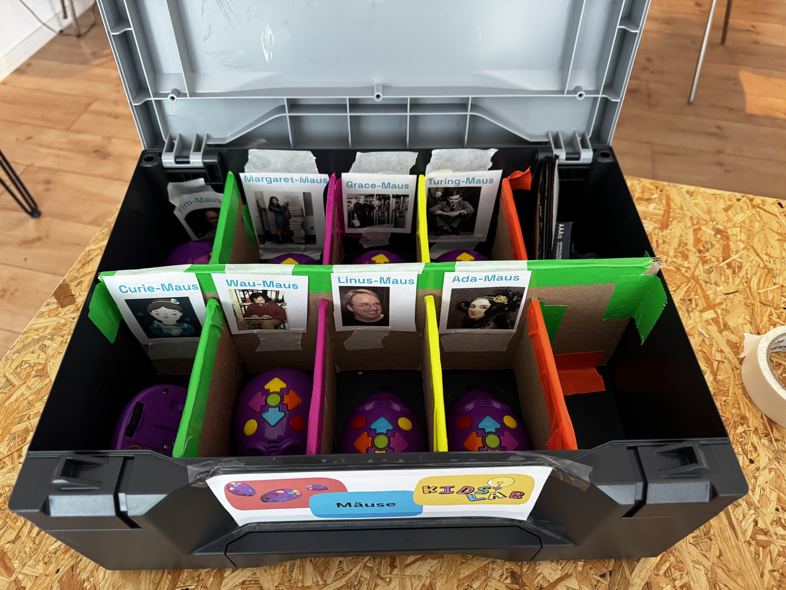
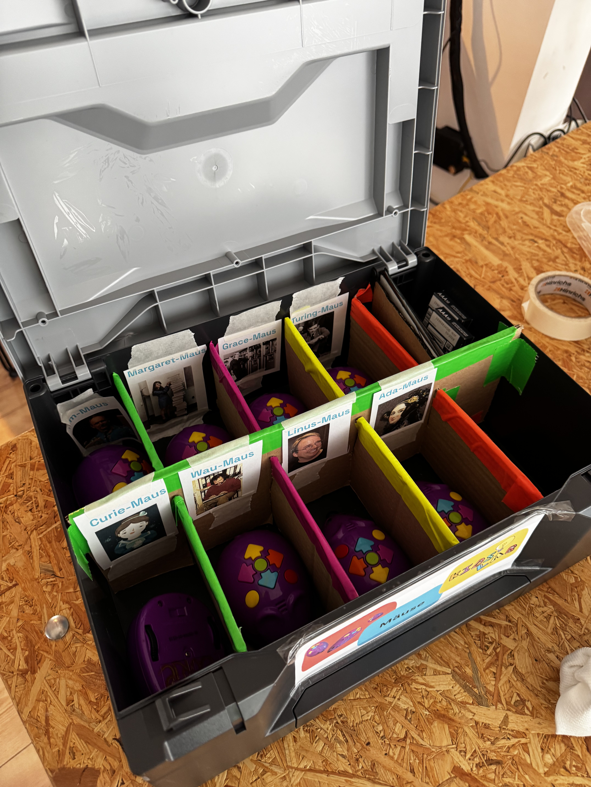
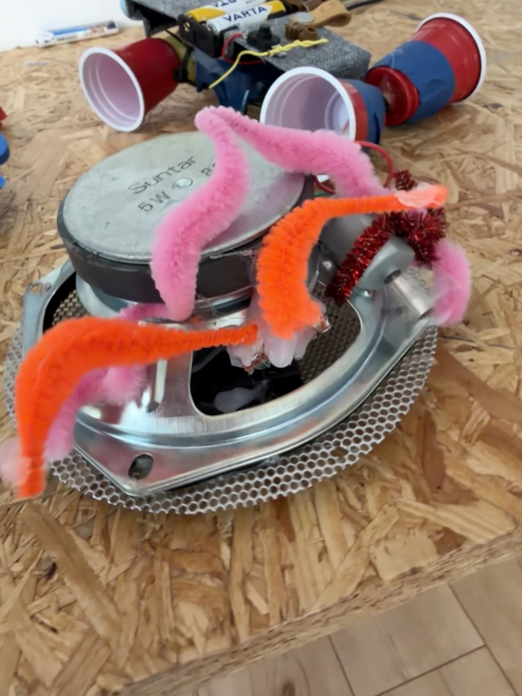
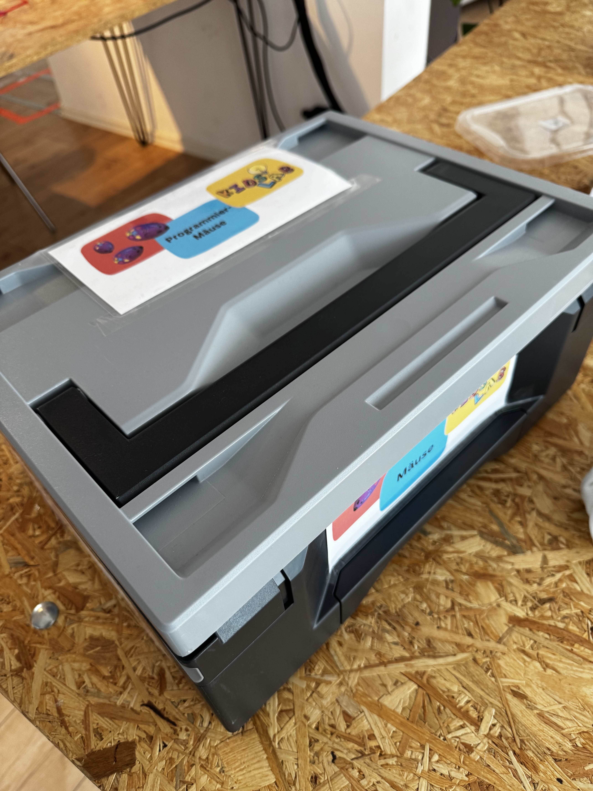
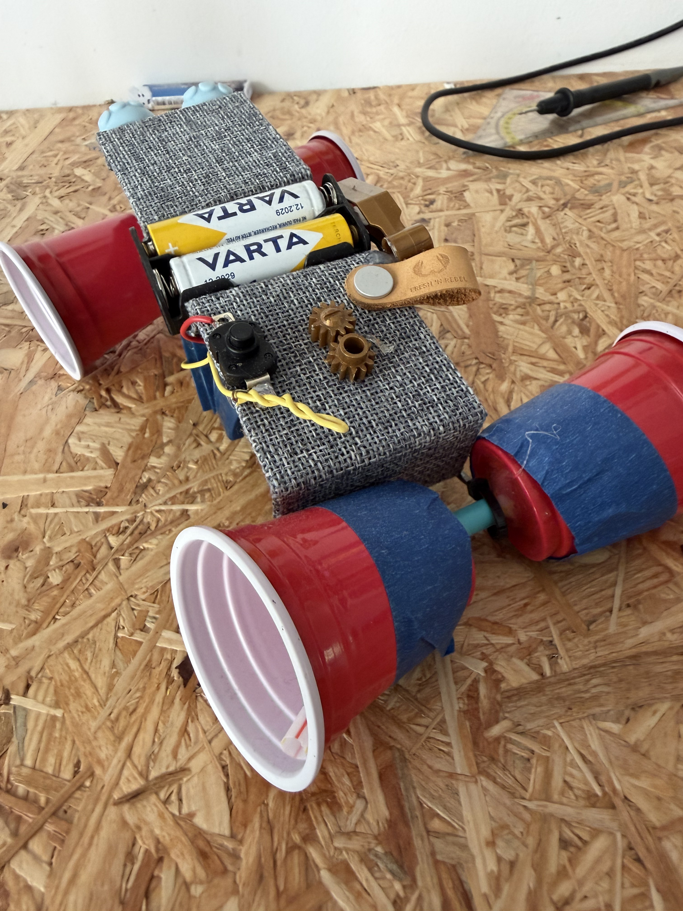
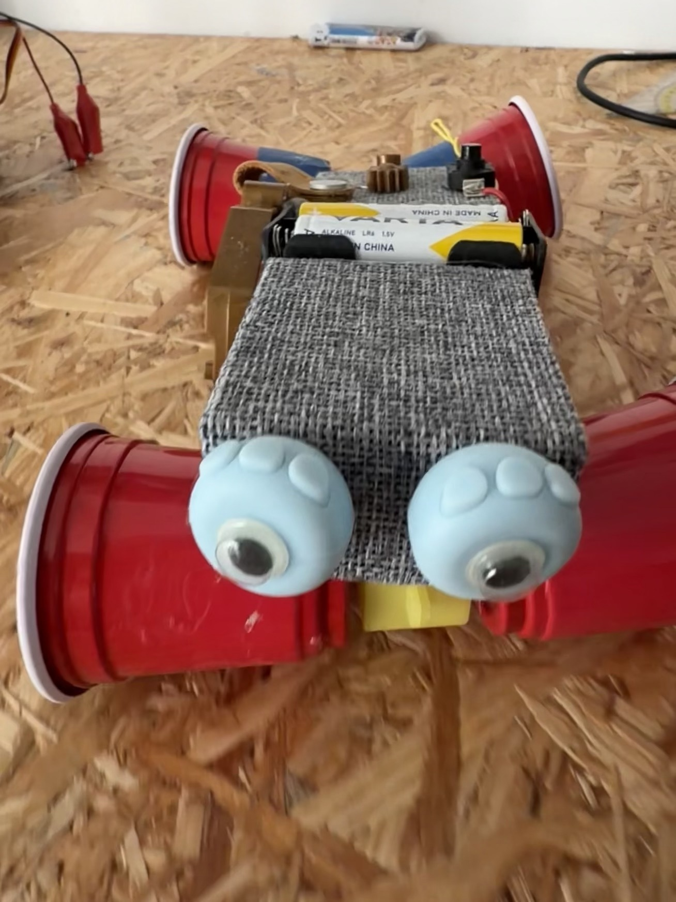

> The robot mouse offers a first, playful introduction to programming – with no digital devices at all!

The "Code and Go" robot mouse offers a first, playful introduction to programming! Using the colourful buttons, the mouse is programmed to travel a certain route. To do this, the kids create imaginative mazes or an obstacle course on paper for the mouse to navigate!

This way, kids learn programming intuitively – with no digital devices at all!





### Video: The robot mouse in action



### Course details

- **Target group**: kindergarten, primary school
- **Duration**: from 2 hours
- **Equipment**: "Code and Go" robot mice, paper and pens
- **Cost:** from €190 (50% discount possible)


Want to use the robot mice yourself in class? You can borrow our **learning kit with 8 robot mice** for free for up to 2 weeks! More under [Borrow a kit](../koffer-leihen/).

