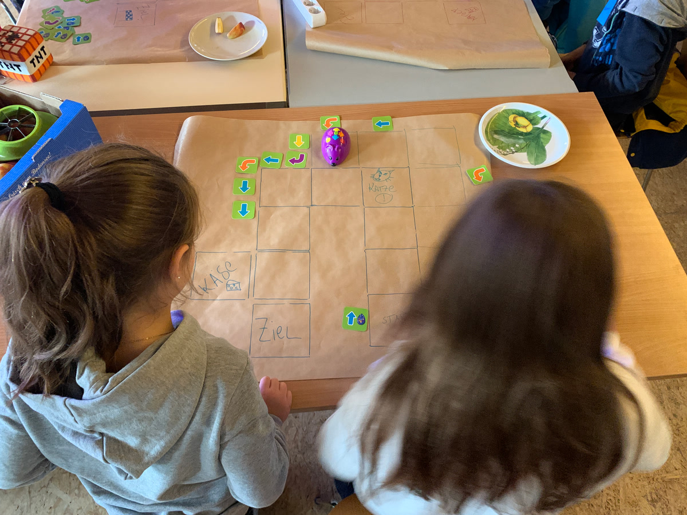
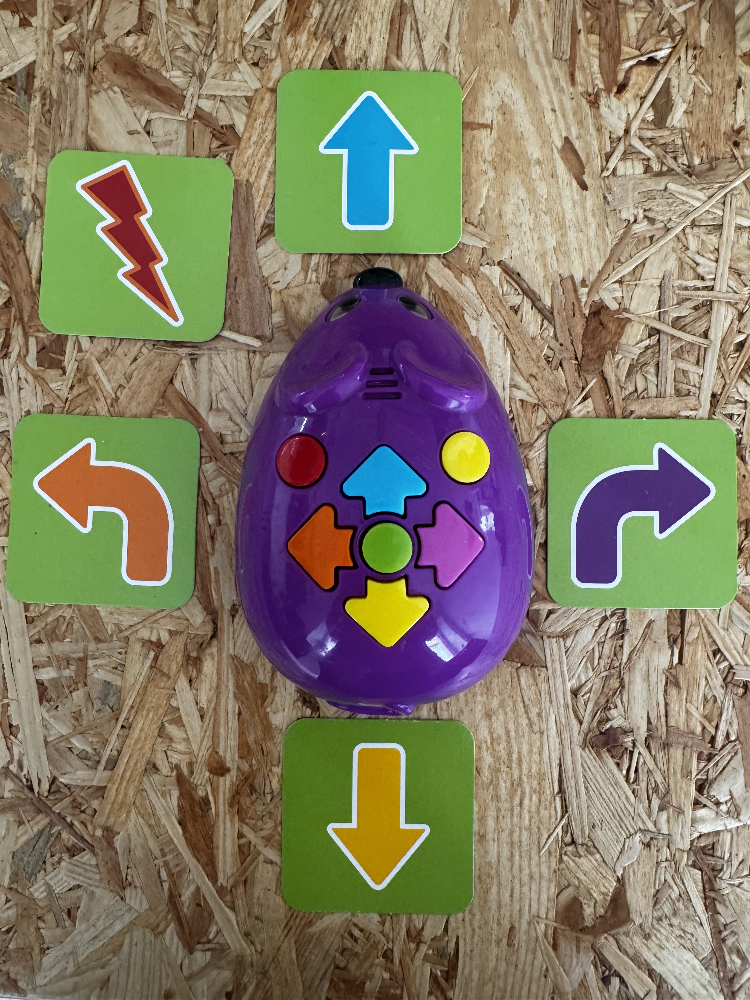
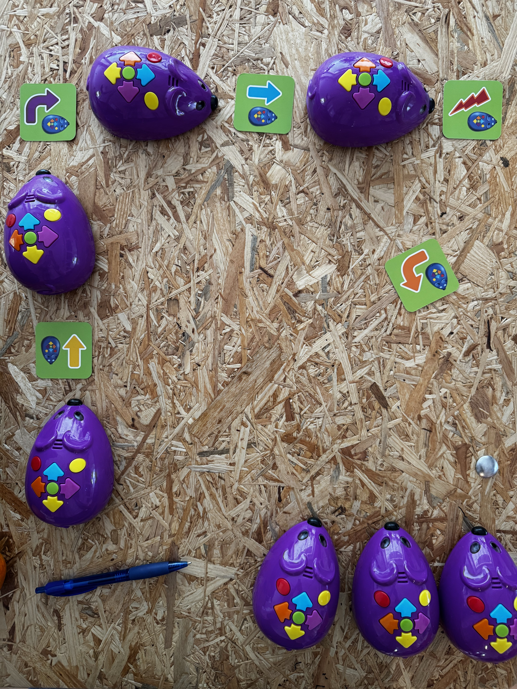
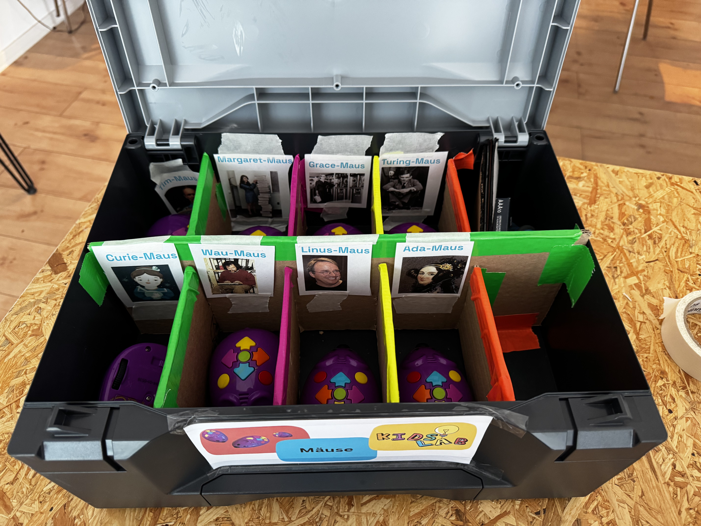
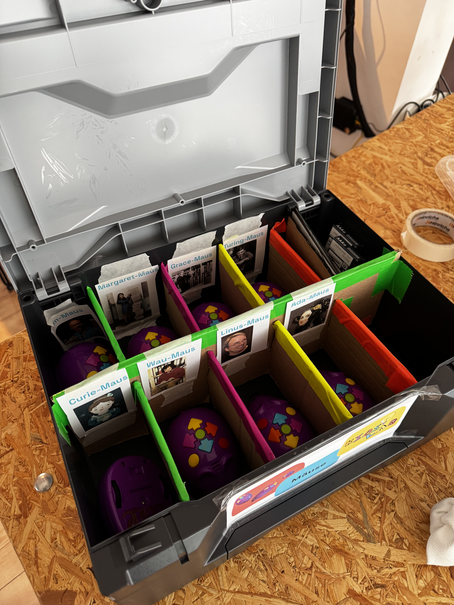
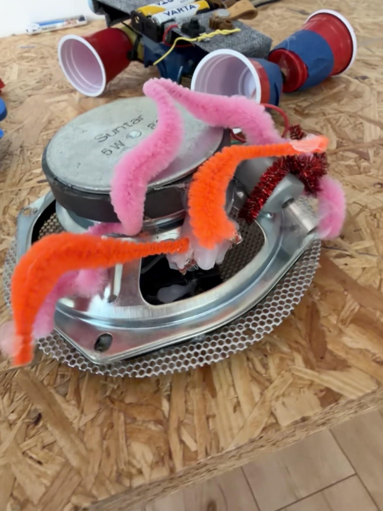
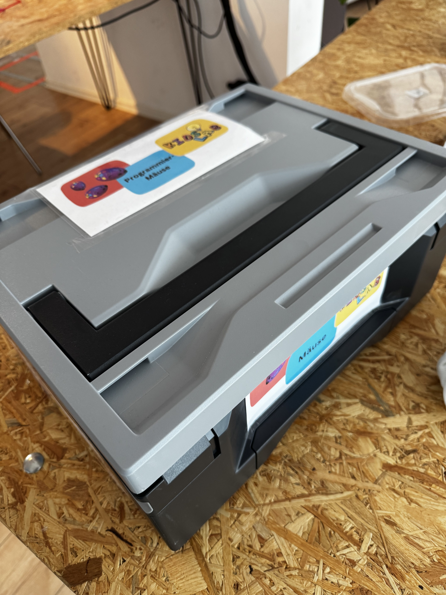
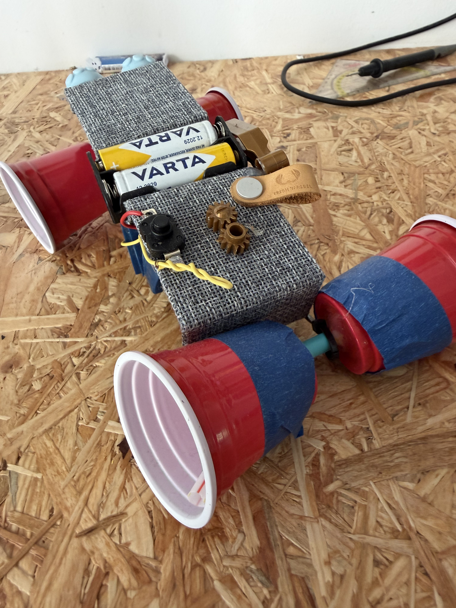
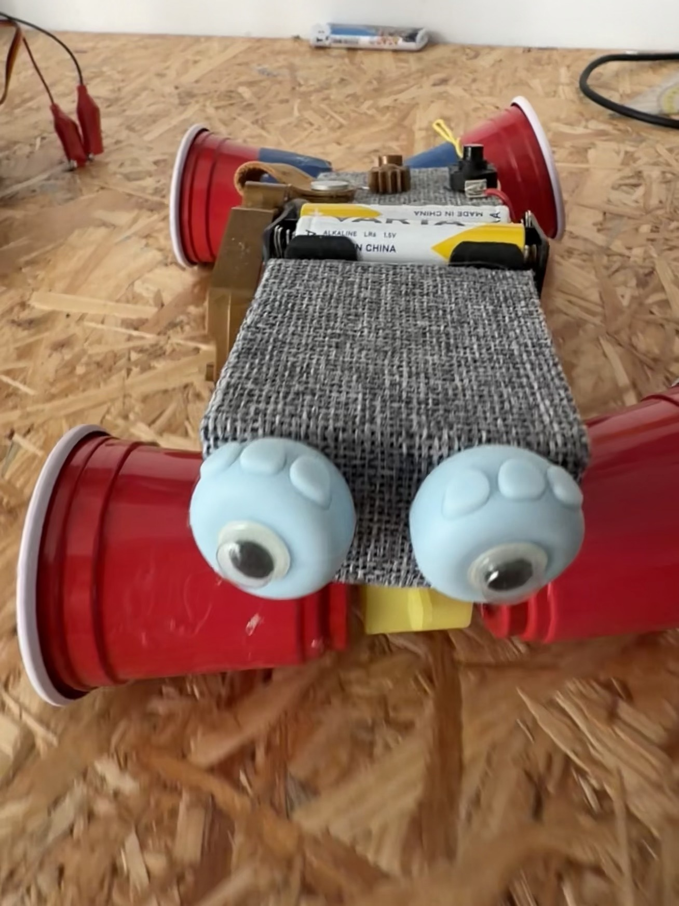

> Die Roboter-Maus ermöglicht einen ersten, spielerischen Einstieg in die Programmierung – ganz ohne digitale Geräte!

Die "Code and Go" Roboter-Maus ermöglicht einen ersten, spielerischen Einstieg in die Programmierung! Mit den bunten Tasten wird die Maus programmiert, eine bestimmte Strecke abzufahren. Die Kinder erschaffen dazu auf Papier phantasievolle Labyrinthe oder einen Parkour, den die Maus dann befahren muss!

So lernen die Kinder intuitiv Programmieren – ganz ohne digitale Geräte!





### Video: Die Roboter-Maus in Aktion



### Kursdetails

- **Zielgruppe**: Kindergarten, Grundschule
- **Dauer**: ab 2 Stunden
- **Ausstattung**: "Code and Go"-Roboter-Mäuse, Papier und Stifte
- **Kosten:** ab 190 € (50% Ermäßigung möglich)


Sie möchten die Roboter-Mäuse selbst im Unterricht einsetzen? Unseren **Lernkoffer mit 8 Roboter-Mäusen** können Sie kostenlos für bis zu 2 Wochen ausleihen! Mehr dazu unter [Koffer leihen](../koffer-leihen/).

