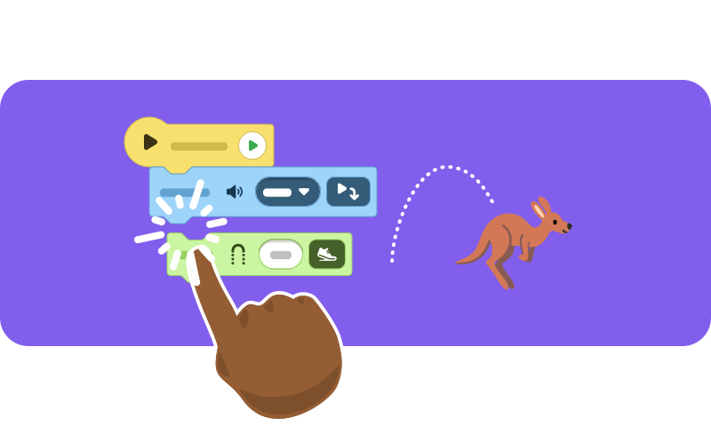
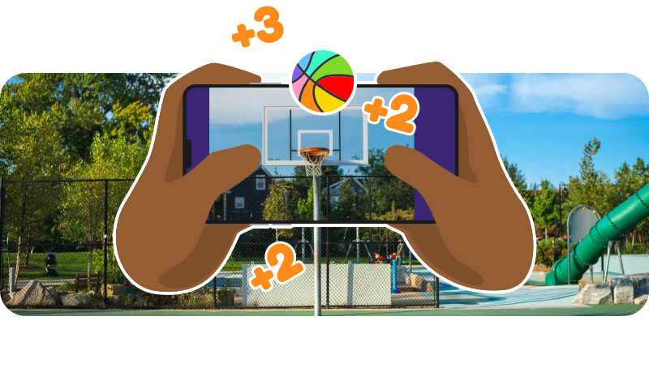
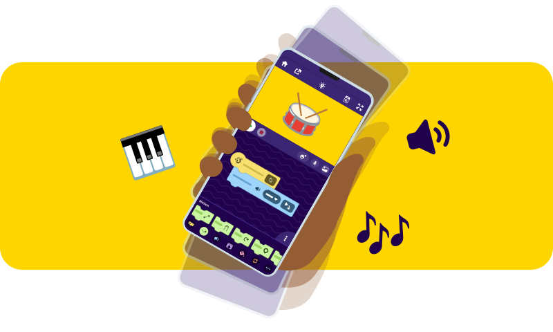
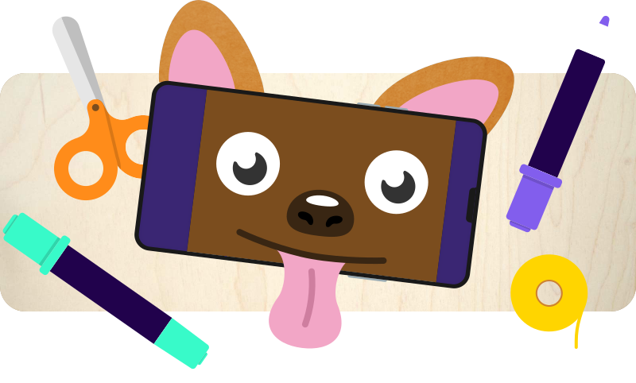

> With ScratchJr and OctoStudio, even the youngest kids can create interactive stories and animated films on a tablet — with no internet needed!

ScratchJr and its successor [OctoStudio](https://octostudio.org/) are perfect starting points for programming for the youngest kids. Children create interactive stories, games, and animated films on a tablet — playfully and intuitively.

**OctoStudio** brings even more possibilities: gesture control, recording sounds, adding photos, and even connecting craft projects with technology.

- **Target group**: kindergarten, primary school
- **Duration**: from 2 hours
- **Equipment**: iPads or tablets with ScratchJr / OctoStudio — no internet needed!
- **Free**: both apps are available at no cost
