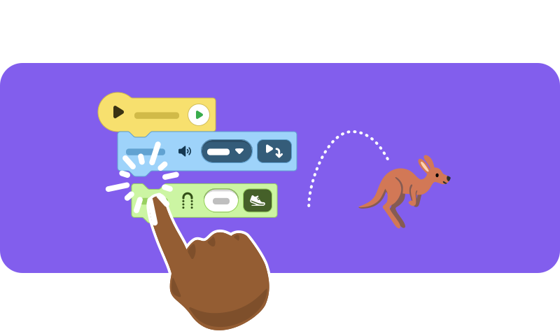
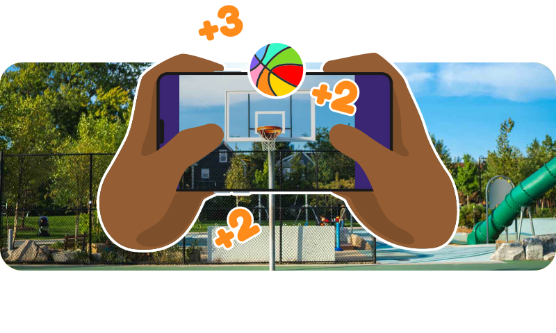
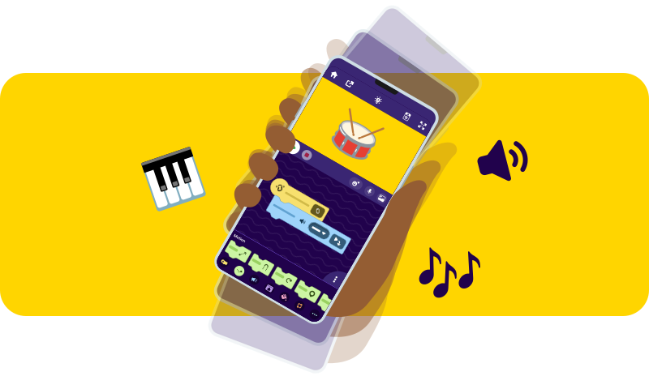
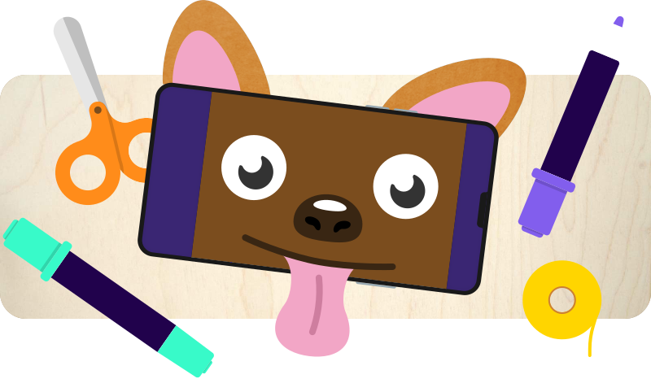

> Mit ScratchJr und OctoStudio können schon die Kleinsten interaktive Geschichten und Trickfilme am Tablet erschaffen — ganz ohne Internet!

ScratchJr und sein Nachfolger [OctoStudio](https://octostudio.org/) sind perfekte Einstiege ins Programmieren für die Jüngsten. Kinder erschaffen interaktive Geschichten, Spiele und Trickfilme am Tablet — spielerisch und intuitiv.

**OctoStudio** bringt noch mehr Möglichkeiten: Gesten-Steuerung, Sounds aufnehmen, Fotos einbauen und sogar Bastelprojekte mit Technik verbinden.

- **Zielgruppe**: Kindergarten, Grundschule
- **Dauer**: ab 2 Stunden
- **Ausstattung**: iPads oder Tablets mit ScratchJr / OctoStudio — kein Internet nötig!
- **Kostenlos**: Beide Apps sind gratis verfügbar
