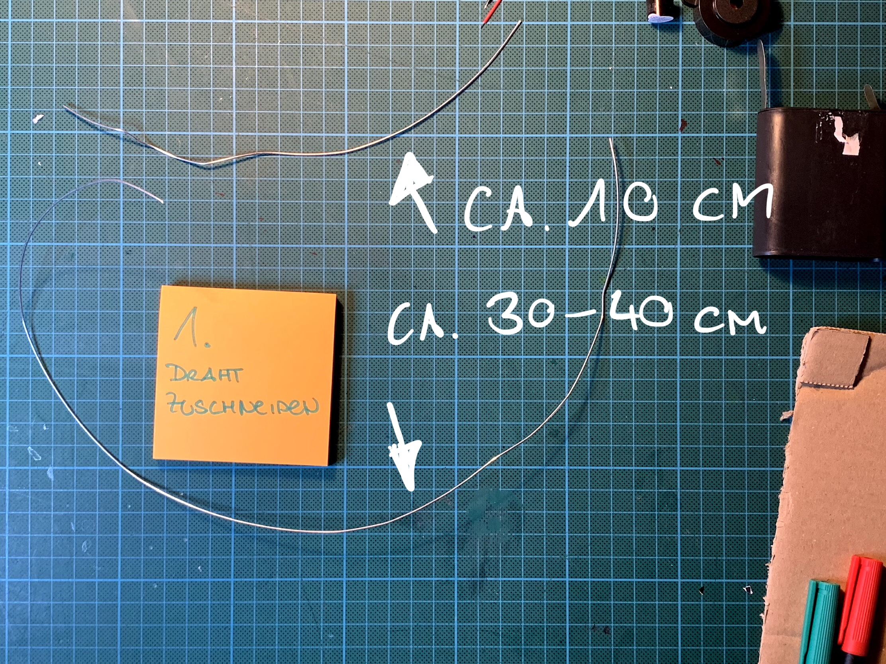
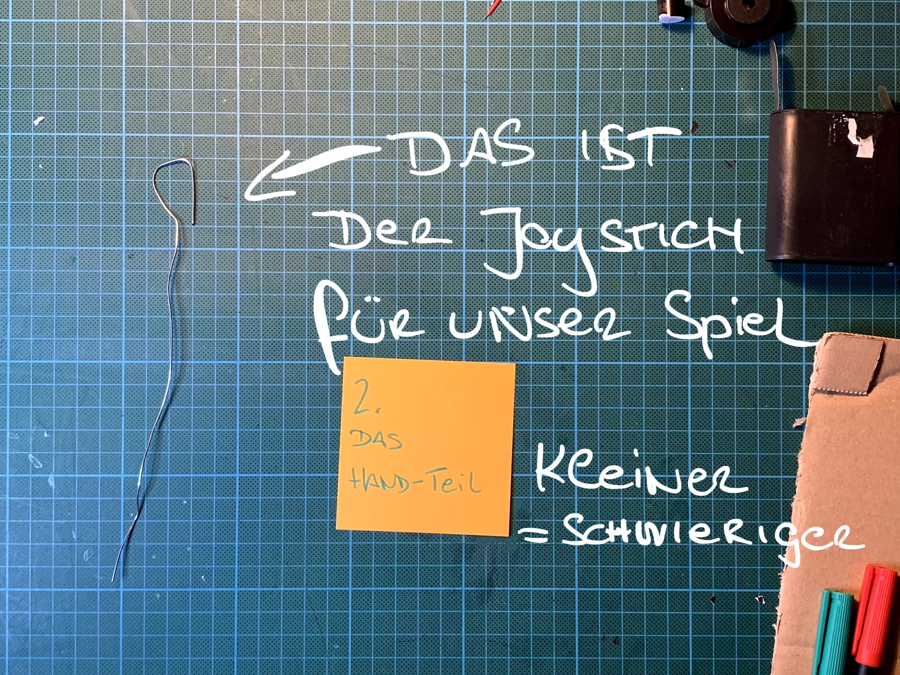
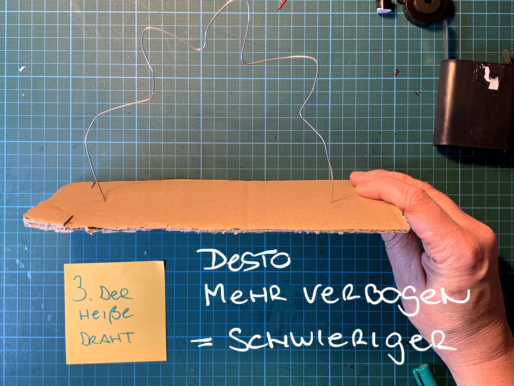
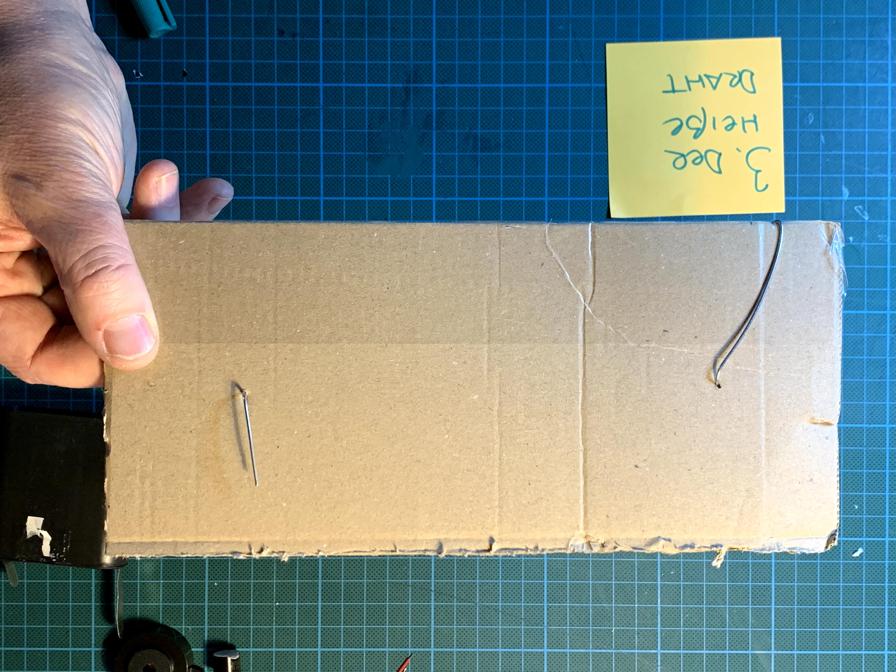
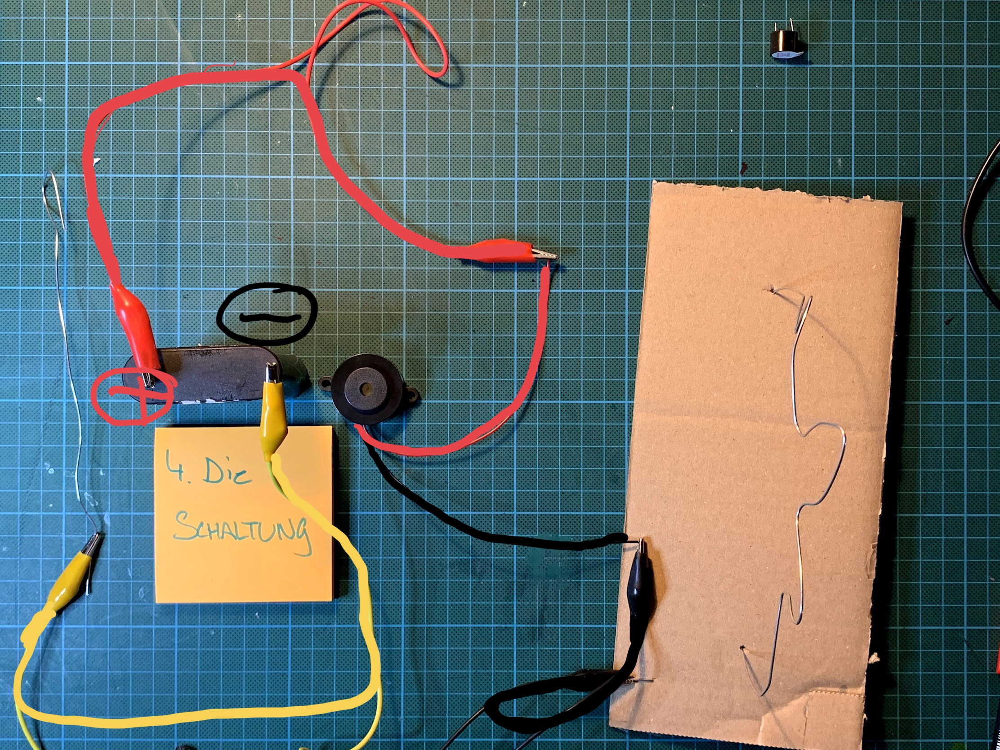

**Build your own hot wire game!**

**Careful, this is where it gets exciting!**
Build your own skill game and test how steady your hand really is.

**What is the "hot wire" game?**
You guide a small wire loop along a bent wire. But watch out: if you touch the wire, a loud beep sounds! If you make it to the end without touching the wire, you win.

**Step 1:**

First we cut the wire to length:
- one piece approx. 10 cm – this becomes our handle
- one piece approx. 30–40 cm – this becomes the hot wire!
image:
- 

**Step 2:**

From the shorter piece of wire, we build our joystick:
- Bend the front part into a small loop
- The smaller the loop, the harder the game gets later

image:
- 

**Step 3:**

From the long wire, you make the playing field
- push both ends through your cardboard
- bend the wire
- the more you bend it – the harder the game!
image:
- 
- 
step: Here's what the whole thing looks like from below…
image:
- 

**Step 4:**

And now for the circuit:
- Red clamp connects the battery's positive terminal and the buzzer's positive terminal
- Yellow clamp connects the battery's negative terminal and the joystick
- Black clamp connects the buzzer's negative terminal and the hot wire
image:
- 
- 
step: Done! Time to play!
image:

