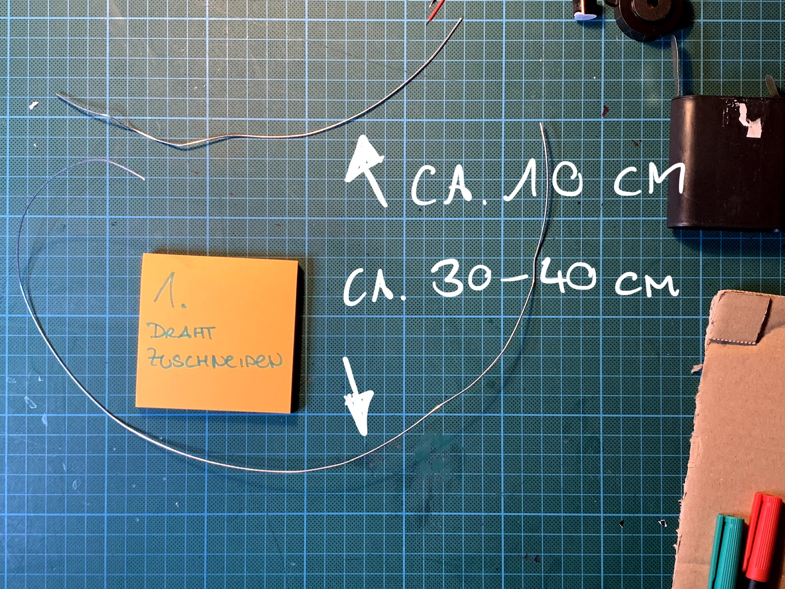
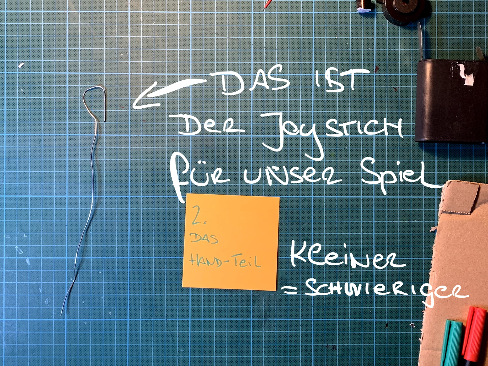
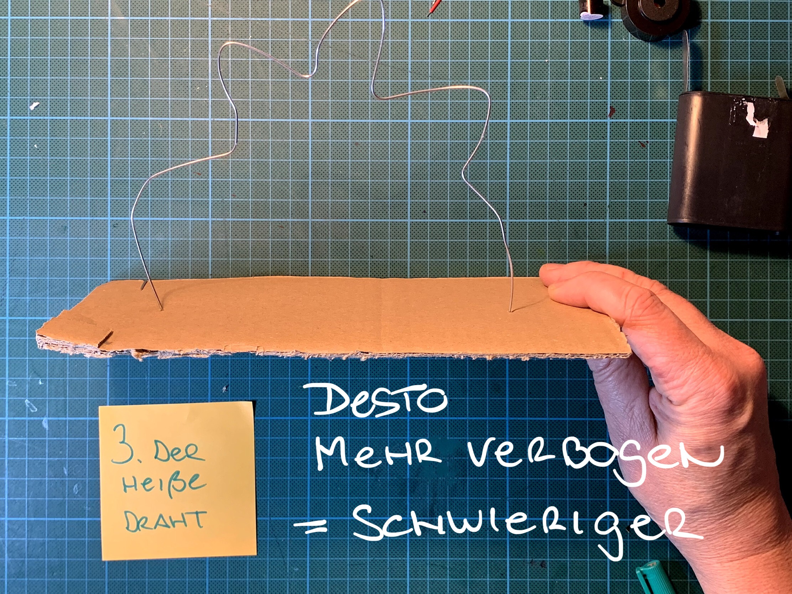
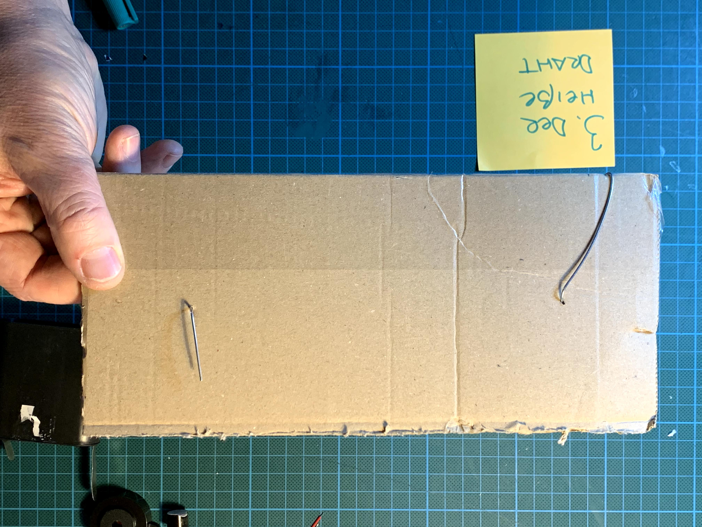
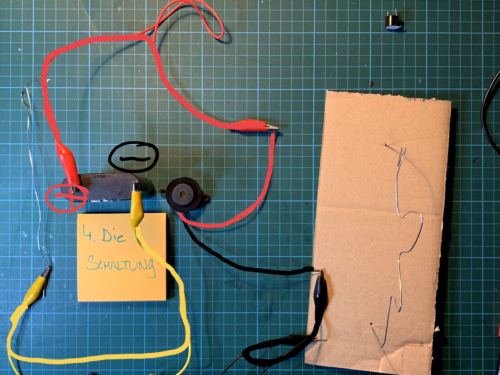

**Bau dein eigenes Heißer-Draht-Spiel!**

**Achtung, jetzt wird’s spannend!**
Bau dir dein eigenes Geschicklichkeitsspiel und teste, wie ruhig deine Hand wirklich ist.

**Was ist der „Heiße Draht“?**
Du führst eine kleine Drahtschlaufe entlang eines gebogenen Drahtes. Aber pass auf: Berührst du den Draht, ertönt ein lautes Piepen! Schaffst du es bis zum Ende, ohne den Draht zu berühren, hast du gewonnen.

**Schritt 1:**

Zuerst schneiden wir den Draht zu:
- ein Stück ca. 10 cm – das wird unser Handteil
- ein Stück ca. 30-40 cm – das wird der heiße Draht!
image:
- 

**Schritt 2:**

Aus dem kürzeren Stück Draht bauen wir unser Joystick:
- Biege das vordere Teil zu einer kleinen Schlaufe
- Desto kleiner die Schlaufe ist, desto schwieriger das Spiel später
image:
- 

**Schritt 3:**

Aus dem langen Draht machst du das Spielfeld
- stecke die beiden Enden durch deinen Karton oder Pappe
- verbiege den Draht
- desto mehr du ihn verbiegst – desto schwieriger das Spiel!
image:
- 
- 
step: So sieht das ganze von unten aus…
image:
- 

**Schritt 4:**

Und nun zur Schaltung:
- Rote Klemme verbindet Plus der Batterie und Plus des Summers
- Gelbe Klemme verbindet Minus der Batterie und den Joystick
- Schwarze Klemme verbindet Minus des Summers und den heißen Draht
image:
- 
- 
step: Fertig! Und es darf gespielt werden!
image:
- 
